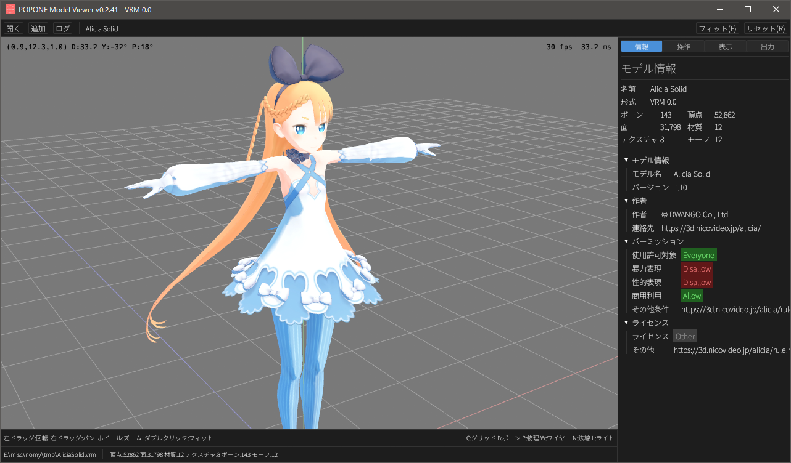
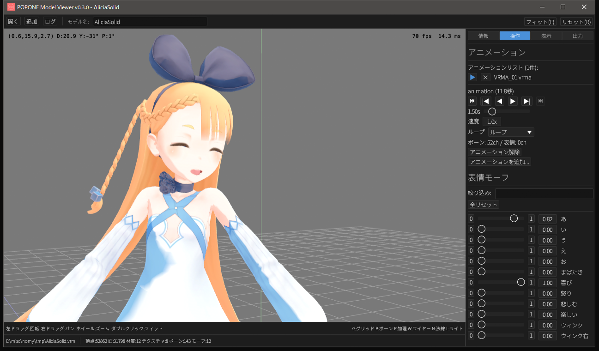
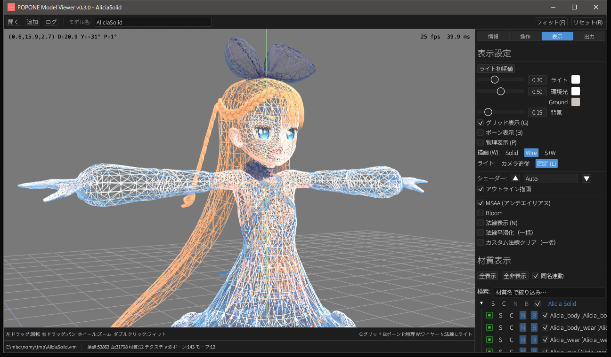
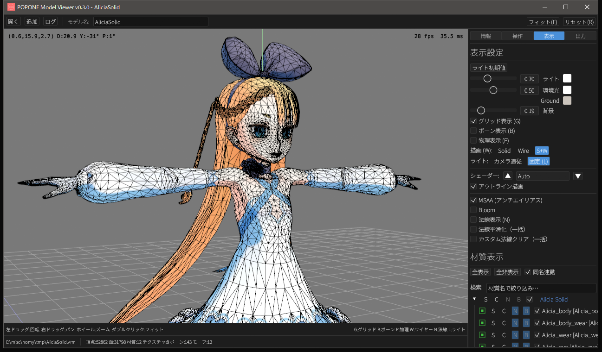

# popone

[English](README.md)

VRM / FBX / PMX / PMD / OBJ / STL / DirectX .x を 3D 表示します。

## ダウンロード

最新リリース: **[popone-v0.5.5.exe](https://github.com/tinatsu-nomy/popone/releases/download/v0.5.5/popone-v0.5.5.exe)**

全リリース一覧: [Releases](https://github.com/tinatsu-nomy/popone/releases)

## スクリーンショット






> モデル: [Alicia Solid](https://3d.nicovideo.jp/alicia/) — (C) DWANGO Co., Ltd. / キャラクターデザイン：黒星紅白

## 注意事項

- 本ツールの使用により発生したいかなる問題についても、作者は一切の責任を負いません。

## ライセンス

[0BSD License](LICENSE) — 帰属表示なしで自由に利用・改変・再配布できます。

同梱のサードパーティアセット（フォント等）はそれぞれ独自のライセンスに従います。
詳細は [THIRD_PARTY_NOTICES.md](THIRD_PARTY_NOTICES.md) を参照してください。

## 使い方

詳細は [使い方](docs/usage.jp.md) を参照。

## ソースからのビルド

[Rust](https://www.rust-lang.org/tools/install)（stable）が必要です。

```bash
# CLI のみ（VRM/FBX/PMX 変換）
cargo build --release

# ビューア付き（3D ビューア GUI）
cargo build --release --features viewer
```

Windows では exe にアイコンを埋め込むために [Windows SDK](https://developer.microsoft.com/windows/downloads/windows-sdk/)（`rc.exe`）の導入を推奨します。未インストールの場合もビルドは成功しますが、exe にカスタムアイコンが付きません。

## 依存クレート

<details>
<summary>コア（CLI 変換）</summary>

| クレート | 用途 |
|---------|------|
| gltf | GLB/glTF 2.0 パーサー（`extensions` 機能有効） |
| serde / serde_json | VRM 拡張 JSON デシリアライズ |
| glam | 3D 数学（Vec3, Quat, Mat4） |
| byteorder | PMX バイナリ読み書き |
| image | テクスチャ PNG/JPEG/BMP/TGA デコード・エンコード |
| mikktspace | MikkTSpace 接線ベクトル生成（法線マップ用） |
| encoding_rs | PMD Shift_JIS テキスト変換 |
| flate2 | zlib 圧縮・展開 |
| tar | .unitypackage (tar.gz) 展開 |
| zip | ZIP アーカイブ展開 |
| sevenz-rust2 | 7z アーカイブ展開 |
| tobj | OBJ/MTL パーサー |
| toml | TOML 設定パーサー |
| dunce | UNC パス簡略化 |
| tempfile | 一時ファイル作成 |
| clap | CLI 引数パーサー |
| anyhow / thiserror | エラーハンドリング |
| log / fern / chrono / env_logger | ログ出力 |

</details>

<details>
<summary>ビューア（viewer feature）</summary>

| クレート | 用途 |
|---------|------|
| eframe | egui + wgpu ウィンドウフレームワーク |
| rfd | ネイティブファイルダイアログ |
| bytemuck | 頂点/ユニフォーム Pod 変換 |
| encase | ユニフォームバッファシリアライズ（glam 連携） |
| pollster | async ブロッキング実行 |

</details>

<details>
<summary>依存ライブラリのライセンス</summary>

### コア依存

| クレート | ライセンス |
|---------|-----------|
| [gltf](https://github.com/gltf-rs/gltf) | MIT OR Apache-2.0 |
| [serde](https://github.com/serde-rs/serde) / [serde_json](https://github.com/serde-rs/json) | MIT OR Apache-2.0 |
| [glam](https://github.com/bitshifter/glam-rs) | MIT OR Apache-2.0 |
| [byteorder](https://github.com/BurntSushi/byteorder) | Unlicense OR MIT |
| [image](https://github.com/image-rs/image) | MIT OR Apache-2.0 |
| [mikktspace](https://github.com/gltf-rs/mikktspace) | MIT OR Apache-2.0 |
| [encoding_rs](https://github.com/hsivonen/encoding_rs) | MIT OR Apache-2.0 |
| [flate2](https://github.com/rust-lang/flate2-rs) | MIT OR Apache-2.0 |
| [tar](https://github.com/alexcrichton/tar-rs) | MIT OR Apache-2.0 |
| [zip](https://github.com/zip-rs/zip2) | MIT |
| [sevenz-rust2](https://github.com/hasenbanck/sevenz-rust2) | Apache-2.0 |
| [tobj](https://github.com/tatsy/tobj) | MIT |
| [clap](https://github.com/clap-rs/clap) | MIT OR Apache-2.0 |
| [anyhow](https://github.com/dtolnay/anyhow) / [thiserror](https://github.com/dtolnay/thiserror) | MIT OR Apache-2.0 |
| [log](https://github.com/rust-lang/log) / [fern](https://github.com/daboross/fern) / [chrono](https://github.com/chronotope/chrono) | MIT (fern) / MIT OR Apache-2.0 (others) |
| [toml](https://github.com/toml-rs/toml) | MIT OR Apache-2.0 |
| [dunce](https://gitlab.com/kornelski/dunce) | CC0-1.0 OR MIT-0 OR Apache-2.0 |
| [tempfile](https://github.com/Stebalien/tempfile) | MIT OR Apache-2.0 |
| [env_logger](https://github.com/rust-cli/env_logger) | MIT OR Apache-2.0 |

### ビューア依存

| クレート | ライセンス |
|---------|-----------|
| [eframe](https://github.com/emilk/egui) | MIT OR Apache-2.0 |
| [rfd](https://github.com/PolyMeilex/rfd) | MIT |
| [bytemuck](https://github.com/Lokathor/bytemuck) | Zlib OR Apache-2.0 OR MIT |
| [encase](https://github.com/teoxoy/encase) | MIT OR Apache-2.0 |
| [pollster](https://github.com/zesterer/pollster) | MIT OR Apache-2.0 |

</details>

## 商標・権利帰属

本ソフトウェアは以下のファイル形式を読み込み・変換します。各商標はそれぞれの所有者に帰属します。

- **VRM** — [VRM Consortium](https://vrm-consortium.org/) による 3D アバター形式
- **FBX** — FBX は [Autodesk, Inc.](https://www.autodesk.com/) の商標です
- **glTF / GLB** — glTF は [Khronos Group Inc.](https://www.khronos.org/) の商標です
- **DirectX .x** — DirectX は [Microsoft Corporation](https://www.microsoft.com/) の商標です
- **PSD** — Photoshop および PSD は [Adobe Inc.](https://www.adobe.com/) の商標です
- **PMX / PMD** — MikuMikuDance（樋口M氏）および PMXEditor（極北P氏）由来の形式
- **OBJ** — Wavefront Technologies が開発した Wavefront OBJ 形式
- **STL** — 3D Systems がステレオリソグラフィ用に開発した形式

### シェーダー技術への帰属

本ソフトウェアは PMX 変換時に以下のシェーダー技術を検出・近似変換します：

- **MToon** — [VRM Consortium](https://vrm-consortium.org/) / [Santarh](https://github.com/Santarh/MToon) によるトゥーンシェーダー仕様（MIT License）
- **UTS2 (Unity-Chan Toon Shader 2.0)** — [Unity Technologies](https://unity.com/)（Unity-Chan License 2.0）
- **lilToon** — [lilxyzw](https://github.com/lilxyzw/lilToon)（MIT License）
- **Poiyomi Toon Shader** — [Poiyomi](https://www.poiyomi.com/)
