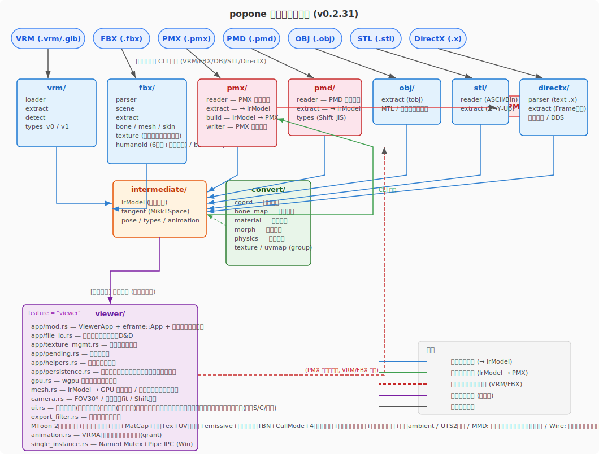

<!-- START doctoc generated TOC please keep comment here to allow auto update -->
<!-- DON'T EDIT THIS SECTION, INSTEAD RE-RUN doctoc TO UPDATE -->
**Table of Contents** *generated with [DocToc](https://github.com/thlorenz/doctoc)*

- [技術詳細](#%E6%8A%80%E8%A1%93%E8%A9%B3%E7%B4%B0)
  - [章構成](#%E7%AB%A0%E6%A7%8B%E6%88%90)
  - [座標変換](#%E5%BA%A7%E6%A8%99%E5%A4%89%E6%8F%9B)
    - [PMX/PMD → IrModel 逆変換](#pmxpmd-%E2%86%92-irmodel-%E9%80%86%E5%A4%89%E6%8F%9B)
  - [VRM ロード](#vrm-%E3%83%AD%E3%83%BC%E3%83%89)
    - [フォーマット判定](#%E3%83%95%E3%82%A9%E3%83%BC%E3%83%9E%E3%83%83%E3%83%88%E5%88%A4%E5%AE%9A)
    - [拡張のパース](#%E6%8B%A1%E5%BC%B5%E3%81%AE%E3%83%91%E3%83%BC%E3%82%B9)
    - [VRM 0.0 と 1.0 の差異](#vrm-00-%E3%81%A8-10-%E3%81%AE%E5%B7%AE%E7%95%B0)
    - [ヒューマノイドボーン照合](#%E3%83%92%E3%83%A5%E3%83%BC%E3%83%9E%E3%83%8E%E3%82%A4%E3%83%89%E3%83%9C%E3%83%BC%E3%83%B3%E7%85%A7%E5%90%88)
    - [Expression / BlendShape 抽出](#expression--blendshape-%E6%8A%BD%E5%87%BA)
    - [メタ情報抽出](#%E3%83%A1%E3%82%BF%E6%83%85%E5%A0%B1%E6%8A%BD%E5%87%BA)
    - [テクスチャ処理](#%E3%83%86%E3%82%AF%E3%82%B9%E3%83%81%E3%83%A3%E5%87%A6%E7%90%86)
  - [FBX ロード](#fbx-%E3%83%AD%E3%83%BC%E3%83%89)
    - [バイナリ/ASCII 判定](#%E3%83%90%E3%82%A4%E3%83%8A%E3%83%AAascii-%E5%88%A4%E5%AE%9A)
    - [FBX ノードツリー](#fbx-%E3%83%8E%E3%83%BC%E3%83%89%E3%83%84%E3%83%AA%E3%83%BC)
    - [FBX シーングラフ](#fbx-%E3%82%B7%E3%83%BC%E3%83%B3%E3%82%B0%E3%83%A9%E3%83%95)
    - [リグ自動判定](#%E3%83%AA%E3%82%B0%E8%87%AA%E5%8B%95%E5%88%A4%E5%AE%9A)
    - [ボーン階層抽出](#%E3%83%9C%E3%83%BC%E3%83%B3%E9%9A%8E%E5%B1%A4%E6%8A%BD%E5%87%BA)
    - [座標系と UnitScaleFactor](#%E5%BA%A7%E6%A8%99%E7%B3%BB%E3%81%A8-unitscalefactor)
    - [GeometryInstance 抽出](#geometryinstance-%E6%8A%BD%E5%87%BA)
    - [ASCII FBX Content ブロック処理](#ascii-fbx-content-%E3%83%96%E3%83%AD%E3%83%83%E3%82%AF%E5%87%A6%E7%90%86)
    - [FBX パーサー入力バリデーション](#fbx-%E3%83%91%E3%83%BC%E3%82%B5%E3%83%BC%E5%85%A5%E5%8A%9B%E3%83%90%E3%83%AA%E3%83%87%E3%83%BC%E3%82%B7%E3%83%A7%E3%83%B3)
    - [FBX 外部テクスチャ近傍検索](#fbx-%E5%A4%96%E9%83%A8%E3%83%86%E3%82%AF%E3%82%B9%E3%83%81%E3%83%A3%E8%BF%91%E5%82%8D%E6%A4%9C%E7%B4%A2)
    - [テクスチャ解決パイプライン](#%E3%83%86%E3%82%AF%E3%82%B9%E3%83%81%E3%83%A3%E8%A7%A3%E6%B1%BA%E3%83%91%E3%82%A4%E3%83%97%E3%83%A9%E3%82%A4%E3%83%B3)
  - [PMX/PMD ロード](#pmxpmd-%E3%83%AD%E3%83%BC%E3%83%89)
    - [PMX リーダー](#pmx-%E3%83%AA%E3%83%BC%E3%83%80%E3%83%BC)
    - [PMD リーダー](#pmd-%E3%83%AA%E3%83%BC%E3%83%80%E3%83%BC)
    - [IrModel 変換](#irmodel-%E5%A4%89%E6%8F%9B)
    - [Tスタンス変換](#t%E3%82%B9%E3%82%BF%E3%83%B3%E3%82%B9%E5%A4%89%E6%8F%9B)
    - [剛体回転](#%E5%89%9B%E4%BD%93%E5%9B%9E%E8%BB%A2)
    - [テクスチャ読み込み](#%E3%83%86%E3%82%AF%E3%82%B9%E3%83%81%E3%83%A3%E8%AA%AD%E3%81%BF%E8%BE%BC%E3%81%BF)
    - [テクスチャ欠落フォールバック (v0.5.7)](#%E3%83%86%E3%82%AF%E3%82%B9%E3%83%81%E3%83%A3%E6%AC%A0%E8%90%BD%E3%83%95%E3%82%A9%E3%83%BC%E3%83%AB%E3%83%90%E3%83%83%E3%82%AF-v057)
    - [ミップマップ生成 (最適化)](#%E3%83%9F%E3%83%83%E3%83%97%E3%83%9E%E3%83%83%E3%83%97%E7%94%9F%E6%88%90-%E6%9C%80%E9%81%A9%E5%8C%96)
  - [OBJ/STL ロード](#objstl-%E3%83%AD%E3%83%BC%E3%83%89)
    - [OBJ リーダー](#obj-%E3%83%AA%E3%83%BC%E3%83%80%E3%83%BC)
    - [STL リーダー](#stl-%E3%83%AA%E3%83%BC%E3%83%80%E3%83%BC)
    - [座標変換](#%E5%BA%A7%E6%A8%99%E5%A4%89%E6%8F%9B-1)
    - [IrModel 構築](#irmodel-%E6%A7%8B%E7%AF%89)
    - [動的グリッド](#%E5%8B%95%E7%9A%84%E3%82%B0%E3%83%AA%E3%83%83%E3%83%89)
  - [DirectX .x ロード](#directx-x-%E3%83%AD%E3%83%BC%E3%83%89)
    - [パーサー (`directx/parser.rs`)](#%E3%83%91%E3%83%BC%E3%82%B5%E3%83%BC-directxparserrs)
    - [IrModel 変換 (`directx/extract.rs`)](#irmodel-%E5%A4%89%E6%8F%9B-directxextractrs)
  - [UnityPackage 読み込み](#unitypackage-%E8%AA%AD%E3%81%BF%E8%BE%BC%E3%81%BF)
    - [GUID 参照チェーン](#guid-%E5%8F%82%E7%85%A7%E3%83%81%E3%82%A7%E3%83%BC%E3%83%B3)
    - [UnityPackageIndex](#unitypackageindex)
    - [Prefab 形式判別](#prefab-%E5%BD%A2%E5%BC%8F%E5%88%A4%E5%88%A5)
    - [Prefab Variant 解決](#prefab-variant-%E8%A7%A3%E6%B1%BA)
    - [テクスチャ照合の三段階フォールバック](#%E3%83%86%E3%82%AF%E3%82%B9%E3%83%81%E3%83%A3%E7%85%A7%E5%90%88%E3%81%AE%E4%B8%89%E6%AE%B5%E9%9A%8E%E3%83%95%E3%82%A9%E3%83%BC%E3%83%AB%E3%83%90%E3%83%83%E3%82%AF)
    - [Unity YAML パーサー](#unity-yaml-%E3%83%91%E3%83%BC%E3%82%B5%E3%83%BC)
    - [主要データ型](#%E4%B8%BB%E8%A6%81%E3%83%87%E3%83%BC%E3%82%BF%E5%9E%8B)
    - [Prefab 複数 FBX の MaterialGroup 分割](#prefab-%E8%A4%87%E6%95%B0-fbx-%E3%81%AE-materialgroup-%E5%88%86%E5%89%B2)
    - [ファイル構成ツリー](#%E3%83%95%E3%82%A1%E3%82%A4%E3%83%AB%E6%A7%8B%E6%88%90%E3%83%84%E3%83%AA%E3%83%BC)
    - [材質表示の常時グループ化](#%E6%9D%90%E8%B3%AA%E8%A1%A8%E7%A4%BA%E3%81%AE%E5%B8%B8%E6%99%82%E3%82%B0%E3%83%AB%E3%83%BC%E3%83%97%E5%8C%96)
    - [GeometryInstance ベースの source_material](#geometryinstance-%E3%83%99%E3%83%BC%E3%82%B9%E3%81%AE-source_material)
    - [link_same_name スコープ制限](#link_same_name-%E3%82%B9%E3%82%B3%E3%83%BC%E3%83%97%E5%88%B6%E9%99%90)
  - [アーカイブ直接ロード](#%E3%82%A2%E3%83%BC%E3%82%AB%E3%82%A4%E3%83%96%E7%9B%B4%E6%8E%A5%E3%83%AD%E3%83%BC%E3%83%89)
    - [archive モジュール](#archive-%E3%83%A2%E3%82%B8%E3%83%A5%E3%83%BC%E3%83%AB)
    - [ビューア統合](#%E3%83%93%E3%83%A5%E3%83%BC%E3%82%A2%E7%B5%B1%E5%90%88)
    - [CLI](#cli)
  - [ドラッグ＆ドロップ読み込み](#%E3%83%89%E3%83%A9%E3%83%83%E3%82%B0%EF%BC%86%E3%83%89%E3%83%AD%E3%83%83%E3%83%97%E8%AA%AD%E3%81%BF%E8%BE%BC%E3%81%BF)
    - [一時パス検出](#%E4%B8%80%E6%99%82%E3%83%91%E3%82%B9%E6%A4%9C%E5%87%BA)
    - [一時パスのバイト列先読み](#%E4%B8%80%E6%99%82%E3%83%91%E3%82%B9%E3%81%AE%E3%83%90%E3%82%A4%E3%83%88%E5%88%97%E5%85%88%E8%AA%AD%E3%81%BF)
    - [D&D 先読みキャッシュ（PreloadedData）](#dd-%E5%85%88%E8%AA%AD%E3%81%BF%E3%82%AD%E3%83%A3%E3%83%83%E3%82%B7%E3%83%A5preloadeddata)
    - [補助ファイルキャッシュ](#%E8%A3%9C%E5%8A%A9%E3%83%95%E3%82%A1%E3%82%A4%E3%83%AB%E3%82%AD%E3%83%A3%E3%83%83%E3%82%B7%E3%83%A5)
    - [TextureSource enum](#texturesource-enum)
    - [テクスチャD&Dプレビューキャッシュ](#%E3%83%86%E3%82%AF%E3%82%B9%E3%83%81%E3%83%A3dd%E3%83%97%E3%83%AC%E3%83%93%E3%83%A5%E3%83%BC%E3%82%AD%E3%83%A3%E3%83%83%E3%82%B7%E3%83%A5)
    - [.gltf の除外](#gltf-%E3%81%AE%E9%99%A4%E5%A4%96)
  - [非同期モデル読み込み (キャンセル/世代管理を追加)](#%E9%9D%9E%E5%90%8C%E6%9C%9F%E3%83%A2%E3%83%87%E3%83%AB%E8%AA%AD%E3%81%BF%E8%BE%BC%E3%81%BF-%E3%82%AD%E3%83%A3%E3%83%B3%E3%82%BB%E3%83%AB%E4%B8%96%E4%BB%A3%E7%AE%A1%E7%90%86%E3%82%92%E8%BF%BD%E5%8A%A0)
    - [データフロー](#%E3%83%87%E3%83%BC%E3%82%BF%E3%83%95%E3%83%AD%E3%83%BC)
    - [主要な型 (pending.rs)](#%E4%B8%BB%E8%A6%81%E3%81%AA%E5%9E%8B-pendingrs)
    - [`cpu_parse_source` フリー関数 (file_io.rs)](#cpu_parse_source-%E3%83%95%E3%83%AA%E3%83%BC%E9%96%A2%E6%95%B0-file_iors)
    - [`route_load_dispatch` メソッド](#route_load_dispatch-%E3%83%A1%E3%82%BD%E3%83%83%E3%83%89)
    - [`apply_bg_load_result` メソッド](#apply_bg_load_result-%E3%83%A1%E3%82%BD%E3%83%83%E3%83%89)
    - [マルチスレッド安全性](#%E3%83%9E%E3%83%AB%E3%83%81%E3%82%B9%E3%83%AC%E3%83%83%E3%83%89%E5%AE%89%E5%85%A8%E6%80%A7)
    - [生 RGBA テクスチャバイパス](#%E7%94%9F-rgba-%E3%83%86%E3%82%AF%E3%82%B9%E3%83%81%E3%83%A3%E3%83%90%E3%82%A4%E3%83%91%E3%82%B9)
    - [遅延 GPU ビルド](#%E9%81%85%E5%BB%B6-gpu-%E3%83%93%E3%83%AB%E3%83%89)
  - [モデル追加読み込み](#%E3%83%A2%E3%83%87%E3%83%AB%E8%BF%BD%E5%8A%A0%E8%AA%AD%E3%81%BF%E8%BE%BC%E3%81%BF)
    - [ボーンマージ 3段フォールバック方式](#%E3%83%9C%E3%83%BC%E3%83%B3%E3%83%9E%E3%83%BC%E3%82%B8-3%E6%AE%B5%E3%83%95%E3%82%A9%E3%83%BC%E3%83%AB%E3%83%90%E3%83%83%E3%82%AF%E6%96%B9%E5%BC%8F)
    - [pkg テクスチャ名前空間](#pkg-%E3%83%86%E3%82%AF%E3%82%B9%E3%83%81%E3%83%A3%E5%90%8D%E5%89%8D%E7%A9%BA%E9%96%93)
    - [Prefab 追加読み込み](#prefab-%E8%BF%BD%E5%8A%A0%E8%AA%AD%E3%81%BF%E8%BE%BC%E3%81%BF)
    - [複数モデル一括読み込み](#%E8%A4%87%E6%95%B0%E3%83%A2%E3%83%87%E3%83%AB%E4%B8%80%E6%8B%AC%E8%AA%AD%E3%81%BF%E8%BE%BC%E3%81%BF)
  - [モデルリロード](#%E3%83%A2%E3%83%87%E3%83%AB%E3%83%AA%E3%83%AD%E3%83%BC%E3%83%89)
    - [ReloadableSource enum](#reloadablesource-enum)
    - [reload_from_source](#reload_from_source)
    - [UnityPackage アーカイブスナップショット](#unitypackage-%E3%82%A2%E3%83%BC%E3%82%AB%E3%82%A4%E3%83%96%E3%82%B9%E3%83%8A%E3%83%83%E3%83%97%E3%82%B7%E3%83%A7%E3%83%83%E3%83%88)
    - [Prefab リロード（A/T スタンス変換対応）](#prefab-%E3%83%AA%E3%83%AD%E3%83%BC%E3%83%89at-%E3%82%B9%E3%82%BF%E3%83%B3%E3%82%B9%E5%A4%89%E6%8F%9B%E5%AF%BE%E5%BF%9C)
    - [FBX 直接選択時の Prefab 対応リロード](#fbx-%E7%9B%B4%E6%8E%A5%E9%81%B8%E6%8A%9E%E6%99%82%E3%81%AE-prefab-%E5%AF%BE%E5%BF%9C%E3%83%AA%E3%83%AD%E3%83%BC%E3%83%89)
    - [リロード安定キー: PkgModelLocator](#%E3%83%AA%E3%83%AD%E3%83%BC%E3%83%89%E5%AE%89%E5%AE%9A%E3%82%AD%E3%83%BC-pkgmodellocator)
    - [reload_unitypackage のテクスチャ復元](#reload_unitypackage-%E3%81%AE%E3%83%86%E3%82%AF%E3%82%B9%E3%83%81%E3%83%A3%E5%BE%A9%E5%85%83)
    - [リロード時のユーザー状態保存（v0.3.0）](#%E3%83%AA%E3%83%AD%E3%83%BC%E3%83%89%E6%99%82%E3%81%AE%E3%83%A6%E3%83%BC%E3%82%B6%E3%83%BC%E7%8A%B6%E6%85%8B%E4%BF%9D%E5%AD%98v030)
    - [assign_texture_source_to_material の IrTexture 重複排除](#assign_texture_source_to_material-%E3%81%AE-irtexture-%E9%87%8D%E8%A4%87%E6%8E%92%E9%99%A4)
  - [GPU パイプラインウォームアップ & モデルビルド最適化](#gpu-%E3%83%91%E3%82%A4%E3%83%97%E3%83%A9%E3%82%A4%E3%83%B3%E3%82%A6%E3%82%A9%E3%83%BC%E3%83%A0%E3%82%A2%E3%83%83%E3%83%97--%E3%83%A2%E3%83%87%E3%83%AB%E3%83%93%E3%83%AB%E3%83%89%E6%9C%80%E9%81%A9%E5%8C%96)
    - [パイプラインウォームアップ (`WarmupPhase`)](#%E3%83%91%E3%82%A4%E3%83%97%E3%83%A9%E3%82%A4%E3%83%B3%E3%82%A6%E3%82%A9%E3%83%BC%E3%83%A0%E3%82%A2%E3%83%83%E3%83%97-warmupphase)
    - [GPU モデルビルド分離 (`cpu_prep_model` / `gpu_finalize_model`)](#gpu-%E3%83%A2%E3%83%87%E3%83%AB%E3%83%93%E3%83%AB%E3%83%89%E5%88%86%E9%9B%A2-cpu_prep_model--gpu_finalize_model)
    - [サムネイルキャッシュ差分更新](#%E3%82%B5%E3%83%A0%E3%83%8D%E3%82%A4%E3%83%AB%E3%82%AD%E3%83%A3%E3%83%83%E3%82%B7%E3%83%A5%E5%B7%AE%E5%88%86%E6%9B%B4%E6%96%B0)
    - [ir テクスチャサムネイルキャッシュ（v0.5.2）](#ir-%E3%83%86%E3%82%AF%E3%82%B9%E3%83%81%E3%83%A3%E3%82%B5%E3%83%A0%E3%83%8D%E3%82%A4%E3%83%AB%E3%82%AD%E3%83%A3%E3%83%83%E3%82%B7%E3%83%A5v052)
  - [WGSL シェーダー構成](#wgsl-%E3%82%B7%E3%82%A7%E3%83%BC%E3%83%80%E3%83%BC%E6%A7%8B%E6%88%90)
    - [共通マクロ](#%E5%85%B1%E9%80%9A%E3%83%9E%E3%82%AF%E3%83%AD)
    - [シェーダー定数](#%E3%82%B7%E3%82%A7%E3%83%BC%E3%83%80%E3%83%BC%E5%AE%9A%E6%95%B0)
  - [MMD レンダリング](#mmd-%E3%83%AC%E3%83%B3%E3%83%80%E3%83%AA%E3%83%B3%E3%82%B0)
    - [アーキテクチャ](#%E3%82%A2%E3%83%BC%E3%82%AD%E3%83%86%E3%82%AF%E3%83%81%E3%83%A3)
    - [MMD シェーダー](#mmd-%E3%82%B7%E3%82%A7%E3%83%BC%E3%83%80%E3%83%BC)
    - [パイプライン構成](#%E3%83%91%E3%82%A4%E3%83%97%E3%83%A9%E3%82%A4%E3%83%B3%E6%A7%8B%E6%88%90)
    - [色空間](#%E8%89%B2%E7%A9%BA%E9%96%93)
    - [共有トゥーンテクスチャ](#%E5%85%B1%E6%9C%89%E3%83%88%E3%82%A5%E3%83%BC%E3%83%B3%E3%83%86%E3%82%AF%E3%82%B9%E3%83%81%E3%83%A3)
  - [シェーダーオーバーライド](#%E3%82%B7%E3%82%A7%E3%83%BC%E3%83%80%E3%83%BC%E3%82%AA%E3%83%BC%E3%83%90%E3%83%BC%E3%83%A9%E3%82%A4%E3%83%89)
    - [シェーダーモード一覧](#%E3%82%B7%E3%82%A7%E3%83%BC%E3%83%80%E3%83%BC%E3%83%A2%E3%83%BC%E3%83%89%E4%B8%80%E8%A6%A7)
    - [アルファ処理](#%E3%82%A2%E3%83%AB%E3%83%95%E3%82%A1%E5%87%A6%E7%90%86)
    - [状態正規化](#%E7%8A%B6%E6%85%8B%E6%AD%A3%E8%A6%8F%E5%8C%96)
  - [MToon シェーディング](#mtoon-%E3%82%B7%E3%82%A7%E3%83%BC%E3%83%87%E3%82%A3%E3%83%B3%E3%82%B0)
    - [MaterialUniform](#materialuniform)
    - [lit/shade 補間公式](#litshade-%E8%A3%9C%E9%96%93%E5%85%AC%E5%BC%8F)
    - [アウトライン描画](#%E3%82%A2%E3%82%A6%E3%83%88%E3%83%A9%E3%82%A4%E3%83%B3%E6%8F%8F%E7%94%BB)
    - [リムライティング](#%E3%83%AA%E3%83%A0%E3%83%A9%E3%82%A4%E3%83%86%E3%82%A3%E3%83%B3%E3%82%B0)
    - [MatCap テクスチャ](#matcap-%E3%83%86%E3%82%AF%E3%82%B9%E3%83%81%E3%83%A3)
    - [VRM パラメータ対応](#vrm-%E3%83%91%E3%83%A9%E3%83%A1%E3%83%BC%E3%82%BF%E5%AF%BE%E5%BF%9C)
    - [UV アニメーション](#uv-%E3%82%A2%E3%83%8B%E3%83%A1%E3%83%BC%E3%82%B7%E3%83%A7%E3%83%B3)
    - [透明描画順制御（alphaMode / transparentWithZWrite / renderQueueOffsetNumber）](#%E9%80%8F%E6%98%8E%E6%8F%8F%E7%94%BB%E9%A0%86%E5%88%B6%E5%BE%A1alphamode--transparentwithzwrite--renderqueueoffsetnumber)
  - [材質編集と Expression 材質バインド（v0.5.0 / v0.5.1）](#%E6%9D%90%E8%B3%AA%E7%B7%A8%E9%9B%86%E3%81%A8-expression-%E6%9D%90%E8%B3%AA%E3%83%90%E3%82%A4%E3%83%B3%E3%83%89v050--v051)
    - [材質編集パネル — 更新経路（v0.5.3 でドック化）](#%E6%9D%90%E8%B3%AA%E7%B7%A8%E9%9B%86%E3%83%91%E3%83%8D%E3%83%AB--%E6%9B%B4%E6%96%B0%E7%B5%8C%E8%B7%AFv053-%E3%81%A7%E3%83%89%E3%83%83%E3%82%AF%E5%8C%96)
    - [DrawCall.material_buf — uniform バッファの永続ハンドル（v0.5.1）](#drawcallmaterial_buf--uniform-%E3%83%90%E3%83%83%E3%83%95%E3%82%A1%E3%81%AE%E6%B0%B8%E7%B6%9A%E3%83%8F%E3%83%B3%E3%83%89%E3%83%ABv051)
    - [full rebuild の情報源整合性（VRM / PMX / PMD 対応）](#full-rebuild-%E3%81%AE%E6%83%85%E5%A0%B1%E6%BA%90%E6%95%B4%E5%90%88%E6%80%A7vrm--pmx--pmd-%E5%AF%BE%E5%BF%9C)
    - [履歴呼出の順序原則](#%E5%B1%A5%E6%AD%B4%E5%91%BC%E5%87%BA%E3%81%AE%E9%A0%86%E5%BA%8F%E5%8E%9F%E5%89%87)
    - [Expression 再適用のタイミング](#expression-%E5%86%8D%E9%81%A9%E7%94%A8%E3%81%AE%E3%82%BF%E3%82%A4%E3%83%9F%E3%83%B3%E3%82%B0)
    - [Expression 材質バインド — 再生パイプライン](#expression-%E6%9D%90%E8%B3%AA%E3%83%90%E3%82%A4%E3%83%B3%E3%83%89--%E5%86%8D%E7%94%9F%E3%83%91%E3%82%A4%E3%83%97%E3%83%A9%E3%82%A4%E3%83%B3)
    - [UV モーフ IR → PMX ラウンドトリップ書き戻し（v0.5.6）](#uv-%E3%83%A2%E3%83%BC%E3%83%95-ir-%E2%86%92-pmx-%E3%83%A9%E3%82%A6%E3%83%B3%E3%83%89%E3%83%88%E3%83%AA%E3%83%83%E3%83%97%E6%9B%B8%E3%81%8D%E6%88%BB%E3%81%97v056)
    - [テクスチャ履歴の補助スロット永続化（v0.5.1）](#%E3%83%86%E3%82%AF%E3%82%B9%E3%83%81%E3%83%A3%E5%B1%A5%E6%AD%B4%E3%81%AE%E8%A3%9C%E5%8A%A9%E3%82%B9%E3%83%AD%E3%83%83%E3%83%88%E6%B0%B8%E7%B6%9A%E5%8C%96v051)
    - [スロット毎 UV 変形の永続化（v0.5.4）](#%E3%82%B9%E3%83%AD%E3%83%83%E3%83%88%E6%AF%8E-uv-%E5%A4%89%E5%BD%A2%E3%81%AE%E6%B0%B8%E7%B6%9A%E5%8C%96v054)
  - [Bloom ポストエフェクト](#bloom-%E3%83%9D%E3%82%B9%E3%83%88%E3%82%A8%E3%83%95%E3%82%A7%E3%82%AF%E3%83%88)
    - [Dual Kawase アルゴリズム](#dual-kawase-%E3%82%A2%E3%83%AB%E3%82%B4%E3%83%AA%E3%82%BA%E3%83%A0)
    - [MRT (Multiple Render Target) による emissive 分離](#mrt-multiple-render-target-%E3%81%AB%E3%82%88%E3%82%8B-emissive-%E5%88%86%E9%9B%A2)
    - [UI パラメータ](#ui-%E3%83%91%E3%83%A9%E3%83%A1%E3%83%BC%E3%82%BF)
    - [材質ごとのエミッシブトグル](#%E6%9D%90%E8%B3%AA%E3%81%94%E3%81%A8%E3%81%AE%E3%82%A8%E3%83%9F%E3%83%83%E3%82%B7%E3%83%96%E3%83%88%E3%82%B0%E3%83%AB)
    - [PMX/PMD 自己発光材質の Bloom 判定](#pmxpmd-%E8%87%AA%E5%B7%B1%E7%99%BA%E5%85%89%E6%9D%90%E8%B3%AA%E3%81%AE-bloom-%E5%88%A4%E5%AE%9A)
    - [Prefab Emission 対応](#prefab-emission-%E5%AF%BE%E5%BF%9C)
  - [カメラ・ライティング](#%E3%82%AB%E3%83%A1%E3%83%A9%E3%83%BB%E3%83%A9%E3%82%A4%E3%83%86%E3%82%A3%E3%83%B3%E3%82%B0)
    - [カメラ](#%E3%82%AB%E3%83%A1%E3%83%A9)
    - [フィット計算（compute_fit）](#%E3%83%95%E3%82%A3%E3%83%83%E3%83%88%E8%A8%88%E7%AE%97compute_fit)
    - [ライティング](#%E3%83%A9%E3%82%A4%E3%83%86%E3%82%A3%E3%83%B3%E3%82%B0)
    - [MMD ambient 分離](#mmd-ambient-%E5%88%86%E9%9B%A2)
  - [ビューア表示スタイル](#%E3%83%93%E3%83%A5%E3%83%BC%E3%82%A2%E8%A1%A8%E7%A4%BA%E3%82%B9%E3%82%BF%E3%82%A4%E3%83%AB)
    - [ダークテーマ](#%E3%83%80%E3%83%BC%E3%82%AF%E3%83%86%E3%83%BC%E3%83%9E)
    - [VRM メタ情報カラーバッジ](#vrm-%E3%83%A1%E3%82%BF%E6%83%85%E5%A0%B1%E3%82%AB%E3%83%A9%E3%83%BC%E3%83%90%E3%83%83%E3%82%B8)
    - [スプラッシュ画像](#%E3%82%B9%E3%83%97%E3%83%A9%E3%83%83%E3%82%B7%E3%83%A5%E7%94%BB%E5%83%8F)
    - [剛体表示](#%E5%89%9B%E4%BD%93%E8%A1%A8%E7%A4%BA)
    - [ジョイント表示（PMX/PMD のみ）](#%E3%82%B8%E3%83%A7%E3%82%A4%E3%83%B3%E3%83%88%E8%A1%A8%E7%A4%BApmxpmd-%E3%81%AE%E3%81%BF)
    - [ワイヤーフレーム描画モード](#%E3%83%AF%E3%82%A4%E3%83%A4%E3%83%BC%E3%83%95%E3%83%AC%E3%83%BC%E3%83%A0%E6%8F%8F%E7%94%BB%E3%83%A2%E3%83%BC%E3%83%89)
    - [法線マップ表示](#%E6%B3%95%E7%B7%9A%E3%83%9E%E3%83%83%E3%83%97%E8%A1%A8%E7%A4%BA)
    - [法線マップ接線空間（TBN）](#%E6%B3%95%E7%B7%9A%E3%83%9E%E3%83%83%E3%83%97%E6%8E%A5%E7%B7%9A%E7%A9%BA%E9%96%93tbn)
    - [描画順](#%E6%8F%8F%E7%94%BB%E9%A0%86)
  - [ボーン表示](#%E3%83%9C%E3%83%BC%E3%83%B3%E8%A1%A8%E7%A4%BA)
    - [形状判定（優先順）](#%E5%BD%A2%E7%8A%B6%E5%88%A4%E5%AE%9A%E5%84%AA%E5%85%88%E9%A0%86)
    - [IK 判定（2 経路）](#ik-%E5%88%A4%E5%AE%9A2-%E7%B5%8C%E8%B7%AF)
    - [IK 影響下ボーン](#ik-%E5%BD%B1%E9%9F%BF%E4%B8%8B%E3%83%9C%E3%83%BC%E3%83%B3)
    - [描画方向](#%E6%8F%8F%E7%94%BB%E6%96%B9%E5%90%91)
    - [描画パイプライン](#%E6%8F%8F%E7%94%BB%E3%83%91%E3%82%A4%E3%83%97%E3%83%A9%E3%82%A4%E3%83%B3)
    - [外観（色・サイズ）](#%E5%A4%96%E8%A6%B3%E8%89%B2%E3%83%BB%E3%82%B5%E3%82%A4%E3%82%BA)
    - [IrBone フィールド](#irbone-%E3%83%95%E3%82%A3%E3%83%BC%E3%83%AB%E3%83%89)
  - [MMD 標準ボーン挿入](#mmd-%E6%A8%99%E6%BA%96%E3%83%9C%E3%83%BC%E3%83%B3%E6%8C%BF%E5%85%A5)
    - [基本ボーン](#%E5%9F%BA%E6%9C%AC%E3%83%9C%E3%83%BC%E3%83%B3)
    - [IK ボーン](#ik-%E3%83%9C%E3%83%BC%E3%83%B3)
    - [準標準ボーン](#%E6%BA%96%E6%A8%99%E6%BA%96%E3%83%9C%E3%83%BC%E3%83%B3)
    - [insert_standard_bones ステップ詳細](#insert_standard_bones-%E3%82%B9%E3%83%86%E3%83%83%E3%83%97%E8%A9%B3%E7%B4%B0)
    - [PmxBuildOptions](#pmxbuildoptions)
  - [PMX 付与（grant）アニメーション](#pmx-%E4%BB%98%E4%B8%8Egrant%E3%82%A2%E3%83%8B%E3%83%A1%E3%83%BC%E3%82%B7%E3%83%A7%E3%83%B3)
    - [D-bones の仕組み](#d-bones-%E3%81%AE%E4%BB%95%E7%B5%84%E3%81%BF)
    - [処理フロー](#%E5%87%A6%E7%90%86%E3%83%95%E3%83%AD%E3%83%BC)
    - [IrGrant データ構造](#irgrant-%E3%83%87%E3%83%BC%E3%82%BF%E6%A7%8B%E9%80%A0)
  - [シェーダー対応PMX材質変換](#%E3%82%B7%E3%82%A7%E3%83%BC%E3%83%80%E3%83%BC%E5%AF%BE%E5%BF%9Cpmx%E6%9D%90%E8%B3%AA%E5%A4%89%E6%8F%9B)
    - [generate_toon()（select_toon を置換）](#generate_toonselect_toon-%E3%82%92%E7%BD%AE%E6%8F%9B)
    - [MToon ambient/specular 補正](#mtoon-ambientspecular-%E8%A3%9C%E6%AD%A3)
    - [UTS2（Unity-Chan Toon Shader Ver.2）近似変換](#uts2unity-chan-toon-shader-ver2%E8%BF%91%E4%BC%BC%E5%A4%89%E6%8F%9B)
    - [lilToon 近似変換](#liltoon-%E8%BF%91%E4%BC%BC%E5%A4%89%E6%8F%9B)
    - [Poiyomi 近似変換](#poiyomi-%E8%BF%91%E4%BC%BC%E5%A4%89%E6%8F%9B)
  - [Aスタンス変換結果の管理](#a%E3%82%B9%E3%82%BF%E3%83%B3%E3%82%B9%E5%A4%89%E6%8F%9B%E7%B5%90%E6%9E%9C%E3%81%AE%E7%AE%A1%E7%90%86)
    - [AStanceResult enum](#astanceresult-enum)
    - [判定ロジック](#%E5%88%A4%E5%AE%9A%E3%83%AD%E3%82%B8%E3%83%83%E3%82%AF)
    - [primary_astance_result](#primary_astance_result)
    - [IrModel::merge() での統合](#irmodelmerge-%E3%81%A7%E3%81%AE%E7%B5%B1%E5%90%88)
    - [ビューアでの警告表示](#%E3%83%93%E3%83%A5%E3%83%BC%E3%82%A2%E3%81%A7%E3%81%AE%E8%AD%A6%E5%91%8A%E8%A1%A8%E7%A4%BA)
  - [表示材質のみ出力](#%E8%A1%A8%E7%A4%BA%E6%9D%90%E8%B3%AA%E3%81%AE%E3%81%BF%E5%87%BA%E5%8A%9B)
    - [設計方針](#%E8%A8%AD%E8%A8%88%E6%96%B9%E9%87%9D)
    - [処理フロー（`build_filtered_ir`）](#%E5%87%A6%E7%90%86%E3%83%95%E3%83%AD%E3%83%BCbuild_filtered_ir)
    - [モーフの再帰的有効性判定](#%E3%83%A2%E3%83%BC%E3%83%95%E3%81%AE%E5%86%8D%E5%B8%B0%E7%9A%84%E6%9C%89%E5%8A%B9%E6%80%A7%E5%88%A4%E5%AE%9A)
    - [テクスチャ pruning](#%E3%83%86%E3%82%AF%E3%82%B9%E3%83%81%E3%83%A3-pruning)
    - [仕様](#%E4%BB%95%E6%A7%98)
  - [UVマップ PSD / PSB レイヤーグループ化](#uv%E3%83%9E%E3%83%83%E3%83%97-psd--psb-%E3%83%AC%E3%82%A4%E3%83%A4%E3%83%BC%E3%82%B0%E3%83%AB%E3%83%BC%E3%83%97%E5%8C%96)
    - [PSD グループフォルダの仕組み](#psd-%E3%82%B0%E3%83%AB%E3%83%BC%E3%83%97%E3%83%95%E3%82%A9%E3%83%AB%E3%83%80%E3%81%AE%E4%BB%95%E7%B5%84%E3%81%BF)
    - [データフロー](#%E3%83%87%E3%83%BC%E3%82%BF%E3%83%95%E3%83%AD%E3%83%BC-1)
    - [入力検証 (`validate_groups`)](#%E5%85%A5%E5%8A%9B%E6%A4%9C%E8%A8%BC-validate_groups)
    - [entries 構築 (`build_entries`)](#entries-%E6%A7%8B%E7%AF%89-build_entries)
    - [出力フォーマット選択（PSD と PSB）](#%E5%87%BA%E5%8A%9B%E3%83%95%E3%82%A9%E3%83%BC%E3%83%9E%E3%83%83%E3%83%88%E9%81%B8%E6%8A%9Epsd-%E3%81%A8-psb)
    - [`MaterialGroup` 構造体（`viewer/app/mod.rs`）](#materialgroup-%E6%A7%8B%E9%80%A0%E4%BD%93viewerappmodrs)
  - [アニメーション再生](#%E3%82%A2%E3%83%8B%E3%83%A1%E3%83%BC%E3%82%B7%E3%83%A7%E3%83%B3%E5%86%8D%E7%94%9F)
    - [アニメーション解除時のポーズリセット](#%E3%82%A2%E3%83%8B%E3%83%A1%E3%83%BC%E3%82%B7%E3%83%A7%E3%83%B3%E8%A7%A3%E9%99%A4%E6%99%82%E3%81%AE%E3%83%9D%E3%83%BC%E3%82%BA%E3%83%AA%E3%82%BB%E3%83%83%E3%83%88)
    - [対応形式](#%E5%AF%BE%E5%BF%9C%E5%BD%A2%E5%BC%8F)
    - [PMX/PMD でのアニメーション再生](#pmxpmd-%E3%81%A7%E3%81%AE%E3%82%A2%E3%83%8B%E3%83%A1%E3%83%BC%E3%82%B7%E3%83%A7%E3%83%B3%E5%86%8D%E7%94%9F)
    - [ヒューマノイドリターゲティング](#%E3%83%92%E3%83%A5%E3%83%BC%E3%83%9E%E3%83%8E%E3%82%A4%E3%83%89%E3%83%AA%E3%82%BF%E3%83%BC%E3%82%B2%E3%83%86%E3%82%A3%E3%83%B3%E3%82%B0)
    - [FBX アニメーション座標変換](#fbx-%E3%82%A2%E3%83%8B%E3%83%A1%E3%83%BC%E3%82%B7%E3%83%A7%E3%83%B3%E5%BA%A7%E6%A8%99%E5%A4%89%E6%8F%9B)
    - [Unity .anim Muscle 変換（隠し機能）](#unity-anim-muscle-%E5%A4%89%E6%8F%9B%E9%9A%A0%E3%81%97%E6%A9%9F%E8%83%BD)
    - [ループモード](#%E3%83%AB%E3%83%BC%E3%83%97%E3%83%A2%E3%83%BC%E3%83%89)
  - [セッション永続化](#%E3%82%BB%E3%83%83%E3%82%B7%E3%83%A7%E3%83%B3%E6%B0%B8%E7%B6%9A%E5%8C%96)
    - [設定ファイル (popone.toml)](#%E8%A8%AD%E5%AE%9A%E3%83%95%E3%82%A1%E3%82%A4%E3%83%AB-poponetoml)
    - [テクスチャ割り当て履歴 (popone_history.json)](#%E3%83%86%E3%82%AF%E3%82%B9%E3%83%81%E3%83%A3%E5%89%B2%E3%82%8A%E5%BD%93%E3%81%A6%E5%B1%A5%E6%AD%B4-popone_historyjson)
  - [ログ出力](#%E3%83%AD%E3%82%B0%E5%87%BA%E5%8A%9B)
    - [ログの全体構成](#%E3%83%AD%E3%82%B0%E3%81%AE%E5%85%A8%E4%BD%93%E6%A7%8B%E6%88%90)
    - [パニックログ](#%E3%83%91%E3%83%8B%E3%83%83%E3%82%AF%E3%83%AD%E3%82%B0)
    - [ログビュアー（別ウインドウ）](#%E3%83%AD%E3%82%B0%E3%83%93%E3%83%A5%E3%82%A2%E3%83%BC%E5%88%A5%E3%82%A6%E3%82%A4%E3%83%B3%E3%83%89%E3%82%A6)
  - [シングルインスタンス](#%E3%82%B7%E3%83%B3%E3%82%B0%E3%83%AB%E3%82%A4%E3%83%B3%E3%82%B9%E3%82%BF%E3%83%B3%E3%82%B9)
  - [FPS 計測](#fps-%E8%A8%88%E6%B8%AC)
  - [ウォッチドッグ — メインスレッド応答性監視](#%E3%82%A6%E3%82%A9%E3%83%83%E3%83%81%E3%83%89%E3%83%83%E3%82%B0--%E3%83%A1%E3%82%A4%E3%83%B3%E3%82%B9%E3%83%AC%E3%83%83%E3%83%89%E5%BF%9C%E7%AD%94%E6%80%A7%E7%9B%A3%E8%A6%96)
    - [アーキテクチャ](#%E3%82%A2%E3%83%BC%E3%82%AD%E3%83%86%E3%82%AF%E3%83%81%E3%83%A3-1)
    - [ハートビート (`viewer/watchdog.rs`)](#%E3%83%8F%E3%83%BC%E3%83%88%E3%83%93%E3%83%BC%E3%83%88-viewerwatchdogrs)
    - [ウォッチドッグスレッド](#%E3%82%A6%E3%82%A9%E3%83%83%E3%83%81%E3%83%89%E3%83%83%E3%82%B0%E3%82%B9%E3%83%AC%E3%83%83%E3%83%89)
    - [ログ出力例](#%E3%83%AD%E3%82%B0%E5%87%BA%E5%8A%9B%E4%BE%8B)
  - [コードベースアーキテクチャ](#%E3%82%B3%E3%83%BC%E3%83%89%E3%83%99%E3%83%BC%E3%82%B9%E3%82%A2%E3%83%BC%E3%82%AD%E3%83%86%E3%82%AF%E3%83%81%E3%83%A3)
  - [ソースファイル構成](#%E3%82%BD%E3%83%BC%E3%82%B9%E3%83%95%E3%82%A1%E3%82%A4%E3%83%AB%E6%A7%8B%E6%88%90)
  - [ライブラリ API](#%E3%83%A9%E3%82%A4%E3%83%96%E3%83%A9%E3%83%AA-api)
  - [テスト](#%E3%83%86%E3%82%B9%E3%83%88)
  - [更新履歴](#%E6%9B%B4%E6%96%B0%E5%B1%A5%E6%AD%B4)
  - [制限事項](#%E5%88%B6%E9%99%90%E4%BA%8B%E9%A0%85)
  - [参考資料](#%E5%8F%82%E8%80%83%E8%B3%87%E6%96%99)
    - [VRM 仕様の主要ポイント](#vrm-%E4%BB%95%E6%A7%98%E3%81%AE%E4%B8%BB%E8%A6%81%E3%83%9D%E3%82%A4%E3%83%B3%E3%83%88)
    - [PMX 仕様の主要ポイント](#pmx-%E4%BB%95%E6%A7%98%E3%81%AE%E4%B8%BB%E8%A6%81%E3%83%9D%E3%82%A4%E3%83%B3%E3%83%88)
    - [PMD 仕様の主要ポイント](#pmd-%E4%BB%95%E6%A7%98%E3%81%AE%E4%B8%BB%E8%A6%81%E3%83%9D%E3%82%A4%E3%83%B3%E3%83%88)

<!-- END doctoc generated TOC please keep comment here to allow auto update -->

# 技術詳細

[English](technical.md)

popone の内部実装に関する詳細ドキュメント。

## 章構成

本ドキュメントは 7 つの論理カテゴリで構成されています。

**フォーマット別ローディング** — フォーマットごとのパースと抽出パイプライン:
座標変換, VRM ロード, FBX ロード, PMX/PMD ロード, OBJ/STL ロード, DirectX .x ロード, UnityPackage 読み込み, アーカイブ直接ロード。

**ローディングパイプライン** — ランタイムのロード処理とライフサイクル:
ドラッグ＆ドロップ読み込み, 非同期モデル読み込み, モデル追加読み込み, モデルリロード, GPU パイプラインウォームアップ & モデルビルド最適化。

**レンダリング** — GPU レンダリング、シェーダー、視覚表示:
WGSL シェーダー構成, MMD レンダリング, シェーダーオーバーライド, MToon シェーディング, Bloom ポストエフェクト, カメラ・ライティング, ビューア表示スタイル, ボーン表示。

**コンテンツ変換・出力** — モデル変換と PMX 出力:
MMD 標準ボーン挿入, PMX 付与（grant）アニメーション, シェーダー対応PMX材質変換, Aスタンス変換結果の管理, 表示材質のみ出力, UVマップ PSD レイヤーグループ化。

**アニメーション** — 再生、リターゲット、アニメーションインポート:
アニメーション再生。

**プラットフォーム・運用** — ランタイム基盤と運用サポート:
セッション永続化, ログ出力, シングルインスタンス, FPS 計測, ウォッチドッグ。

**リファレンス** — アーキテクチャと外部参照情報:
コードベースアーキテクチャ, ソースファイル構成, ライブラリ API, テスト, 更新履歴, 制限事項, 参考資料。

## 座標変換

glTF 右手系から PMX 左手系への変換。スケール係数: `PMX_SCALE = 12.5`（1m = 12.5 PMX 単位）。

| | VRM 0.0 | VRM 1.0 | FBX |
|--|---------|---------|-----|
| 入力座標系 | glTF（+Z 向き、ルート Y=180° 回転） | glTF（-Z 向き） | GlobalSettings に依存（Y-Up / Z-Up） |
| 位置変換 | `(-x, y, z) × scale` | `(x, y, -z) × scale` | coord_fn（GlobalSettings 基準）→ glTF 空間 |
| 法線変換 | `(-x, y, z)` | `(x, y, -z)` | 同上（逆転置行列） |
| 面巻き順 | b↔c swap（行列式 -1） | b↔c swap（行列式 -1） | b↔c swap（行列式 -1） |
| スケール | glTF メートル単位 | glTF メートル単位 | UnitScaleFactor / 100（cm → m 変換） |
| PreRotation | なし | なし | Model ノードの PreRotation を世界変換に反映 |

### PMX/PMD → IrModel 逆変換

PMX/PMD ファイルをビューアで表示するために、PMX 座標を glTF 座標に逆変換する。

| 対象 | 変換 |
|------|------|
| 位置 | `(x, y, -z) / 12.5` |
| 法線 | `(x, y, -z)` |
| モーフオフセット（位置） | `(x, y, -z) / 12.5`（変位ベクトル、スケール必要） |
| モーフオフセット（法線・接線） | `(x, y, -z)`（方向ベクトル、スケール不要） |
| 面巻き順 | b↔c swap（逆変換で反転） |
| 剛体・ジョイント位置 | PMX 座標のまま保持（ビューアが PMX 座標で描画） |

#### PMD 固有の変換

| 対象 | 処理 |
|------|------|
| 剛体位置 | ボーン相対オフセット → `bone.position + offset` で絶対座標に変換 |
| 剛体回転 | 絶対 Euler 角（そのまま使用、変換不要） |

## VRM ロード

VRM 0.0 / VRM 1.0 は glTF 2.0 をベースとしたヒューマノイドアバター形式。popone は `gltf` crate を `features = ["extensions"]` 付きで使用して VRM 固有拡張をパースし、crate が直接サポートしない拡張（MToon・スプリングボーン・ノードコンストレイント）は `gltf::Document::as_json()` から raw JSON を取り出して読み取る。

### フォーマット判定

- `vrm::loader::load_glb` / `load_glb_from_data` が `.glb` コンテナを `gltf::import` / `import_slice` でパースし、VRM 拡張 JSON を取り出す
- `vrm::detect::detect_version` は `gltf::Document::as_json().extensions.others` を確認する:
 - `VRMC_vrm` があれば `VrmVersion::V1`
 - `VRM` があれば `VrmVersion::V0`
 - それ以外は `VrmVersion::Unknown`（plain GLB 経路。ヒューマノイド・モーフなしで読み込む）
- `extract_vrm_extension` は該当する拡張 JSON を返し、plain GLB では空オブジェクトを返す
- Unknown 分岐も `extract_physics_v1` を通すため、`VRMC_springBone` のみ持つ plain GLB でもスプリングボーンが読み込まれる

### 拡張のパース

VRM 拡張 JSON は強く型付けされた `VrmV0` / `VrmV1` 構造体（`vrm::types_v0`、`vrm::types_v1`）に 1 回だけデシリアライズし、`VrmTyped` 列挙体でラップしてパイプラインの以降で `serde_json::from_value` のコストを再度払わないようにする:

| 拡張 | VRM バージョン | パース先 | 用途 |
|------|----------------|----------|------|
| `VRMC_vrm` | 1.0 | `VrmV1`（humanoid, meta, expressions, lookAt, firstPerson） | ヒューマノイド照合・Expression 抽出・メタコメント |
| `VRM`（旧仕様） | 0.0 | `VrmV0`（humanoid, meta, blendShapeMaster, secondaryAnimation, materialProperties） | 上記 + MToon マイグレーション |
| `VRMC_materials_mtoon` | 1.0 | `materials[i].extensions` から raw JSON で読み取り | [MToon シェーディング](#mtoon-%E3%82%B7%E3%82%A7%E3%83%BC%E3%83%87%E3%82%A3%E3%83%B3%E3%82%B0)参照 |
| `VRMC_springBone` | 1.0 | `SpringBoneV1`（`all_extensions` 経由） | スプリングボーン物理 |
| `VRMC_node_constraint` | 1.0 | `all_extensions` から読み取り | ノードコンストレイント |

### VRM 0.0 と 1.0 の差異

| 項目 | VRM 0.0 | VRM 1.0 |
|------|---------|---------|
| 拡張名 | `VRM` | `VRMC_vrm` |
| 正面方向 | +Z | -Z（[座標変換](#%E5%BA%A7%E6%A8%99%E5%A4%89%E6%8F%9B)参照） |
| モーフ概念 | BlendShape（`blendShapeMaster.blendShapeGroups`） | Expression（`expressions.preset` + `expressions.custom`） |
| ヒューマノイドボーン | `humanoid.humanBones` 下の `{bone, node}` 配列 | `humanoid.humanBones` 下の名前付きフィールド（`hips`, `spine`, ...） |
| bind weight スケール | 0..100（`extract_morphs_v0` 内で 100 で割る） | 0..1 |
| 材質仕様 | `VRM.materialProperties`（Unity シェーダーパラメータのダンプ） | 材質ごとの `VRMC_materials_mtoon` |

### ヒューマノイドボーン照合

`extract_bones` は全 `gltf::Node` を走査して 1 ノードにつき 1 `IrBone` を生成する（非ヒューマノイドノードも含む）ため、`IrModel::node_to_bone` はノード index → ボーン index の完全マップになる。並行して `build_humanoid_map` が `HashMap<node_idx, vrm_bone_name>` を構築する:

- VRM 1.0: `HumanBones` の各名前付きフィールド（`hips`, `spine`, `chest`, `upperChest`, `neck`, `head`, 左右 4 脚ボーン、左右 4 腕ボーン、左右 15 指ボーン、`leftEye` / `rightEye`, `jaw`）を `add_bone!` マクロで個別に確認し、`(node, "vrmBoneName")` をマップに挿入
- VRM 0.0: `humanoid.humanBones`（配列形式）を走査し、`(bone.node, bone.bone)` をそのまま挿入
- 得られた `vrm_bone_name` は `IrBone.vrm_bone_name: Option<String>` に格納され、後段のリグリターゲット・T ポーズ正規化・アニメーション名マッピングで使用される

### Expression / BlendShape 抽出

`extract_morphs` は `VrmTyped` で分岐する:

- **VRM 1.0**（`extract_morphs_v1`）: preset 表情（`aa`, `ih`, `ou`, `ee`, `oh`, `blink`, `blinkLeft`, `blinkRight`, `happy`, `angry`, `sad`, `relaxed`, `surprised`, `neutral`, `lookUp`, `lookDown`, `lookLeft`, `lookRight`）と `expressions.custom` を全走査する。各 `morphTargetBinds` はノード index → `IrMesh` index マップ（1 ノードが複数 IR メッシュに展開される場合を考慮）で解決し、対応する `morph_targets` の位置・法線・接線オフセットをグローバル頂点 index でまとめる
- **VRM 0.0**（`extract_morphs_v0`）: `blendShapeMaster.blendShapeGroups` を走査。各 bind は `mesh` index でメッシュを参照し、`bind.weight` は 0..100 スケールなので 100 で割る。preset 名は `convert::morph::preset_to_jp_v0` で日本語モーフ名に変換する
- **`materialColorBinds` / `textureTransformBinds`（VRM 1.0、v0.5.1 で再生対応）** — `extract_morphs_v1` が `IrMorphKind::Material { color_binds, uv_binds }` として発行する。頂点モーフと同居する Expression は**同名の 2 つの IrMorph**（`Vertex` + `Material`）として登録され、名前ベースの `morph_weights` マッピングで両方に同一ウェイトが適用される。`MaterialColorBindType` は `color` / `emissionColor` / `shadeColor` / `matcapColor` / `rimColor` / `outlineColor` の 6 バリアントで、`from_vrm_str` が文字列から enum にパースする（未知の文字列は警告ログ + スキップ）

### メタ情報抽出

`extract_meta_comment` は `VrmMeta` を固定幅の複数行コメント（Model Info / Author / Permissions / License セクション）に平坦化し、`IrModel.comment` に格納する。`extract_model_name` は `meta.name`（V1）または `meta.title`（V0）を読む。同じフィールドはビューア表示の [VRM メタ情報カラーバッジ](#vrm-%E3%83%A1%E3%82%BF%E6%83%85%E5%A0%B1%E3%82%AB%E3%83%A9%E3%83%BC%E3%83%90%E3%83%83%E3%82%B8) でも使用される。

### テクスチャ処理

- `extract_textures` は `gltf::image::Data` を読み、`R8G8B8A8` / `R8G8B8` ピクセルを `TextureData::RawRgba { pixels, width, height }` に変換して PNG エンコード/デコードの往復を回避する
- MIME タイプはセンチネル値 `"image/x-raw-rgba8"` を記録し、下流コードがデコード済みピクセルとエンコード済みバイト列を区別できるようにする
- テクスチャ名は `gltf::Image::name()` が存在すればサニタイズして上書き（`sanitize_filename` は英数字・`_`・`-` のみ保持）
- ミップチェーンは `generate_mip_chain` がバックグラウンドスレッドで事前生成（sRGB → linear f32 変換を LUT で高速化、リサイズ後に linear → sRGB）し、`IrTexture.mip_chain` に格納する。共通設計は PMX/PMD ロード章の[ミップマップ生成](#%E3%83%9F%E3%83%83%E3%83%97%E3%83%9E%E3%83%83%E3%83%97%E7%94%9F%E6%88%90-%E6%9C%80%E9%81%A9%E5%8C%96)を参照
- `read_texture_info` は MToon 材質スロットの `KHR_texture_transform`（offset / scale / rotation / texCoord）を raw JSON から解決し、glTF texture index → image index への正規化も行う

## FBX ロード

popone は `src/fbx/` 配下に独自 FBX リーダーを持ち、バイナリ FBX と ASCII FBX の両方を扱い、リグ種別（Mixamo / VRoid / Unreal / Blender / Max Biped / Maya HumanIK）を自動判定し、埋め込み Video コンテンツまたは外部ファイルからテクスチャを解決する。

### バイナリ/ASCII 判定

`parser::parse` はファイル先頭を確認する:

- UTF-8 BOM（`\xEF\xBB\xBF`）は先頭で除去
- `; FBX` プレフィックス → ASCII FBX → `parse_ascii`（行指向パーサー）
- `Kaydara FBX Binary  \x00\x1a\x00` マジック（23 バイト） → バイナリパーサー（`Cursor<&[u8]>` 経由でノードを読む）
- それ以外のヘッダ → `FbxParse("Invalid FBX magic number")`

バイナリノードはバージョン依存のヘッダ（7500 未満は 32bit オフセット、7500 以降は 64bit）を持ち、プロパティと子ノードが続き、末尾のゼロオフセットマーカーで終端する。ASCII ノードはインデントに依存せず `{` / `}` のブロック対応でパースする。

### FBX ノードツリー

- `FbxDocument { version, nodes }` — パース後の生ツリー。呼び出し側が所有する
- `FbxNode { name, properties: Vec<FbxProperty>, children }` — 再帰ノード。`FbxNode::child(name)` で指定名の先頭子ノードを取得
- `FbxProperty` は `Bool`, `I16/I32/I64`, `F32/F64`、それらの配列版、`String`, `Binary` を網羅する型付き列挙体で、`as_i64_value`, `as_f64_value`, `as_string`, `as_binary`, `as_*_array` 等のアクセサを提供する

### FBX シーングラフ

`FbxScene::from_document` は生ツリーをオブジェクトグラフに変換する:

- `Objects/*` の子を走査し、FBX id をキーとする `HashMap<i64, FbxObject>` を構築する。各オブジェクトは `name`（最初の `\x00` で切り詰めて `\x00\x01Model` サフィックスを除去）、`sub_type`（例: `Mesh`, `LimbNode`, `Root`, `Null`）、`class`（FBX ノード名: `Geometry`, `Model`, `Material`, `Texture`, `Video` 等）、生ノードへの参照を保持する
- `Connections/C` を走査して `OO`（object-object）/`OP`（object-property）に分類する。`children_map` と `parents_map`（どちらも `HashMap<i64, Vec<i64>>`）を構築し O(1) で辿れるようにする
- ヘルパークエリ: `materials_for_geometry`, `textures_for_material`（`Diffuse*` 等のスロット識別のために `OP` プロパティ名も返す）, `video_for_texture`, `geometries`

### リグ自動判定

`humanoid::detect_humanoid` はボーン名リストを `strip_namespace_lower`（`Model::` / `Namespace::` プレフィックス除去＋小文字化）してから `detect_rig_type` に渡す。サポートするリグ:

| リグ | 判定条件 |
|------|----------|
| Mixamo | ボーン名が `mixamorig:` または `mixamorig_` で始まる、または `Hips` + `Spine1` + `LeftArm` の 3 点セットが存在 |
| VRoid | `j_bip_c_hips` または `j_bip_` で始まるボーンが存在 |
| 3ds Max Biped | `bip01` または `bip01 ` で始まるボーンが存在 |
| Maya HumanIK | ボーン名が `hik_` で始まる |
| Unreal | `root` と `pelvis` の両方が存在 |
| Blender | `Hips` + (`Head` または `Spine`)。日本語名 `下半身` / `上半身` / `頭` も許容 |
| Unknown | 上記のいずれにも該当しない |

各リグ種別は固有の `*_MAP: &[(&str, HumanBone)]` 照合テーブルを持つ。判定結果の `RigType` と `HashMap<bone_index, HumanBone>` が `HumanoidMapping` として返される。

### ボーン階層抽出

`BoneHierarchy::from_scene` は sub-type が `LimbNode`, `Root`, `Null` の `Model` を全て収集し、FBX id でソートして順序を決定的にする。各ボーンで以下を行う:

- `extract_transform` が `Properties70` ブロックから `Lcl Translation`, `Lcl Rotation`, `PreRotation`, `Lcl Scaling` を読み取る（値は各 `P` エントリの `properties[4..7]` に格納される）
- Euler 角は度数法で格納され、FBX デフォルトの `EulerRot::ZYX`（内的 ZYX = 外的 XYZ）で扱う
- ローカル回転は `pre_rotation * rotation` で合成する。FBX の PreRotation はアニメーション回転の前に適用される
- `compute_world_transforms` が `Connection` 由来の `parent_index` を再帰的に辿り、ボーンごとのワールド行列を計算する

続いて `convert_bones` が各ボーンを `coord_fn`（後述）経由で `IrBone` にリマップし、`humanoid_mapping` から `vrm_bone_name` を補完する。VRM ヒューマノイド名が割り当てられた場合、`bone_map::vrm_bone_to_pmx_name` で `IrBone.name` / `name_en` を正規の PMX 日本語名・英語名に置き換える。

### 座標系と UnitScaleFactor

`build_coord_transform` は `GlobalSettings.Properties70` を読み、軸リマップとメートル単位化を行うクロージャ `|[f32;3]| -> [f32;3]` を返す:

- `UpAxis` / `UpAxisSign`, `FrontAxis` / `FrontAxisSign`, `CoordAxis` / `CoordAxisSign` で軸のリマップを制御する
- `UnitScaleFactor`（cm 基準: 1.0 = 1cm, 100.0 = 1m）を 100 で割ってメートルスケール（`to_meters`）を得る
- `FrontAxis` は意図的に反転しない。FBX の FrontAxis はシーン奥向きだが、キャラクターは通常その逆を向くため、符号をそのままにすると glTF の `-Z` forward に自然に乗る

メッシュ頂点・法線・ボーンワールド位置・`GeometryInstance.world_transform` の位置列はすべてこのクロージャを通す。

### GeometryInstance 抽出

`FbxScene::geometry_instances` は sub-type が `Mesh` の `Geometry` を id 順に走査し、以下を構築する:

- `model`: 先頭の親 `Model`（0 個なら警告してスキップ、複数なら先頭を使って警告）
- `world_transform`: root から leaf へ `Model` のローカル変換を累積する。各ローカルは `T * (PreRotation * Rotation) * S` で構築
- `material_slots`: `Connections` を順に走査し、`Model` の子 `Material` を `MaterialSlot { slot_index, material }` にする。スロット index は安定かつ FBX の material index と一致するため、PMX / Prefab の renderer path と整合する

`extract_ir_model_from_fbx_with_options` はこれらの instance を走査し、生のポリゴンインデックス（ポリゴン終端の負値マーカー）を展開して頂点ごとのデータを解決し、材質ごとのサブメッシュを出力する。

### ASCII FBX Content ブロック処理

ASCII FBX の `Video/Content` ノードは base64 等のテキスト表現で埋め込みデータを格納する。行指向パーサーでは通常の子ノード（`:` 区切り）として解析できないため、専用処理で `}` まで読み取り `FbxProperty::String` として保持する。

```
Content: {
 <base64 encoded data lines...>
}
→ FbxProperty::String(joined_lines)
```

テクスチャ抽出時（`texture.rs`）は `as_binary()` のみで取得するため、ASCII FBX の Content 文字列からは画像デコードされない。代わりに `RelativeFilename` / `FileName` による外部ファイルフォールバックで復元する。

### FBX パーサー入力バリデーション

悪意のある FBX ファイルによる OOM / スタックオーバーフロー / 無限ループを防止するため、`parser.rs` に以下の制限を設ける:

| 制限 | 定数 | 値 | 目的 |
|------|------|----|------|
| プロパティ数上限 | `MAX_NUM_PROPERTIES` | 1,000,000 | `Vec::with_capacity` OOM 防止 |
| ノード再帰深さ | `MAX_NODE_DEPTH` | 64 | スタックオーバーフロー防止 |
| 配列サイズ上限 | `MAX_ARRAY_SIZE` | 512 MB | 巨大配列確保防止 |

追加チェック:
- `end_offset` 範囲検証: `cursor.position() < end_offset <= data_len` でなければエラー。子ノード再帰時は親の `end_offset` を境界として渡す
- `array_len * element_size` に `checked_mul` を使用（release ビルドのオーバーフロー wrap 防止）
- `compressed_len` が残りバイト数を超えないことを検証してからバッファ確保

### FBX 外部テクスチャ近傍検索

`RelativeFilename` / `FileName` のパスが実際のディレクトリ構造と一致しない場合（Unity/Blender プロジェクトからのエクスポートで頻発）、`TextureSearchCache` を使用して FBX 親ディレクトリ以下を再帰検索（最大深度 3）する。キャッシュはファイル名（小文字）→パスの `HashMap` で、画像ファイル拡張子（png/jpg/tga/bmp/dds/psd 等）のみを対象とする。1 回の変換で走査は 1 度だけ実行される。

PSD ファイルは `image` crate が未対応のため、`decode_image_data_with_ext` の先頭で拡張子を検出し、自前デコーダー (`psd::decode_psd`) で RGBA に直接デコードする。PNG 変換を経由しないため高速。

### テクスチャ解決パイプライン

`extract_texture_for_material` はシーングラフを以下の順に辿る:

1. `textures_for_material(mat_id)` — `Model → Material → Texture` 接続を辿る。`find_diffuse_texture` が `OP` プロパティに `Diffuse` を含むスロットを優先し、なければ先頭テクスチャを返す
2. 埋め込み `Video/Content` を `video_for_texture` → `FbxProperty::Binary` で試行。ASCII FBX では `Content` が `FbxProperty::String` として保持されるためスキップされる
3. FBX ディレクトリに対して `RelativeFilename` を解決（バックスラッシュは `/` に正規化）
4. FBX ディレクトリに対して `FileName` の basename を解決
5. `TextureSearchCache` による近傍検索にフォールバック

画像デコードは `decode_image_data_with_ext` が担当する。PSD は内蔵の `crate::psd` モジュールでデコードし、その他の形式はまず `image::load_from_memory` を試行し、失敗した場合は TGA 等マジックナンバーのない形式向けに拡張子ヒント付きの `image::load_from_memory_with_format` にフォールバックする。デコード済みテクスチャは PNG エンコードして `IrTexture` に格納する（FBX 経路では `RawRgba` は使用しない）。

## PMX/PMD ロード

### PMX リーダー

- PMX 2.0 / 2.1 バイナリ対応
- UTF-16LE / UTF-8 テキスト自動判定（ヘッダ encoding に従う）
- 可変インデックスサイズ: 頂点（符号なし 1/2/4）、他（符号あり 1/2/4）
- SDEF → BDEF2 フォールバック、QDEF → BDEF4 扱い
- PMX 2.1: フリップモーフ → Group 扱い、インパルスモーフ → 読み飛ばし、SoftBody → 読み飛ばし

### PMD リーダー

- `encoding_rs` による Shift_JIS → UTF-8 変換
- 固定長構造パース（頂点 38byte、材質 70byte、ボーン 39byte）
- IK は別セクション → ボーン情報には統合せず `PmdIk` として保持
- モーフ: base + offset 形式 → グローバル頂点インデックスに展開
- 英語ヘッダ・トゥーンテクスチャ・剛体・ジョイントはオプション（EOF 時スキップ）
- 材質名テキストファイル: PMD と同名の `.txt`（S-JIS）があり行数が材質数と一致すれば材質名として適用

### IrModel 変換

- 頂点インデックスマッピング: メッシュ分割時に PMX/PMD グローバル頂点 → IrModel 通し番号のマッピングテーブルを構築し、モーフの頂点インデックスを変換
- ボーン名マッピング: `pmx_name_to_vrm_bone()` で PMX 日本語ボーン名 → VRM ヒューマノイド名の逆引き（VRMA アニメーション再生用）
- **重要**: `"センター"` → `"hips"` マッピング（PMX のセンターが VRM の hips に対応。下半身ではない）
- **モーフインデックスリマッピング**: PMX はボーン/材質/UV モーフを含むが、IrModel では頂点・グループ・材質（v0.5.1）・UV（v0.5.5）モーフを保持しボーンモーフだけスキップする。スキップされるモーフがあるとインデックスがずれるため、`extract_morphs` で 2 パスの変換を行う:
 1. PMX モーフインデックス → IrModel モーフインデックスのマッピングテーブルを構築（スキップされるモーフは `None`）
 2. グループモーフのサブモーフ参照をリマッピング済みインデックスに変換。スキップされたモーフへの参照は除外
- **グループモーフ再帰深度制限**: ビューアの `apply_gpu_morph_recursive` はグループモーフを再帰的に展開するが、循環参照や自己参照を持つモデルで無限再帰→スタックオーバーフローを防ぐため最大深度 16 で打ち切り

### Tスタンス変換

`normalize_pose_to_tstance_full()` で A スタンス → T スタンスに変換:

1. 左右上腕を検出（`vrm_bone_name` または PMX 名 `"左腕"` / `"右腕"`）
2. 腕方向から水平までの角度を計算し、逆回転の補正クォータニオンを生成
3. ボーン位置・グローバル行列を補正
4. メッシュ頂点・法線をスキンウェイトに基づいて回転
5. モーフオフセット（位置・法線・接線）に回転を適用
6. 剛体・ジョイント: 影響ボーンの子孫に属するものの位置・回転を補正

### 剛体回転

PMX/PMD の剛体回転は Euler 角で格納。D3DX 行優先規約 `v * Ry * Rx * Rz`（外的 ZXY）に準拠し、glam 列優先では `Rz * Rx * Ry`（内的 YXZ）として再構成する。ファイルの値をそのまま使用する（座標変換不要）。

#### 剛体アニメーション追従の座標変換

ビューアの剛体・ジョイント描画は PMX 空間で行われる。`rb.position` と `joint.position` は PMX 座標のまま保持されるが、`bone.position` と `bone.global_mat` は PMX/PMD 抽出時に glTF 空間に変換されている（`pmx_pos_to_gltf`）。そのため、アニメーション追従のデルタ計算では全形式共通で glTF→PMX 座標変換を適用する:

- **位置変換**: PMX/PMD は VRM 1.0 と同じ Z 反転（`pmx_pos_to_gltf(v) = (x/S, y/S, -z/S)`）なので `gltf_pos_to_pmx` で逆変換
- **回転デルタ**: Z-flip `Quat(-x, -y, z, w)` を適用（VRM 1.0 と同一パス）

### テクスチャ読み込み

- PMX: テクスチャパステーブルからの相対パスで読み込み
- PMD: `parse_pmd_texture_slots` で `*` 区切りのメイン/スフィアテクスチャを分離。`.sph`→乗算、`.spa`→加算で分類。トゥーンテクスチャはファイル存在確認付きで登録し、不在時は共有トゥーンにフォールバック
- MIME ヒント: 拡張子から MIME タイプを推定し、`image::load_from_memory_with_format` で明示指定（TGA はマジックナンバーがなく自動判定が失敗するため）。`.sph/.spa` は `image/bmp` として扱う
- UnityPackage テクスチャ: `embed_textures_into_ir` でファイル拡張子から `mime_for_ext` 経由で MIME タイプを設定。空 MIME のままだと TGA/BMP 等の自動判定が失敗しマゼンタフォールバックになる
- **パスサニタイズ**: ディスクベースのテクスチャ読み込み（DirectX .x / OBJ / PMX / PMD）はすべて `base_dir.join()` 前に `sanitize_rel_path()` を適用。`..` コンポーネント（ディレクトリトラバーサル防止）と `:` 文字（Windows ドライブレター `C:` 等による絶対パスバイパス防止）を除去。アーカイブ経由は `normalize_archive_path()` を使用

### テクスチャ欠落フォールバック (v0.5.7)

PMX のテクスチャパスがディスク上に実在しない場合や、デコードに失敗した場合（非対応フォーマット・壊れたバイト列など）、ビューアは材質をアンバインドにせず **1×1 の共有フォールバックテクスチャ** で代替する。v0.5.6 までは失敗ごとに 1×1 マゼンタを作っていたため欠落は目立つが、toon/sphere のような乗算・加算合成スロットでこれが使われると顔などに強いピンク色被りが出る（例: PMX の内部テクスチャが `textures\Skin.png` を参照しているが実物は `toon\` 配下にしかない）。

v0.5.7 では失敗ごとの 1×1 テクスチャ生成をやめ、`viewer/texture.rs` の **プロセス共有シングルトン `SharedFallback { tex, srgb_view, unorm_view }`** を `Mutex<Option<_>>` で遅延初期化する方式に変更。3 つのフォールバック経路は全て同一の sRGB / Unorm `TextureView` ペアのクローンを返す:

- `upload_single_texture` の `IrTexture.data` 空分岐
- `upload_single_texture` の `decode_image_to_rgba_with_hint` 失敗分岐
- `upload_textures` の非対応 `gltf::image::Format` 分岐

wgpu の `TextureView::clone` は内部 Arc 参照カウントを増やすだけなので、失敗発生ごとに `wgpu::Texture` を作っていた従来から GPU アロケーションが 0 に改善し、材質の BindGroup はすべて同じテクスチャ本体をバインドする。表示タブの「テクスチャ欠落時フォールバックを白に」トグルで色をランタイム切替する際は `set_white_texture_fallback_dynamic(enabled, &queue)` が `AtomicBool` を更新し、共有テクスチャが初期化済みなら `queue.write_texture` で 4 バイトを書き込む。View 参照は不変のため BindGroup 再構築は不要で、切替は次フレームから反映される。設定は `DisplaySettings` 経由で新設の `DisplayConfig` セクションに永続化（`popone.toml` の `[display] white_texture_fallback`、全フィールド `#[serde(default)]` で `[display]` ブロックのない旧 TOML も前方互換）。

### ミップマップ生成 (最適化)

GPU テクスチャはフルミップチェーン付きでアップロードされる。ミップレベル数は `floor(log2(max(w,h))) + 1`。

- **u8 sRGB 空間リサイズ** — `image::imageops::resize`（Triangle フィルタ）を `RgbaImage` に直接適用。理論的には linear 空間の方が数学的に正確だが、f32 変換（256MB のメモリ確保 + `powf` 呼び出し）のオーバーヘッドと比較して視覚的な差はほぼ知覚できないため、速度優先で u8 空間を採用
- **NPOT 対応** — 各レベルの寸法は `max(1, dim >> level)` で、2の冪でないテクスチャにも対応
- **GPU 最大サイズ** — `max_texture_dimension_2d` を超えるテクスチャはミップ生成前に同じ sRGB 正確なリサイズで事前縮小
- **サンプラー** — `mipmap_filter: Linear` は既設定済みで、複数ミップレベルにより有効化
- **異方性フィルタリング** — 全テクスチャサンプラー（`default_sampler`、`create_sampler_from_info`、`ensure_sampler`）に `anisotropy_clamp: 16` を追加。斜め面のテクスチャシャープネスを向上。wgpu/WebGPU 仕様により、3 つのフィルタモード（mag, min, mipmap）が全て `Linear` の場合のみ適用し、`Nearest` フィルタを含むサンプラーは `anisotropy_clamp: 1` を使用
- **バックグラウンド事前生成** — VRM/GLB のミップチェーンは `vrm::extract::generate_mip_chain()` がバックグラウンドスレッドで事前生成し、`IrTexture.mip_chain: Option<Vec<(u32, u32, Vec<u8>)>>` に格納。メインスレッドの `upload_rgba_to_gpu_with_mips` は事前生成されたデータを `queue.write_texture` で各レベルに転送するだけ。KizunaAI_KAMATTE.vrm（26 × 4K テクスチャ）で `upload_textures_from_ir` の実行時間が 7.3秒 → 197ms に短縮

## OBJ/STL ロード

### OBJ リーダー

- `tobj` クレートによるパース（`GPU_LOAD_OPTIONS`: 三角化 + 単一インデックス化）
- MTL 材質ファイルの自動読み込み。MTL が見つからない場合は warn + デフォルト白材質で続行
- テクスチャは `IrTexture` にバイト列で埋め込み（ファイルパス参照ではない）
- メモリ読み込み時（archive/snapshot）: カスタム MTL ローダーで `aux_files` から解決
- サイドカー解決（`resolve_sidecar`）:
 - archive/snapshot 由来: パス正規化 → 完全一致 → case-insensitive → basename fallback。ディスクフォールバック禁止
 - 通常ファイル: `base_dir.join(rel)` でディスクから直接読み込み（`..` パスをそのまま保持）
- 法線なし OBJ: 面法線から累積加算 → 正規化でスムーズシェーディング法線を自動生成

### STL リーダー

- ASCII / バイナリ両形式対応（自作パーサー）
- フォーマット判定: バイナリ長整合（`84 + tri_count × 50 == data.len()`）を優先、不一致なら ASCII として試行
- バイナリ: 80 バイトヘッダ + u32 三角形数 + 三角形データ（法線 3×f32 + 頂点 3×3×f32 + u16 属性 = 50 バイト/面）
- ゼロ法線・不正法線: `length_squared < 1e-8` のとき面法線を頂点座標から再計算

### 座標変換

| 形式 | デフォルト単位 | デフォルト座標系 | デフォルト変換 |
|------|---------|-----------|------|
| OBJ | cm | Y-Up 右手系 | ÷100（cm → m）のみ。座標軸変換なし |
| STL | mm | Z-Up | ÷1000（mm → m）+ Y↔Z 入替 + 面の巻き順反転（b↔c swap） |

- Y↔Z 入替の行列式 = -1 → 面の巻き順が反転するため b↔c swap が必要
- 変換後は glTF 空間（Y-Up 右手系、メートル単位）→ ビューア描画時に `gltf_pos_to_pmx`（×12.5）で PMX 単位

**インポートオプションダイアログ**: ビューアで OBJ/STL ファイルを開く際にインポート設定ダイアログを表示。座標単位（mm / cm / m / inch → スケール係数 0.001 / 0.01 / 1.0 / 0.0254）と Z-Up → Y-Up 変換の ON/OFF を選択可能。`load_obj_with_params` / `load_stl_with_params` が `scale: f32` と `z_up: bool` パラメータを受け取る。CLI は従来動作を維持。`ImportUnit` enum と `PendingImportOptions` 構造体は `viewer/app/pending.rs` に定義

### IrModel 構築

- 静的メッシュ: ルートボーン 1 本（「全ての親」）、全頂点ウェイトは `(0, 1.0)` の BDEF1
- OBJ: 材質ごとにメッシュ分割（tobj の Model 単位）。MTL の `Kd`/`Ks`/`Ns`/`d` → `IrMaterial`、`map_Kd` → `IrTexture`
- STL: デフォルト白材質 1 つ。テクスチャ・UV なし。フラットシェーディング（三角形ごとに独立した 3 頂点）

### 動的グリッド

- モデルの bbox から `compute_grid_params()` でグリッドの extent（範囲）と step（間隔）を自動計算
- デフォルト（extent=100、step=5）を下限とし、bbox が ±100 PMX 単位を超える場合のみ拡大
- 切りの良い値に丸め: extent → 200, 500, 1000, ...、step → 10, 20, 50, ...
- `GpuRenderer::rebuild_grid()` で GPU バッファを再構築（モデル読み込み時 + append 時）

## DirectX .x ロード

### パーサー (`directx/parser.rs`)

- テキスト形式のみ対応（`xof 0303txt 0032` ヘッダ）。バイナリ/圧縮形式はヘッダ検出で明示エラー
- UTF-8 / Shift_JIS 自動判定（`encoding_rs`）
- トークナイザ: `{` `}` `;` `,` + Ident + Num + Str。`<UUID>` は自動スキップ
- ドット付き名前（`Cube.001`）: `read_optional_name()` で `{` 手前まで Ident+Num を連結
- 対応テンプレート: `Frame`, `FrameTransformMatrix`, `Mesh`, `MeshNormals`, `MeshTextureCoords`, `MeshMaterialList`, `Material`, `TextureFilename`
- 未知テンプレート: `{` `}` の対応を数えてブロックごとスキップ
- `SkinWeights` / `XSkinMeshHeader` 検出: `has_skin_weights` フラグで extract 側がエラー返却
- 材質参照: `{ MaterialName }` を `global_materials` テーブルで解決。`MeshMaterialList` 内の名前付き Material もテーブルに登録。前方参照は `unresolved_refs` に記録し 2-pass で再束縛
- 宣言材質数 > 解決材質数の場合はプレースホルダ灰色材質で補完
- 4角面以上: fan 分割で三角形化

### IrModel 変換 (`directx/extract.rs`)

- **座標変換**: DirectX 左手系 Y-Up → glTF 右手系 Y-Up。位置 `(x, y, -z) × 0.8`、法線 `(x, y, -z)`
 - スケール 0.8 = 10 / PMX_SCALE(12.5): PMX 出力で元座標の 10 倍
- **Frame 階層**: `compute_world_transform()` で親チェーンを辿りワールド行列を積算。法線は逆転置行列で変換
- **面の巻き順**: Z 反転（det=-1）× ワールド変換の行列式で swap 要否を動的判定
- **ハードエッジ**: `(position_index, normal_index)` キーで頂点を重複排除。同一位置でも異なる法線は別頂点
- **法線なし**: `compute_face_normals()` で面法線からスムーズシェーディング法線を自動生成（swap 後のインデックスで計算）
- **UV**: DirectX V → `1.0 - v` で反転
- **テクスチャ解決** (`resolve_texture`):
 - archive/snapshot 由来: 元パス完全一致 → 正規化完全一致 → case-insensitive。ディスクフォールバック禁止
 - 通常ファイル: `base_dir.join(rel)` でディスクから直接読み込み（`..` パスをそのまま保持）
 - `IrTexture.filename` はファイル名のみに正規化（PMX 書き出し時のパス逸脱防止）
- **ボーン**: ルートボーン「ルート」1 本。全頂点ウェイトは BDEF1。材質なしメッシュは遅延初期化の共用デフォルト材質
- **DDS テクスチャ**: `mime_for_ext` で `image/vnd.ms-dds` 登録。`image` crate の `dds` feature でデコード

## UnityPackage 読み込み

この章では `.unitypackage` アーカイブからのモデル読み込みと、Prefab ベースのテクスチャマッピングを扱う。popone が Unity の GUID 参照チェーンをどのように辿り、Prefab Variant を解決し、`.prefab` から内包された FBX モデルにテクスチャをマッピングするかを説明する。

### GUID 参照チェーン

```
.prefab → m_SourcePrefab / m_Mesh (FBX GUID)
 → FBX .meta → externalObjects (マテリアル名 → .mat GUID)
 → .mat → m_TexEnvs → _MainTex (テクスチャ GUID)
 → テクスチャファイル
```

### UnityPackageIndex

GUID ベースのインデックス構造で、GUID から pathname・data・meta への O(1) 参照を実現する。

```rust
pub struct UnityPackageIndex {
 pub entries: Vec<AssetEntry>,
 pub by_guid: HashMap<String, usize>,
 pub by_path: HashMap<String, usize>,
}
```

`build_unity_package_index()` で tar.gz を一度だけ展開し、以降は `by_guid` / `by_path` で参照。
ビューア直接読み込みとアーカイブ（ZIP / 7z）経由の両方で構築される。

### Prefab 形式判別

| 形式 | 判別条件 | 代表パッケージ |
|------|----------|---------------|
| New | 独立した `PrefabInstance:` 行がある | Shinano, FC_Milltina |
| Old | `--- !u!137` (SkinnedMeshRenderer) + `m_Mesh` のみ | 幽狐族のお姉様 |
| Unpacked | Old スタイルだが `m_CorrespondingSourceObject` を含む | Nekoyama, CHR_LML01 |
| Mixed | New (`PrefabInstance`) + Old (`m_Mesh`) が共存 | SVST01_common |
| Variant | `m_SourcePrefab` が別の `.prefab` を参照 | SVST01_01_VRC |

`detect_prefab_format()` は行単位で `PrefabInstance:` を検出（`m_PrefabInstance:` との誤マッチ防止）。
Mixed 形式では New パーサーの後に Old パーサーも常に実行し、両方の FBX 参照を収集する。

### Prefab Variant 解決

`resolve_variant_multi()` で再帰的に Variant チェーンを辿り、全参照先 FBX GUID を収集する。
循環検出（`HashSet<String>`）と深度制限（32 段）で無限ループを防止。

`resolve_single_prefab()` は `resolve_single_prefab_inner()` に再帰対応を委譲し、
ネスト Prefab（m_SourcePrefab が `.prefab` を指す場合）を再帰的に解決する。

### テクスチャ照合の三段階フォールバック

1. **source_material** — `SourceMaterialRef`（renderer_path + slot_index）で FBX メッシュの材質スロットを一意に特定
2. **material_name / fbx_material_name** — `.mat` のマテリアル名と FBX 内部マテリアル名（`.meta` の `externalObjects` から取得）の両方で照合
3. **source_texture_name** — 既存のファイル名ベースマッチング（フォールバック）

### Unity YAML パーサー

- `parse_prefab_new()` — `m_Modifications` + `m_SourcePrefab` の 2 パス方式
- `parse_prefab_old()` — `--- !u!137` (SkinnedMeshRenderer) セクションから `m_Mesh` + `m_Materials` を抽出
- `parse_fbx_meta()` — `externalObjects` からマテリアル名 → GUID マッピングを取得
- `parse_material_textures()` — `m_TexEnvs` からメインテクスチャ・ノーマルマップ GUID を取得し、`m_Floats` から `_BumpScale` を取得。`MatSection` enum でセクション遷移を安全に管理。スロット優先順: メイン=`_MainTex` > `_BaseMap` > `_BaseColorMap`、ノーマル=`_BumpMap` > `_NormalMap`
- `decode_unity_escape()` — `\uXXXX` → Unicode 変換、YAML 引用符のトリム

### 主要データ型

| 型 | 役割 |
|---|---|
| `PkgModelLocator` | モデル選択キー（GUID + pathname + kind） |
| `PkgModelListItem` | モデル選択ダイアログの表示項目 |
| `PackageTexture` | GUID + 表示名 + データバイト列 |
| `PreparedPkgFbx` | FBX データ + テクスチャ + 解決済みマテリアル |
| `ResolvedMaterialTextures` | マテリアル名 + メインテクスチャ GUID + ノーマルマップ GUID + bump_scale + fbx_material_name |
| `FbxResolveEntry` | 単一 FBX の GUID + インデックス + 解決済みマテリアル |
| `PrefabResolveResult` | Prefab 全体の解決結果（複数 FBX を含む可能性あり） |
| `SourceMaterialRef` | renderer_path + slot_index（FBX メッシュ→材質の安定キー） |

### Prefab 複数 FBX の MaterialGroup 分割

`load_prefab_from_assets` の merge ループで各 FBX の材質範囲 `(name, mat_start, mat_count)` を追跡。`finish_load()` 後に `gpu_model.draws` をスキャンして `draw_range` を計算し、単一 `MaterialGroup` を FBX 数分の個別グループに分割する。

```
Prefab: Body.fbx(0..12材質) + Hair.fbx(12..18材質)
 → MaterialGroup[0] { name:"Body.fbx", material_range:0..12, draw_range:0..15 }
 → MaterialGroup[1] { name:"Hair.fbx", material_range:12..18, draw_range:15..20 }
```

### ファイル構成ツリー

表示タブの材質表示下にロードチェーンを階層表示する `show_file_tree()` 関数。

**表示構造:**

| ロード方式 | ツリー構造 |
|---|---|
| 直接 VRM/FBX/PMX | `source.vrm` → テクスチャ |
| Archive (ZIP/7z) | `archive.zip` → `entry.vrm` → テクスチャ |
| UnityPackage (FBX直接) | `pkg.unitypackage` → テクスチャ |
| UnityPackage (Prefab) | `pkg.unitypackage` → `Prefab.prefab` → `Body.fbx` / `Hair.fbx` → テクスチャ |

テクスチャ参照は `collect_material_tex_indices()` で材質が参照する全テクスチャインデックス（base_color, normal, emissive, sphere, toon, MToon 6 種）を収集。

### 材質表示の常時グループ化

`material_groups` は単一モデルでも必ず 1 つ以上のグループを持つ。UI 側の `has_groups` 条件を `!group_names.is_empty()`（常に true）に変更し、フラットリスト表示パスを廃止。`CollapsingState` による統一的なグループ表示を実現。

グループヘッダー行は `▶ [S] [C] [N] [B] [☑] グループ名` の構成で、`CollapsingState` + `ui.horizontal` で実装。各ボタンの動作:

| ボタン | 対象 | 動作 |
|--------|------|------|
| `[S]` | `smooth_normals_per_mat` | グループ内の全材質の法線平滑化を一括トグル（法線マップと併用可: TBN 基底法線の平滑化でポリゴン境界を改善） |
| `[C]` | `clear_normals_per_mat` | グループ内の全材質のカスタム法線クリアを一括トグル（法線マップと併用可） |
| `[N]` | `normal_map_per_mat` | グループ内の法線マップ付き材質のノーマルマップ適用を一括トグル。OFF にすると `MaterialUniform.has_normal_tex` がゼロになりシェーダーで法線マップサンプリングをスキップ |
| `[B]` | `emissive_per_mat` | グループ内の emissive 付き材質のエミッシブを一括トグル。OFF にすると `emissive_factor` がゼロ化され、`lit += emissive` と MRT Bloom 出力の両方が無効 |
| `[☑]` | `material_visibility` | グループ内の全 DrawCall の表示/非表示を一括トグル |

ヘッダー行のホバー判定は `contains_pointer()`（矩形内判定）を使用。`hovered()` は子ウィジェット（ボタン等）が hover を消費するため不適。

### GeometryInstance ベースの source_material

FBX 抽出で `scene.geometries()` の代わりに `FbxScene::geometry_instances()` を使用するよう変更。各 `GeometryInstance` は以下を提供:
- `model` — 親 Model ノード（階層パス計算用）
- `world_transform` — 事前計算されたワールド変換（`compute_geometry_world_transform` を置換）
- `material_slots` — Connection 順の材質と `slot_index`

各材質に `SourceMaterialRef { renderer_path, slot_index }` を `model_hierarchy_path(inst.model.id)` から設定。これにより `embed_textures_with_prefab` の戦略1（source_material 照合）が有効になり、Prefab の renderer パスと FBX の Model 階層パスを正確にマッチさせる。

**`embed_textures_with_prefab` の三段階フォールバック:**
1. **source_material** — `SourceMaterialRef`（renderer_path + slot_index）による完全一致
2. **material_name** — 名前ベースのマッチング（大文字小文字無視・サフィックスフォールバック付き）
3. **source_texture_name** — 従来のファイル名ベースのマッチング

### link_same_name スコープ制限

`LoadedModel::same_name_siblings(mat_idx)` は `mat_idx` を含む `MaterialGroup` 内に同名材質の連動を限定。同じ FBX を複数回 append した場合のインスタンス跨ぎの波及を防止。

## アーカイブ直接ロード

### archive モジュール

ZIP / 7z アーカイブ内のモデルファイルを検出・展開する統一 API。

#### 2段階 API

| 関数 | ZIP | 7z | 説明 |
|------|-----|-----|------|
| `list_models` | メタデータのみ取得 | 対象拡張子を全展開（ストリーミング制約） | モデル一覧を返す |
| `extract_model_bundle` | 選択ファイルのみ展開 | 既に展開済みのエントリを使用 | モデル + テクスチャ/aux_files を返す |

7z は `sevenz-rust2` のストリーミング API の制約上、`list_models` 時点で対象拡張子のファイルを全展開してメモリに保持する（`MAX_TOTAL_BYTES = 2GB` 上限）。展開済みエントリは `ArchiveContents` 内に保持され、`extract_model_bundle` で再展開なく利用される。

#### PMX/PMD テクスチャ参照解決

PMX/PMD はモデルファイルをパースしてテクスチャ参照パス一覧を取得し、アーカイブ内の対応ファイルを照合:

1. 完全一致
2. Case-insensitive フォールバック
3. PMD basename のみ照合

マッチしたファイルはモデル親ディレクトリ基準の相対パスをキーとして `aux_files: HashMap<PathBuf, Arc<[u8]>>` に格納。

#### セキュリティ

- **パストラバーサル防御**: `normalize_archive_path` でアーカイブエントリの `..` や絶対パスを拒否。ディスク直接読み込みは `sanitize_rel_path()`で `..` やドライブレターを除去
- **Shift_JIS ファイル名**: `name_raw()` → UTF-8 → Shift_JIS フォールバック（`enclosed_name()` は CP437 誤パースのため使用しない）
- **zip bomb 対策**: ZIP は `take(limit)` でハード制限、7z はチャンク読み込みで実読込バイト数を検証（`saturating_add` でオーバーフロー安全）
- **ZIP PMX/PMD 残予算**: 2回目の `extract_files` に `remaining = MAX_TOTAL_BYTES - model_size` を渡す

### ビューア統合

#### PendingArchive / PendingArchiveLoad

`PendingUnityPackage` / `PendingPkgModelLoad` と同じ遅延ロードパターン:

1. `try_load_archive` → `list_models` → モデル1個: `pending_archive_load`、複数: `pending_archive`（選択ダイアログ）
2. `show_archive_select_dialog`（`ui.rs`）→ 選択 → `pending_archive_load`
3. `update_progress_flags` → `shown = true`（オーバーレイ表示）
4. 次フレーム → `load_model_from_archive` → `extract_model_bundle` → `build_ir_from_archive_bundle` → `finish_load`

#### リロード

`ReloadableSource::Archive` は `selected_entry_path` で同じモデルを再選択。`load_ir_from_archive_source` が `reload_from_source` と `append_model_from_source` の両方から呼ばれる共通関数。

#### アーカイブ内 UnityPackage（二重展開）

ZIP / 7z 内の `.unitypackage` を検出し、二重展開で内部の VRM / FBX を読み込む。

1. `list_models` で `.unitypackage` を `ArchiveModelKind::UnityPackage` として検出
2. `extract_model_bundle` で `.unitypackage` 本体のみ展開（sibling テクスチャは不要）
3. `load_unitypackage_from_archive` → `extract_all_assets` で tar.gz を二重展開
4. 内部モデル選択 → 既存の `PendingPkgModelLoad` フローへ接続
5. `ReloadableSource::Archive { inner_kind: UnityPackage }` でソース情報を保持
6. リロード時は `reload_archive_unitypackage` でアーカイブ再展開 → unitypackage 再抽出 → `selected_fbx_name` でモデル再選択

展開サイズ上限: 外側アーカイブ（`MAX_TOTAL_BYTES = 2GB`）と内側 `.unitypackage`（同 2GB）の両方で防御。

### CLI

`--list-models`: アーカイブ内モデル一覧を表示して終了（output 不要）。
`--model-name`: 完全一致 → 前方一致 → 部分一致の3段階で検索。各段階で一意のみ採用し、複数候補時はエラーメッセージに候補一覧を表示。

## ドラッグ＆ドロップ読み込み

### 一時パス検出

`is_temp_path()` で `std::env::temp_dir()` 配下かどうかを2段階で判定:

1. **canonicalize ベース**（ファイル存在時）: `canonicalize()` で正規化し、シンボリックリンクやドライブレター大小文字の差異を吸収
2. **文字列ベースフォールバック**（ファイル消失後）: `to_string_lossy().to_lowercase()` で大小文字を正規化し、`MAIN_SEPARATOR` で区切り文字境界を保証して `starts_with` 比較（`TempBackup` 等の誤検出を防止）

フォールバックは、zipアーカイブからの D&D 時に一時ファイルが即座に削除されるケースに対応するために必要。

### 一時パスのバイト列先読み

`process_drag_and_drop()` 内で `is_temp_path()` が true を返した場合、通常パスと同じ `PendingLoadDispatch` 経路に投入するが、投入前にメインスレッドで `std::fs::read()` + `collect_image_files_recursive()` を実行してモデル本体と aux ファイルを `PreloadedData` にキャッシュする。`PendingLoadDispatch.preloaded` に埋め込んで BG スレッドに渡すため、BG スレッドがパースを開始する前に一時ファイルが消失しても安全。非 temp の D&D も同じ経路を使い、`preloaded: None` で投入する。

### D&D 先読みキャッシュ（PreloadedData）

`process_drag_and_drop()` で一時パスを検出した時点で、モデル本体と隣接ファイルのバイト列を `PreloadedData` にキャッシュし、以降のロードチェーン全体でディスクアクセスを排除する。

```rust
/// D&D temp ファイルの先読みデータ
pub struct PreloadedData {
 path: PathBuf, // 元の一時ファイルパス
 main_bytes: Arc<[u8]>, // モデル本体のバイト列
 aux_files: HashMap<PathBuf, Arc<[u8]>>, // 隣接画像ファイル（相対パスキー）
}
```

#### ヘルパーメソッド

| メソッド | 説明 |
|---------|------|
| `read_or_preloaded(path)` | `preloaded.main_bytes` または `aux_files` にマッチすればキャッシュから返す。マッチしなければ `std::fs::read` にフォールバック |
| `take_or_collect_aux(path)` | `preloaded.aux_files` にマッチすれば take で移動して返す。マッチしなければ `collect_image_files_recursive` でディスク収集 |

#### データ受け渡しフロー

```
process_drag_and_drop:
 1. std::fs::read(&model_path) → PreloadedData.main_bytes
 2. collect_image_files_recursive() → PreloadedData.aux_files
 3. self.pending.load_dispatch = Some(PendingLoadDispatch {
 path, append, overlay: WaitingOverlay,
 preloaded: Some(PreloadedData { ... })
 })
 4. Frame N: update_progress_flags → overlay: Ready
 5. Frame N+1: process_pending_tasks → route_load_dispatch
 - self.preloaded = dispatch.preloaded で既存メソッド互換性を維持
 - format 判定、FBX choice、spawn_bg_load へ振り分け

FBX 選択ダイアログ経由:
 route_load_dispatch() → PendingFbxChoice { preloaded: self.preloaded.take() }
 → execute_fbx_choice() → self.preloaded = choice.preloaded で復元
 → try_load_fbx() → read_or_preloaded() でキャッシュ使用
 → self.preloaded = None でクリア

バックグラウンドロード経由:
 route_load_dispatch() → spawn_bg_load(dispatch, format)
 → std::thread::spawn で cpu_parse_source(path, format, ..., preloaded) を実行
 → PreloadedData は所有権ごとスレッドに移動（main_bytes は Arc<[u8]> で共有）
```

#### 各形式での使用箇所

| メソッド | main file | aux files |
|---------|-----------|-----------|
| `try_load_fbx` | `read_or_preloaded` | `take_or_collect_aux` → `ReloadableSource::Snapshot` |
| `try_load_vrm` | `read_or_preloaded` | 埋め込み（外部参照なし） |
| `try_load_pmx` | `read_or_preloaded` | `preloaded_aux` 優先 → `std::fs::read` フォールバック |
| `try_load_pmd` | `read_or_preloaded` | `preloaded_aux` 優先 → `std::fs::read` フォールバック |
| `try_load_unitypackage` | `read_or_preloaded` | アーカイブ内に含まれる |
| `try_load_fbx_animation` | `read_or_preloaded` → `load_fbx_animation_from_data` | N/A |
| `append_model` (FBX/PMX/PMD/VRM) | `read_or_preloaded` | N/A（IrModel 構築のみ） |

### 補助ファイルキャッシュ

| 形式 | aux_files の内容 |
|------|----------------|
| VRM / GLB | 空（テクスチャはバイナリ埋め込み） |
| FBX | 隣接画像ファイルを再帰収集（サブディレクトリ構造保持） |
| PMX | `pmx.textures` の各パスからテクスチャファイルを収集 |
| PMD | テクスチャ + 同名 `.txt`（材質名テキスト） |

FBX の外部テクスチャは `collect_image_files_recursive()` で親ディレクトリ以下を再帰走査し、`strip_prefix(base_dir)` で相対パスをキーに保持。リロード時は `create_dir_all` でサブディレクトリ構造を復元してから FBX パーサーに渡す。

### TextureSource enum

テクスチャ割り当ての読み込み元を追跡する。`TextureState.assignments` の値型。

| バリアント | 説明 |
|-----------|------|
| `File(PathBuf)` | 通常のファイルパス |
| `Cached { original_name, data: Arc<[u8]>, is_psd }` | 一時ファイルからのキャッシュ。`Arc<[u8]>` で clone コスト削減 |

### テクスチャD&Dプレビューキャッシュ

ZIP 内テクスチャを D&D した際、一時ファイルが消失してもテクスチャ割り当てが正しく記録されるよう、`PendingTexPreview` にデータをキャッシュする。

| フィールド | 型 | 説明 |
|-----------|------|------|
| `cached_data` | `Vec<u8>` | ファイル読み込み時にキャッシュしたバイトデータ |
| `is_psd` | `bool` | 拡張子判定結果（読み込み時に確定） |
| `was_temp` | `bool` | 一時パス判定結果（`is_temp_path` を `std::fs::read` **前**に評価して確定） |

#### 処理フロー

```
open_texture_preview:
 1. was_temp = is_temp_path(&path) ← ファイル存在時に判定（canonicalize 前提）
 2. data = std::fs::read(&path) ← バイトデータ読み込み
 3. upload_texture_from_bytes(&data) ← GPU テクスチャ作成
 4. PendingTexPreview { cached_data: data, is_psd, was_temp, ... }

apply_tex_preview:
 1. tex_data = preview.cached_data.clone() ← キャッシュから取得（再読み込みなし）
 2. is_psd = preview.is_psd ← キャッシュから取得
 3. cached_data = if preview.was_temp { Some(...) } else { None }
 4. TextureSource::Cached or File に分岐
```

**重要**: `is_temp_path` の評価は `std::fs::read` より前に行う。`canonicalize()` がファイル存在を前提とするため、読み込み後にファイルが消えると判定が失敗するレースを防ぐ。

### .gltf の除外

`.gltf` ファイルは外部バッファ参照（`.bin`・画像ファイル）を持つため、スナップショット化の対象外。`gltf::import_slice` では外部URI を解決できないため、通常の `load_glb(path)` パスを使用。

## 非同期モデル読み込み (キャンセル/世代管理を追加)

モデルパースと GPU リソース構築を CPU フェーズ（バックグラウンドスレッド）と GPU フェーズ（メインスレッド）に分離し、UI フリーズを解消する。

### データフロー

```
1. トリガー（ファイルダイアログ結果 / D&D / IPC / コマンドライン引数）
 → pending.load_dispatch = Some(PendingLoadDispatch {
 path, append, overlay: WaitingOverlay, preloaded
 })

2. Frame N: update_progress_flags()
 → overlay: WaitingOverlay → Ready
 → paint_progress_overlay で「読み込み中...」表示

3. Frame N+1: process_pending_tasks() → poll_dispatch_and_bg_load()
 → bg_state から PendingDispatch { dispatch, prior_loading } を取り出す
 → route_load_dispatch(dispatch, prior_loading)
 - format 検出
 - .vrma / .glb/.gltf アニメ / .anim → 即時実行（BG 不要、prior_loading 保護）
 - FBX (mesh+anim) → PendingFbxChoice 表示
 - UnityPackage / zip / 7z → spawn_bg_index_load()
 - それ以外 → spawn_bg_load()
 → 全 spawn_bg_* 関数は spawn_bg_task() 共通ヘルパーに委譲
 → pending.bg_state = BackgroundLoadState::Loading(BgLoadHandle { rx, cancel, request_id })

4. Frame N+2〜: process_pending_tasks() → poll_dispatch_and_bg_load()
 → BackgroundLoadState::Loading(handle) から handle.rx.try_recv() でポーリング
 → Ok(Ok(result)) → apply_bg_load_result()
 → Ok(Err(e)) → エラー表示
 → Err(Empty) → 待機継続
 → Err(Disconnected) → スレッドパニックエラー
```

### 主要な型 (pending.rs)

| 型 | 説明 |
|---|---|
| `BackgroundLoadState` | BG ロードの状態マシン。`Idle` / `PendingDispatch { dispatch, prior_loading }` / `Loading(BgLoadHandle)` の 3 バリアント。`load_dispatch` + `bg_load` 2 フィールド併存を廃して型レベルで排他化 |
| `PendingLoadDispatch` | ロード予約。`path` / `append` / `overlay` / `preloaded` を持つ |
| `BgLoadHandle` | BG ロードのハンドル。`rx: mpsc::Receiver<Result<BgLoadResult>>` / `cancel: Arc<AtomicBool>` / `request_id: u64` |
| `BgLoadResult` | BG パース結果。`ir: IrModel` / `source: ReloadableSource` / `kind: BgLoadKind` / `path` / `request_id: u64` |
| `BgLoadKind::Initial { format, auto_fbx_anim }` | 通常ロード |
| `BgLoadKind::Append` | 追加読み込み |

### `cpu_parse_source` フリー関数 (file_io.rs)

`&self` を取らない純粋関数で、BG スレッドから安全に呼び出せる。各フォーマット（VRM / FBX / PMX / PMD / OBJ / STL / DirectX .x）のパースロジックを統一的に提供し、`(IrModel, ReloadableSource)` を返す。、第 1 引数を `path` / `format` / `preloaded` の個別パラメータから `CpuParseInput` enum に変更。現在は `CpuParseInput::File { path, format, preloaded }` のみ実装。将来のアーカイブ内パース BG 化に備えた `ArchiveEntry` / `Reload` バリアント拡張を想定。の `cancel: &Arc<AtomicBool>` 引数で各フォーマット分岐内の複数箇所でキャンセルフラグをチェックする。

### `route_load_dispatch` メソッド

メインスレッドで以下を振り分ける:
- **即時実行**: VRMA、GLB/glTF アニメ、.anim（モデルロード不要、GPU リソース操作なし）
- **対話 UI**: FBX choice ダイアログ（`self.preloaded = dispatch.preloaded` で既存メソッド互換性を維持）
- **バックグラウンド**: VRM / FBX / PMX / PMD / OBJ / STL / DirectX .x / UnityPackage / ZIP / 7z（全フォーマット対応）

### `apply_bg_load_result` メソッド

BG スレッドから受信した結果をメインスレッドで後処理する:
- **Initial**: `finish_load(ir, source)` → アニメーション状態クリア → FBX 自動アニメーション適用
- **Append**: 座標系互換チェック（`host_fmt.is_vrm0() != other_fmt.is_vrm0()` なら拒否）→ `finish_append_with_source`

### マルチスレッド安全性

- **Send 境界**: `IrModel` / `ReloadableSource` / `PreloadedData` はすべて `Send`（POD + `Arc<[u8]>`）
- **GPU アクセス制限**: `cpu_parse_source` は `wgpu::Device` / `Queue` を一切参照しないフリー関数。GPU 操作はメインスレッドの `finish_load` でのみ実行
- **egui::Context スレッド安全性**: egui 0.31 の `Context` は `Arc<RwLock<ContextImpl>>` で実装され `Send + Sync`。BG スレッドから `ctx.request_repaint()` を呼び出し可能
- **二重ロード**: 新しい `load_dispatch` 投入時に古い `bg_load` receiver を drop。スレッドは走り切るが `tx.send()` は `Err` を返し結果は破棄される。では「先行ロード進行中は新規 dispatch を拒否」する暫定対応を入れていた
- **`spawn_bg_task` 共通ヘルパー**: `spawn_bg_load` / `spawn_bg_index_load` / `spawn_bg_archive_load` / `spawn_bg_pkg_load` の共通ボイラープレート（旧タスクキャンセル・`request_id` 発番・`mpsc` チャネル作成・`std::thread::spawn` + `cpu_parse_source` 呼び出し）を `spawn_bg_task` ヘルパーに集約。各呼び出し元は `CpuParseInput` と `fallback_kind` の構築のみ担当
- **二重ロードのキャンセル**: `route_load_dispatch` は「拒否」ではなく「キャンセルして受け入れる」方式に変更。先行 `BgLoadHandle` の `cancel: Arc<AtomicBool>` を `true` にセットしてから新規 `spawn_bg_load` を実行する。先行スレッドは次回のキャンセルチェック地点（現在は `cpu_parse_source` 冒頭）で `"bg load cancelled"` を返し、受信側はそれをキャンセル由来エラーとして `log::info!` のみ記録し UI には出さない
- **世代管理**: `ViewerApp.next_request_id: u64` の `wrapping_add(1)` で単調増加する ID を `spawn_bg_load` ごとに発番し、`BgLoadHandle.request_id` と `BgLoadResult.request_id` の両方に埋め込む。受信側では `handle.request_id == result.request_id` を確認し、不一致なら古い世代の結果として破棄する（ハンドル自体は保持し、現世代の結果を引き続き待つ）。これにより「先行スレッドがキャンセル直前にギリギリ完了して結果を送信していた」レースでも現世代モデルが上書きされない
- **FBX reload 一時ディレクトリ**: Snapshot リロードで FBX の外部テクスチャを一旦ディスクに書き戻す経路では、以前は `%TEMP%\popone_fbx_reload` 固定名を使っていたため並行リロード時に衝突していた。 `tempfile::TempDir::builder().prefix("popone_fbx_reload_").tempdir()?` に置換し、毎回ユニーク名が割り当てられる。`TempDir::Drop` で自動削除されるので明示的な `remove_dir_all` 呼び出しも不要になった

### 生 RGBA テクスチャバイパス

VRM/GLB ロードで PNG エンコード/デコードの往復を避ける最適化。

- **`TextureData` enum**: `IrTexture.data` を `TextureData` enum に変更。`Encoded(Vec<u8>)`（PNG/JPEG/TGA 等）と `RawRgba { pixels, width, height }`（デコード済み VRM/GLB ピクセル）の 2 バリアント。従来の `mime_type == "image/x-raw-rgba8"` 文字列判定と `raw_dims: Option<(u32, u32)>` フィールドを置換。`TextureData` は `as_bytes()`、`len()`、`is_empty()` メソッドで透過的にアクセス可能
- **`IrTexture::is_raw_rgba()`**: `matches!(self.data, TextureData::RawRgba { .. })` で判定
- **`IrTexture::raw_dims()`**: `RawRgba` なら `Some((width, height))`、`Encoded` なら `None` を返す
- **`upload_textures_from_ir`**: `TextureData::RawRgba` に直接マッチし、デコードなしで GPU にアップロード
- **`write_all_textures_from_ir`（PMX エクスポート）**: `TextureData::RawRgba` にマッチし、`image::RgbaImage::save` で PNG エンコードして出力

### 遅延 GPU ビルド

BG パース完了後、GPU テクスチャアップロードとモデル構築をフレーム分割し、UI スレッドのブロックを回避する:

**フレーム分割テクスチャアップロード:**
- `start_deferred_gpu_build()` がマージ済み IR と材質ごとの表示フラグを持つ `PendingGpuBuild` を生成
- `process_pending_tasks`（ `poll_*` メソッドに分割）が1フレームあたり `GPU_UPLOAD_BATCH`（4枚）を `upload_single_texture` でアップロード
- アップロード中はプログレスオーバーレイに「GPU構築中...」を表示

**完了処理:**
- 全テクスチャのアップロード完了後、`build_gpu_model_inner` で頂点/インデックスバッファを構築
- 初回ロード: `finish_load_with_gpu` + `apply_gpu_build_post`（pkg_material_keys、MaterialGroup 等）
- 追加読み込み: `finish_deferred_append` が保存済みメタデータ + 新 GPU モデルから `LoadedModel` を再構築

**Append ロールバック:**
- `AppendGpuBuildInfo` が旧 `GpuModel` とマージ前の IR サイズを保持。ロールバック状態は型付きスナップショットに整理: `IrRollbackSnapshot`（IR 配列サイズ + メタデータ）、`LoadedModelOwnership`（source, appended_models, material_groups 等）、`AnimationSnapshot`（再生状態）。`LoadedModel` / `IrModel` のフィールド追加時に更新箇所が 1 箇所に限定される
- GPU ビルド失敗時、`rollback_append`（`IrRollbackSnapshot::rollback()` 経由）がマージ済み IR をマージ前サイズに切り詰め、旧 `GpuModel` を復元

**読み込み中止:**
- 「中止」ボタンおよび Escape キーが `cancel_bg_load` を発火
- `AtomicBool` で BG スレッドをキャンセルし、全 pending 状態をクリア、`self.loaded = None` に設定
- `pre_decode_textures` はテクスチャごとにキャンセルフラグをチェックし、中止後の無駄な CPU 使用を回避
- GPU 構築フェーズ: キャンセルボタンが `cancel_gpu_build` を発火し、`PendingGpuBuild` をクリア
- リロード中のキャンセル: `restore_snapshot_on_failure` で旧モデルを復元（初期状態に戻さない）

**PMX 変換のバックグラウンド化:**
- `execute_conversion` が `clone_for_export`（`mip_chain`/`uvs1` 除外）で IR を clone し、BG スレッドを起動
- `convert_ir_to_pmx_with_cancel` が全出力を一時ディレクトリ（`.popone_convert_tmp/`）に書き出す。`TmpDirGuard` RAIIにより、キャンセル/エラー/パニック時に Drop で自動削除、成功パスで `disarm()` により削除を抑制
- キャンセルフラグ確認: 各ステップ前、テクスチャ書き出し中は1枚ごと、PMX 書き込み中はセクション間（vertices/faces/textures/materials/bones/morphs）で `write_model_opt_cancel`が確認
- 成功時: `TmpDirGuard` を disarm、一時ディレクトリから最終出力先にファイルを移動
- キャンセル/エラー時: `TmpDirGuard` の Drop で一時ディレクトリごと削除、部分出力は残らない
- `PendingConvertBg` が `mpsc::Receiver` で結果ポーリング、`AtomicBool` でキャンセル
- `TextureData::RawRgba::pixels` を `Arc<[u8]>` に変更 — BG スレッドへの IR clone 時、テクスチャコピーコストがほぼゼロ

**リロードのバックグラウンド化:**
- `reload_current` が File/Snapshot ソースを既存の `spawn_bg_load` パイプライン経由でディスパッチ
- Archive/UnityPackage ソースは同期パスを維持（状態管理が複雑なため）
- `reload_snapshot: Option<ReloadSnapshot>` をディスパッチ前に `ViewerApp` に保存
- GPU ビルド完了時: `finish_reload_from_snapshot` がカメラ・モーフ・表示状態・アニメーションを復元
- キャンセル時: `restore_snapshot_on_failure` で旧モデルと状態を復元

**選択ダイアログの Esc キー対応:**
- FBX 読み込み方法選択・OBJ/STL インポート設定・UnityPackage モデル選択・アーカイブ内モデル選択ダイアログを Esc キーで閉じ可能に

## モデル追加読み込み

### ボーンマージ 3段フォールバック方式

`IrModel::merge()` でボーンを既存側に統合する際、信頼度の高い順に 3 段のフォールバックで候補を決定し、親子関係の整合性を順序非依存で保証する。

#### 問題

従来の `bone.name`（PMX 名）のみの照合では、同一モデルでも命名規則が異なる場合（日本語名 "下半身" vs 英語名 "Hips" 等）に統合が全く行われなかった。また、1パス方式では異なる部分木の子孫が誤統合される問題があった。

#### 解決策: 3段フォールバック + 親伝播

```
Pass 1a（vrm_bone_name 照合）: VRM ヒューマノイドボーン名で照合
 - VRM 名は全身で一意のため、親チェック不要
 - vrm 確定フラグを立てる（パス2 の取り消し対象外）

Pass 1b（original_name 照合）: FBX ノード名を小文字正規化して照合
 - 親がマッチ済み or 親の original_name が一致する場合のみ統合候補

Pass 1c（bone.name 照合）: PMX 名 + 同親名チェック（従来動作、後方互換）

パス2（伝播ループ）: 親が候補でない子の候補を取り消し（vrm 確定フラグ付きは除外）
 while changed:
 for i in 0..N:
 if candidate[i].is_some() && !is_vrm_match[i] && parent の candidate が None:
 candidate[i] = None

確定: candidate が Some のボーンを統合、None のボーンを新規追加
```

#### マージ前ヒューマノイド補完

追加モデルに `vrm_bone_name` が未設定の場合（Unknown リグ等）、マージ前に `detect_humanoid` を `original_name` に対して再実行し、`vrm_bone_name` を補完する。これにより Pass 1a の照合精度が向上する。

パス2 の反復は最悪 O(depth) 回で収束する（各反復で少なくとも 1 候補が取り消されるため）。

### pkg テクスチャ名前空間

複数の UnityPackage を追加読み込みすると、パッケージ間でテクスチャ名が衝突する可能性がある（例: 両方に `body.png` が含まれる場合）。

#### 解決策

アペンド時にテクスチャ名にパッケージ固有のプレフィックスを付与:

```
{パッケージファイル名(拡張子なし)}_pkg{アペンド連番}_{元のテクスチャ名}
例: outfit_pkg1_body.png
```

- **auto-matched テクスチャ**: `embed_textures_into_ir` で `IrModel` に入ったテクスチャの `filename` にも、マージ後にプレフィックスを付与（`loaded.ir.textures[tex_count_before..]`）
- **手動割当テクスチャ**: `pkg_textures` Vec への `extend` 時にプレフィックスを付与。`pkg_assignments` HashMap はプレフィックス付き名前をキーとして自然に一意化
- **パスセパレータ回避**: プレフィックスに `/` を使わない（`IrTexture.filename` が PMX export のファイルパスに使われるため）

### Prefab 追加読み込み

既にモデルが読み込まれたシーンに Prefab を追加読み込み（append）可能。`append_from_pkg` の `PkgModelType::Prefab` 分岐で処理:

1. `resolve_single_prefab(pkg, model_index)` で Prefab の GUID 参照チェーンを解決し、全参照先 FBX を特定
2. 各 FBX: `pkg.entries` からデータ取得 → `extract_ir_model_from_fbx_with_options` → `embed_textures_with_prefab` で GUID ベースのテクスチャマッピング
3. 複数 FBX は `ir.merge()` で単一 `IrModel` に結合
4. 結合した `IrModel` を `finish_append_ext` に渡し、GPU モデル再構築と `MaterialGroup` 作成を行う

関数は `bool` を返し、失敗時は呼び出し元で `PendingMultiLoad` をクリアしてバッチを中断。

### 複数モデル一括読み込み

`.unitypackage` のモデル選択ダイアログでチェックボックスによる複数選択に対応:

**UI フロー:**
- 各モデルにチェックボックスを追加（従来のクリック即ロードも維持）
- 「まとめて読み込み (N)」ボタンで一括ロード開始

**キューアーキテクチャ:**
- `PendingMultiLoad` が `Arc<Vec<ExtractedAsset>>` 1 つと残りモデルリスト `Vec<(usize, PkgModelType)>` を保持
- 1 つ目は `PendingPkgModelLoad` で通常ロード（コンテキストに応じて通常/append）
- `process_pending_tasks` がフレームごとに `PendingMultiLoad` から 1 つデキューし、`Arc::clone`（参照カウントのみ、データコピーなし）で新しい `PendingPkgModelLoad` を構築
- デキュー条件: `pkg_load.is_none()` かつ `fbx_choice.is_none()`（読み込みモード選択中はキューを進めない）

**ゼロコピーアセット共有:**
- `take_fbx_and_textures` / `take_vrm`: `Vec<ExtractedAsset>`（消費）→ `&[ExtractedAsset]`（借用）に変更
- `PendingPkgModelLoad.assets` / `PendingFbxChoicePkg.assets`: `Arc<Vec<ExtractedAsset>>` に変更
- N モデルが 1 つのアセットリストを共有し、`ExtractedAsset` のクローンは発生しない

**失敗時の中断:**
- いずれかのモデルロードが失敗（`Err` または `append_from_pkg` が `false`）した場合、`multi_load` を `None` に設定
- FBX 読み込みモード選択ダイアログがキャンセルされた場合も `multi_load` をクリア

## モデルリロード

リロードは現在読み込み済みのモデルを元のソース（ファイル、メモリ内スナップショット、または包含アーカイブ）から再パースし、手動のテクスチャ割り当てを再適用する。リロードボタン、A/T スタンス変換トグル、その他 IR の再構築を必要とする設定から呼び出される。この章ではリロード関連のデータ型、リロードディスパッチフロー、形式ごとのリロード経路、テクスチャ復元の詳細を集約する。

### ReloadableSource enum

モデルの読み込み元を追跡する enum。一時ファイルのリロード問題を解決する。

| バリアント | 説明 |
|-----------|------|
| `File(PathBuf)` | 通常のファイルパス。リロード時はファイルを再読み込み |
| `Snapshot { original_path, main_bytes: Arc<[u8]>, aux_files }` | 一時ファイルからのスナップショット。リロード時はメモリから復元 |
| `Archive { original_path, archive_bytes, selected_entry_path, inner_kind }` | アーカイブ内モデル。リロード時はアーカイブを再展開して同モデルを選択 |

### reload_from_source

`load_file()` の UI 分岐（FBX メッシュ+アニメ選択ダイアログ等）を回避し、`ReloadableSource` から直接 `try_load_*` を呼ぶ。`Result` を返し、失敗時は退避した状態を復元して早期リターン。

### UnityPackage アーカイブスナップショット

ZIP 内 .unitypackage を D&D した際、アーカイブデータを `Arc<[u8]>` としてスナップショット保持する。

#### 構造体フィールド

| 構造体 | 追加フィールド |
|--------|--------------|
| `PendingUnityPackage` | `archive_snapshot: Option<Arc<[u8]>>` |
| `PendingPkgModelLoad` | `archive_snapshot: Option<Arc<[u8]>>` |
| `PendingFbxChoicePkg` | `archive_snapshot: Option<Arc<[u8]>>` |

#### snapshot 生成フロー

```
try_load_unitypackage:
 1. is_temp = is_temp_path(path) ← std::fs::read 前に判定
 2. archive_data = std::fs::read(path)
 3. assets = extract_all_assets(&archive_data)
 4. snapshot = if is_temp { Some(Arc::from(archive_data)) } else { None }
 5. PendingPkgModelLoad / PendingUnityPackage に snapshot を格納
```

#### snapshot 伝播経路

```
try_load_unitypackage / try_load_unitypackage_for_append
 → PendingUnityPackage / PendingPkgModelLoad に格納
 → ui.rs show_fbx_select_dialog で PendingPkgModelLoad に引き継ぎ
 → process_pending_tasks で load_fbx_from_assets / load_vrm_from_assets に渡す
 → ReloadableSource::Snapshot を構築して finish_load に渡す
 → LoadedModel.source に格納
 → reload_current 時に reload_unitypackage(&source, ...) で Snapshot から復元
```

#### reload_unitypackage / reload_append_unitypackage の変更

シグネチャを `path: &Path` から `source: &ReloadableSource` に変更。Snapshot バリアントの場合は `main_bytes.to_vec()` でアーカイブデータを復元し、File バリアントの場合は従来通り `std::fs::read` で読み込む。

**インデックス整合性修正:** `reload_append_unitypackage` は従来 `extract_all_assets()` で `assets` 配列を構築した後、Prefab 解決用に `build_unity_package_index()` を別途呼び出していた。両関数とも内部で `HashMap<String, String>`（`pathnames`）をイテレートするが、Rust の HashMap はイテレーション順序が非決定的なため、2回の呼び出しで生成されるエントリ配列の順序が一致しない可能性があった。`find_asset_by_pathname(&assets, ...)` で取得したインデックスが、別に構築された `UnityPackageIndex` では無関係なファイル（例: `.shader`）を指すことがあり、`resolve_single_prefab` が不正なファイルを Prefab として解析しエラーとなっていた。`try_load_unitypackage_for_append` と同じパターンで `UnityPackageIndex` を1回だけ構築し、`pkg_index.entries` から `assets` を導出するよう修正。

### Prefab リロード（A/T スタンス変換対応）

A スタンス/T スタンス変換チェックボックスの切り替えは `reload_current()` → `reload_unitypackage()` を経由するが、`reload_unitypackage()` は単一 FBX のみをロードするため、Prefab の複数 FBX マージ構造が失われていた。

**修正**: `LoadedModel` に `prefab_entry_path: Option<String>`（pkg_index 内のパス名）を追加。`reload_unitypackage()` / `reload_archive_unitypackage()` で Prefab モデルを検出した場合、`reload_as_prefab()` に分岐する。

```
reload_current()
 → reload_unitypackage() / reload_archive_unitypackage()
 → prefab_entry_path あり？
 → reload_as_prefab()
 1. build_unity_package_index() で pkg_index を再構築
 2. by_path[prefab_entry_path] で Prefab エントリを特定
 3. load_prefab_from_assets() で複数 FBX マージ再実行
 4. 手動テクスチャ割当を assign_texture_data_to_material() で事後復元
```

`assign_texture_data_to_material()` は GPU モデル構築後でもテクスチャを適用可能（IrTexture 追加 + bind group 再構築）。借用チェッカー対策として、復元データを先に `Vec<(usize, String, Vec<u8>)>` に収集してから適用する。

`reload_as_prefab` は `archive_source: &ReloadableSource` を受け取り、`snapshot` が `None`（通常ファイルからのアーカイブ読み込み）の場合は元の `Archive` ソースをそのまま引き継ぐ。これにより、リロード時も正しく `reload_archive_unitypackage` パスに入り、ZIP ファイルが GLB として解析される問題を防止する。

### FBX 直接選択時の Prefab 対応リロード

`.unitypackage` 内の FBX を直接選択した場合（Prefab ではなく FBX を選択）、`load_fbx_from_assets` が `pkg_index` 経由で `prepare_pkg_fbx` + `embed_textures_with_prefab` を使用し Prefab 対応テクスチャマッピングを行う。しかし `prefab_entry_path` は設定されないため、リロード時に `reload_as_prefab` には分岐しない。

**問題**: `reload_unitypackage` は `embed_textures_into_ir`（単純名前マッチング）を使用するため、材質名とテクスチャ名が一致しないモデルでテクスチャが全て失われる。

**修正**: `reload_unitypackage` で `loaded.pkg_material_keys` が非空（= 初回ロードで Prefab 対応マッピングが使われた）かを判定し、非空の場合は `UnityPackageIndex` を再構築して Prefab 対応パスを使用する。

```
reload_current()
 → reload_unitypackage()
 → pkg_material_keys が非空？
 → Yes: Prefab 対応パス
 1. build_unity_package_index() で pkg_index を再構築
 2. assets 内の FBX パス名から pkg_index 内インデックスを取得
 3. prepare_pkg_fbx() で Prefab テクスチャ解決
 4. embed_textures_with_prefab() でテクスチャ埋め込み
 5. finish_load() 後に pkg_material_keys を再構築
 → No: 従来パス（embed_textures_into_ir）
```

### リロード安定キー: PkgModelLocator

リロード経路で `selected_pkg_model: Option<PkgModelLocator>`（GUID + pathname）によるモデル再選択を使用し、同名 basename のモデルが複数ある場合の取り違えを防止。

**照合優先順:**
1. `PkgModelLocator.guid` → `UnityPackageIndex.by_guid`（Prefab パス）
2. `PkgModelLocator.pathname` → `find_asset_by_pathname`（ExtractedAsset パス）
3. `selected_fbx_name` → basename 一致（レガシーフォールバック）

`AppendedModel.pkg_model` に各 append モデルの locator を保存し、リロード時に正確なモデルを再選択する。

### reload_unitypackage のテクスチャ復元

UnityPackage リロード時に手動割当テクスチャを復元する際、正規パス（`assign_texture_source_to_material`）と同じ PSD→PNG 変換・MIME タイプ設定を適用する。

| テクスチャ形式 | 処理 | ir_filename | mime_type |
|-------------|------|-------------|-----------|
| PSD | `psd_to_png()` で PNG に変換 | `{basename}.png` | `image/png` |
| PNG | そのまま | 元のファイル名 | `image/png` |
| TGA | そのまま | 元のファイル名 | `image/x-tga` |
| BMP | そのまま | 元のファイル名 | `image/bmp` |
| その他 | そのまま | 元のファイル名 | `image/jpeg` |

PSD→PNG 変換失敗時は `continue` で当該材質への割当てをスキップ（通常パスの失敗時中断と一貫）。

`name_to_ir: HashMap<String, usize>` キャッシュにより、同一テクスチャ名の重複 IrTexture 追加を防止。パッケージ内テクスチャ名は一意が保証されるため、`tex_name` 単独キーで十分。

### リロード時のユーザー状態保存（v0.3.0）

`reload_current()` 経由のリロードは新規ロードと同じ `finish_load_with_gpu` を通るため、サイドパネルタブ・スタンス変換フラグ・表示モデル名など「新規ロード時はリセットしたいが、リロード時は保持したい」値が意図せず失われていた。v0.3.0 で以下の 2 経路を追加:

#### ① `ReloadSnapshot` の拡張

従来の `pmx_output_path` / `material_display` / `camera` 等に加え、以下を保存・復元:

| フィールド | 保存理由 |
|---|---|
| `side_panel_tab: SidePanelTab` | `finish_load_with_gpu` が `Info` にリセットする挙動を、`restore_snapshot_on_success` で書き戻す。`[出力]` タブで A/T スタンス変換を切り替えても同じタブに留まる |
| `model_display_name: String` | トップバー / 右パネルでユーザーが編集したモデル名（PMX 出力ファイル名兼用）を保持 |

復元順序:

```
reload_current()
 → save_reload_snapshot() で side_panel_tab / model_display_name をコピー
 → 新規ロード相当の BG パス → finish_load_with_gpu() で両方ともリセット
 → restore_snapshot_on_success() で snapshot から書き戻し
  ・self.side_panel_tab = snap.side_panel_tab
  ・self.export.model_display_name = snap.model_display_name
  ・self.refresh_derived_from_display_name() でタイトルバー + pmx_output_path を再生成
```

新規ロード（`File` ダイアログ、D&D、IPC 等）は `save_reload_snapshot()` を経由しないため、`finish_load_with_gpu` の `Info` リセットがそのまま残り、従来通り `[情報]` タブから開始される。

#### ② `PendingLoadDispatch::is_reload` フラグ

`route_load_dispatch()` は新規ロードとリロードの共通経路だが、新規ロード向けに `spawn_bg_load` を呼ぶ直前で `self.normalize_pose = false` / `normalize_to_tstance = false` を**無条件**にリセットしていた。これによりリロード経由でも BG パース時点ではスタンスフラグが常に `false` となり、`extract_ir_model_with_options(..., normalize_pose=true)` の呼び分けに到達できず、A/T スタンス変換が機能していなかった。

修正: `PendingLoadDispatch` に `is_reload: bool` を追加し、`reload_current` 経由の dispatch だけ `is_reload = true` にする。`route_load_dispatch` はこのフラグを見てリセットをスキップする:

```rust
if !is_reload {
    self.normalize_pose = false;
    self.normalize_to_tstance = false;
}
self.spawn_bg_load(path, BgLoadKind::Initial { ... }, format);
```

他の 4 つの dispatch 呼び出し元（file dialog / D&D / IPC / 起動時 `initial_file`）はすべて `is_reload: false` を明示し、従来の「新規ロードでは状態をリセットする」意図を維持する。

### assign_texture_source_to_material の IrTexture 重複排除

手動テクスチャ割り当て時、`filename + data.len() + data` の完全一致で既存 IrTexture を検索し、存在すればインデックスを再利用する。

```rust
let tex_idx = loaded.ir.textures.iter()
 .position(|t| t.filename == ir_filename
 && t.data.len() == ir_data.len()
 && t.data == ir_data)
 .unwrap_or_else(|| { /* 新規追加 */ });
```

- `data.len()` を先にチェックすることで、サイズが異なるテクスチャは O(1) でスキップ
- 外部ファイルシステムからの割り当てでは同名別内容が起こりうるため、`filename` 単独ではなく `data` も比較
- pkg 復元パスでは `tex_name` キーのキャッシュで重複排除（パッケージ内テクスチャ名の一意性が保証されるため）

## GPU パイプラインウォームアップ & モデルビルド最適化

モデルロード時のメインスレッドフリーズを、フレーム分散とバックグラウンドスレッド化で解消する。

### パイプラインウォームアップ (`WarmupPhase`)

スプラッシュ画面表示中（`self.loaded.is_none()`）に GPU パイプラインを 1 フェーズ/フレームで事前コンパイル:

| フェーズ | 処理内容 | 実測時間 |
|---|---|---|
| `NotStarted` → `RendererCreated` | `GpuRenderer::new()` — シェーダーモジュールコンパイル（naga WGSL） | ~50ms |
| `RendererCreated` → `SrgbMsaaDone` | `ensure_pipelines(sRGB, MSAA=true)` — 26 レンダーパイプライン | ~15ms |
| `SrgbMsaaDone` → `SrgbNoMsaaDone` | `ensure_pipelines(sRGB, MSAA=false)` | ~12ms |
| `SrgbNoMsaaDone` → `Complete` | `ensure_pipelines(Unorm, MSAA=true)` | ~7ms |

従来は初回 `render_to_texture()` で遅延コンパイルされ ~10s のフリーズが発生していた。`ensure_pipelines` は明示 `msaa: bool` 引数を取るようリファクタ。

### GPU モデルビルド分離 (`cpu_prep_model` / `gpu_finalize_model`)

`build_gpu_model_inner`（mesh.rs）を 2 フェーズに分割:

```
PendingGpuBuild ステートマシン:
 Phase 1: テクスチャ upload (4枚/frame, フレーム分割) — メインスレッド、中断可能
 Phase 2: cpu_prep_model (BG スレッド, mpsc 経由) — 頂点 dedup、法線、モーフ
 Phase 3: gpu_finalize_model (メインスレッド, <7ms) — バッファ + bind group
```

- **`cpu_prep_model`**: 純 CPU、`Send` 安全。事前処理済み頂点・インデックス、材質ごとの `CpuDrawPlan`（`MaterialParams` + `AuxTexRefs`）、モーフデータ、bbox、エッジスケールを含む `CpuPrepResult` を生成。`IrModel` は `std::mem::take` で BG に移動し、結果と共に返却。`MaterialBuildFlags` 構造体を受け取り、従来の 4 つの並行スライス引数（`smooth_per_mat`・`clear_per_mat`・`normal_map_per_mat`・`emissive_per_mat`）を置換
- **`gpu_finalize_model`**: bind group layout・サンプラーキャッシュ・デフォルトテクスチャを生成後、各 `CpuDrawPlan` から bind group とバッファを生成。GPU API 呼び出しのみ O(materials)
- **`MaterialBuildFlags`**: 材質ごとの表示フラグ構造体。`smooth`・`clear`・`normal_map`・`emissive` スライスを集約。`build_gpu_model` / `build_gpu_model_from_ir` / `cpu_prep_model` / `PendingGpuBuild` 横断で使用。`default_for(mat_count)` でデフォルト値を一箇所で生成

### サムネイルキャッシュ差分更新

`apply_pkg_append_post` で従来 `rebuild_pkg_thumb_cache()` が全 pkg テクスチャのサムネイルを毎回ゼロから再生成していた。`append_pkg_thumb_cache(start_index)` で新規追加分のみ生成し、バッチ append 時の累積 O(N²) コストを解消。

### ir テクスチャサムネイルキャッシュ（v0.5.2）

材質編集ドロワーの各セクションで割当済みテクスチャを 32px サムネイルとして表示するため、`loaded.ir.textures` と並列の `TextureState.ir_thumb_cache: Vec<Option<egui::TextureId>>` を導入した。`pkg_thumb_cache` と同じ 64px サムネイルパイプライン（`create_thumbnail_rgba` + `upload_rgba_to_gpu` + `register_native_texture`）を流用する。

| メソッド | 目的 |
|---|---|
| `rebuild_ir_thumb_cache` | `loaded.ir.textures` 全枚数からキャッシュを作り直す |
| `append_ir_thumb_cache(start)` | `start` 以降の新規テクスチャ分だけ追記 |
| `clear_ir_thumb_cache` | 保持している `TextureId` を `free_texture` で解放 |
| `sync_ir_thumb_cache` | 長さ比較で「append / rebuild / clear」を差分選択 |

不整合の典型例と対策:

- **モデル切替残留**: 旧モデルと新モデルのテクスチャ数が一致すると `sync` が早期 return し、前モデルの `TextureId` が表示されてしまう → `finish_load_with_gpu` と load キャンセル経路で `clear_ir_thumb_cache()` を呼ぶ。
- **PSD→PNG 非同期変換後の更新抜け**: インプレース更新では長さが変わらず `sync` が再構築しない → `poll_pending_psd_conversions()` が変換完了時に該当 index の `TextureId` を解放・再生成する。
- **材質編集未開封時の index ずれ**: キャッシュ未構築（長さ 0）のまま `push` すると index 0 に入ってしまう → `assign_texture_core` / `apply_tex_preview` で「cache_len 〜 ir.textures.len() までの不足分を一括 append」する自己修復型同期に変更。

## WGSL シェーダー構成

`gpu.rs` のシェーダーは `macro_rules!` + `concat!` で共通構造体定義を一元管理している。

### 共通マクロ

| マクロ | 内容 | 使用箇所 |
|--------|------|----------|
| `wgsl_camera_uniform!()` | `CameraUniform` 構造体定義 | 全8シェーダー |
| `wgsl_mmd_material_uniform!()` | `MmdMaterialUniform` 構造体定義 | MMD 系4シェーダー |
| `wgsl_material_uniform!()` | `MaterialUniform` 構造体定義 | 基本シェーダー・ワイヤーオーバーレイ |
| `wgsl_mmd_main_body!()` | MMD 頂点シェーダー + `compute_mmd_lighting` 関数 | MMD メイン sRGB/Unorm |
| `wgsl_mmd_edge_body!()` | MMD エッジ頂点シェーダー | MMD エッジ sRGB/Unorm |
| `wgsl_grid_body!()` | グリッド頂点シェーダー | グリッド sRGB/Unorm |

### シェーダー定数

| 定数名 | マクロ構成 | 差分（フラグメントシェーダー） |
|--------|-----------|--------------------------|
| `SHADER_SRC` | camera + material + 独自 | Half-Lambert / MToon 2色トゥーン分岐 |
| `MMD_EDGE_SHADER_SRC` | camera + mmd_mat + edge_body + 独自 | `pow(c.rgb, 2.2)` — sRGB 補正 |
| `MMD_EDGE_SHADER_UNORM_SRC` | camera + mmd_mat + edge_body + 独自 | `edge_color` そのまま出力 |
| `MMD_MAIN_SHADER_SRC` | camera + mmd_mat + main_body + 独自 | `pow(out_rgb, 2.2)` — sRGB 補正 |
| `MMD_MAIN_SHADER_UNORM_SRC` | camera + mmd_mat + main_body + 独自 | `clamp(out_rgb)` — ガンマ空間直出力 |
| `GRID_SHADER_SRC` | camera + grid_body + 独自 | `in.color` そのまま |
| `GRID_SHADER_UNORM_SRC` | camera + grid_body + 独自 | `linear_to_srgb()` 変換付き |
| `WIRE_OVERLAY_SHADER_SRC` | camera + material + 独自 | 黒色固定 `(0,0,0,1)` |

sRGB 版と Unorm 版の差分は `compute_mmd_lighting()` の戻り値に対する最終変換のみ。ライティング・テクスチャサンプリング・スフィアマップ・トゥーンなどの本体ロジックは共通。

## MMD レンダリング

PMX/PMD ロード時に自動 ON になる MMD レンダリングモード。

### アーキテクチャ

- **RenderStyle enum** — DrawCall 単位で `Standard` / `Mmd` を判定（材質の `source_format.is_pmx_pmd()` で決定）。append 混在時にも正しく動作
- **フレーム単位 sRGB/Unorm 切り替え** — PMX/PMD 専用フレーム（全可視材質が MMD）では `Rgba8Unorm` レンダーターゲットを使用し、ガンマ空間で正確なアルファブレンドを実現。VRM 混在時は `Rgba8UnormSrgb` にフォールバック
- **パイプライン 4 セット** — `(MSAA有無) × (sRGB/Unorm)` の 4 セット。初回使用時に `ensure_pipelines()` で遅延生成（以前は起動時一括コンパイル）。ランタイムコストはパイプライン参照の切り替えのみ
- **テクスチャデュアルビュー** — `view_formats: [Rgba8Unorm]` で同一テクスチャに sRGB/Unorm 両ビューを作成。MMD は Unorm ビューで読み取り（ガンマ空間のまま、メモリ増加なし）

### MMD シェーダー

#### メインシェーダー（`MMD_MAIN_SHADER_SRC` / `MMD_MAIN_SHADER_UNORM_SRC`）

```
Preshader:
 // AmbientColor = saturate(MaterialAmbient × LightAmbient + MaterialEmissive)
 // PMX ambient = D3D emissive, PMX diffuse = D3D ambient
 base_color = clamp(mat.diffuse_rgb * LightAmbient + mat.ambient, 0, 1)
 // LightAmbient = 154/255 ≈ 0.604

Pixel:
 tex = texture(Unorm)
 out_rgb = base_color * tex.rgb
 out_a = tex.a * mat.alpha

 // スフィアマップ (RGB のみ、アルファ影響なし)
 // sphere_uv: X反転座標系 → vn_x * -0.5 + 0.5, vn_y * -0.5 + 0.5
 sph = sphere_texture(sphere_uv).rgb
 out_rgb += sph // add モード
 out_rgb *= sph // mul モード

 // トゥーン (NdotL 依存サンプリング + 乗算)
 lightNormal = dot(N, -L)
 toon_uv = (0, 0.5 - lightNormal * 0.5)
 toon = toon_texture(toon_uv)
 out_rgb *= toon.rgb

 // アルファテスト
 if out_a < 0.004: discard

 // スペキュラ (最後に加算、トゥーンの影響を受けない)
 // LightSpecular = LightAmbient (≈0.604)
 spec_color = mat.specular * LightSpecular
 out_rgb += spec_color * pow(NdotH, specular_power)

 // sRGB版: pow(2.2) で sRGB encode を打ち消し
 // Unorm版: ガンマ空間値をそのまま出力
```

#### エッジシェーダー（`MMD_EDGE_SHADER_SRC` / `MMD_EDGE_SHADER_UNORM_SRC`）

- inverted hull 法（Front cull）
- 法線方向膨張: `offset = edge_scale × mat.edge_size × camera.edge_thickness × pow(dist, 0.7) × 0.003`
- 2 スロット頂点バッファ: slot0=既存 Vertex、slot1=edge_scale(f32)
- sRGB 版: `pow(edge_color, 2.2)` で sRGB encode を打ち消し
- Unorm 版: edge_color をそのまま出力

### パイプライン構成

sRGB/Unorm 各セットに同一構成のパイプラインを持つ（計 2×2=4 セット）。

| パイプライン | cull | depth write | 用途 |
|------------|------|-------------|------|
| mmd_main_cull | Back | あり | MMD 不透明（片面） |
| mmd_main_no_cull | なし | あり | MMD 不透明（両面） |
| mmd_alpha_cull | Back | あり | MMD 半透明（片面） |
| mmd_alpha_no_cull | なし | あり | MMD 半透明（両面） |
| mmd_edge | Front | あり | エッジ |

MMD 半透明パイプラインもデプス書き込みあり（MMD 準拠）。材質インデックス順で描画するため、モデル作者が意図した前後関係が維持される。

#### MMD 描画順序

MMD は材質インデックス順に1材質ずつ描画する。popone でも同様に単一ループで材質順に描画し、`is_alpha` に応じてパイプライン（opaque/alpha）を切り替える。不透明材質の場合はメイン描画の直後にエッジも描画する。

```
for each material (in index order):
 select pipeline (opaque or alpha based on diffuse.w < 1.0)
 draw material
 if opaque && has_edge:
 draw edge
```

`can_use_unorm_frame()` が毎フレーム判定し、全可視材質が MMD の場合のみ Unorm セットを使用。

### 色空間

MMD (D3D9) はガンマ空間で動作する。wgpu での再現:

| 要素 | Standard (VRM/FBX) | MMD sRGB フォールバック | MMD Unorm（推奨） |
|------|-------|------|------|
| テクスチャ読み取り | Rgba8UnormSrgb（自動 sRGB→linear） | Rgba8Unorm（ガンマ空間） | Rgba8Unorm（ガンマ空間） |
| ライティング計算 | リニア空間 | ガンマ空間 | ガンマ空間 |
| アルファブレンド | リニア空間（正しい） | リニア空間（不正確） | ガンマ空間（MMD 準拠） |
| 出力 | そのまま | pow(2.2) で sRGB encode を打ち消し | そのまま（ガンマ値直接出力） |

### 共有トゥーンテクスチャ

MMD 標準 toon01-10 の実ピクセルデータ（32行分の RGB 値）を定数配列として保持し、1×32 RGBA テクスチャとして GPU にアップロード。サンプラーは `ClampToEdge` + `Linear`。シェーダーからは NdotL 依存の UV `(0, 0.5 − NdotL × 0.5)` でサンプルし、法線とライト方向に応じたトゥーン陰影を再現。

| トゥーン | 特徴 |
|---------|------|
| toon01 | 白→灰 (205,205,205)、2色ステップ |
| toon02 | 白→ピンク (245,225,225)、2色ステップ |
| toon03 | 白→暗灰 (154,154,154)、2色ステップ |
| toon04 | 白→暖ベージュ (248,239,235)、2色ステップ |
| toon05 | 白→暖ピンクのグラデーション |
| toon06 | 黄色系、中央ハイライトバンド + 暗黄 |
| toon07-10 | 全白（トゥーン効果なし） |

## シェーダーオーバーライド

ビューアは 6 種のシェーダーモードをサポートする。内部状態は 2 軸で管理される。

| 内部フィールド | 型 | 役割 |
|---|---|---|
| `shader_override` | `ShaderOverride` (u32) | GPU フラグメントシェーダー分岐（Default=0 / Normal=1 / Unlit=2 / GgxPreview=3） |
| `use_mmd_path` | `bool` | CPU 側の MMD 専用レンダーパス切替 |
| `auto_shader` | `bool` | Auto モード（モデル形式に応じた自動判定） |

`CameraUniform.shader_mode: u32` としてフラグメントシェーダーに渡され、`fs_main` 冒頭の整数比較で早期リターン分岐する。MMD は別パイプラインのため `shader_mode` には含めず、CPU 側の `mmd_solid` フラグで描画パスを切替える。

### シェーダーモード一覧

| モード | shader_mode | 描画パス | 内容 |
|---|---|---|---|
| Auto | 0 | 自動 | モデル形式に応じて Standard/MMD を自動選択 |
| MToon/Lambert | 0 | Standard 固定 | PMX/PMD でも MToon/Lambert で表示 |
| Unlit | 2 | Standard | テクスチャ色のみ、ライティングなし |
| GGX Preview | 3 | Standard | Cook-Torrance GGX (metallic=0, roughness=0.8 固定) |
| 法線 | 1 | Standard | ジオメトリ法線→RGB |
| MMD | 0 | MMD 固定 | Blinn-Phong + スフィア + トゥーン |

### アルファ処理

`apply_alpha_mode()` WGSL 関数で全モード共通のアルファ処理を行う。

```
OPAQUE (cutoff < -0.75): テクスチャ alpha をそのまま返す（PMX/PMD 透過対応）
MASK (cutoff >= -0.25): AlphaToCoverage + fwidth スムーズ化
BLEND (else): 完全透明 discard のみ
```

オーバーライドモード（Unlit / GGX / Normal）では `apply_alpha_mode` を使わず、テクスチャ alpha を直接出力する（PMX/PMD の OPAQUE 材質でもテクスチャ透過を反映）。

### 状態正規化

`normalize_shader_state()` がモデルロード / rebuild / append の全経路、および UI でのシェーダー選択変更時に呼ばれ、Auto モードのみモデル形式に応じて `use_mmd_path` を自動設定する。ユーザーが明示選択した場合はモデル切替時も選択を維持する。

エッジ描画の UI（ON/OFF スイッチ・太さスライダー）は、明示的な MMD モード選択時に加え、Auto モードで `use_mmd_path == true` の場合（PMX/PMD ロード時）にも表示される。

## MToon シェーディング

VRM の MToon 材質は Standard パイプライン内のフラグメントシェーダー分岐で 2 色トゥーンシェーディング + リムライティング + MatCap を行い、専用パイプラインでアウトライン描画を行う。

### MaterialUniform

```rust
// 448 bytes (gpu.rs)
pub struct MaterialUniform {
 pub diffuse: [f32; 4], // ベースカラー（16 bytes）
 pub shade_color: [f32; 3], // MToon 影色（12 bytes）
 pub is_mtoon: f32, // 0.0 or 1.0（4 bytes）
 pub shading_toony: f32, // 影境界の硬さ 0.0~1.0（4 bytes）
 pub shading_shift: f32, // 影の閾値シフト -1.0~1.0（4 bytes）
 pub outline_width: f32, // アウトライン幅（4 bytes）
 pub outline_mode: f32, // 0=none, 1=world, 2=screen（4 bytes）
 pub outline_color: [f32; 4], // アウトラインカラー（16 bytes）
 pub outline_lighting_mix: f32, // ライティング混合率 0~1（4 bytes）
 pub rim_fresnel_power: f32, // リム フレネル指数（4 bytes）
 pub rim_lift: f32, // リム リフト量（4 bytes）
 pub rim_lighting_mix: f32, // リム ライティング混合率（4 bytes）
 pub rim_color: [f32; 3], // リムカラー（12 bytes）
 pub has_matcap: f32, // MatCap 有効フラグ 0.0/1.0（4 bytes）
 pub matcap_factor: [f32; 3], // MatCap 乗算色（12 bytes）
 pub has_shade_multiply_tex: f32, // shadeMultiplyTexture 有無（4 bytes）
 pub has_shading_shift_tex: f32, // shadingShiftTexture 有無（4 bytes）
 pub shading_shift_tex_scale: f32, // shadingShiftTexture スケール（4 bytes）
 pub has_rim_multiply_tex: f32, // rimMultiplyTexture 有無（4 bytes）
 pub uv_anim_scroll_x: f32, // UV スクロール X 速度（4 bytes）
 pub uv_anim_scroll_y: f32, // UV スクロール Y 速度（4 bytes）
 pub uv_anim_rotation: f32, // UV 回転速度（4 bytes）
 pub has_uv_anim_mask: f32, // uvAnimationMaskTexture 有無（4 bytes）
 pub alpha_cutoff: f32, // alphaMode sentinel（4 bytes: -1.0=OPAQUE, -0.5=BLEND, >=0.0=MASK cutoff）
 // --- テクスチャ UV パラメータ ---
 pub base_uv_a: [f32; 4], // baseColor texCoord+transform (16 bytes)
 pub base_uv_b: [f32; 4], // baseColor texCoord+transform (16 bytes)
 pub shade_uv_a: [f32; 4], // shade texCoord+transform (16 bytes)
 pub shade_uv_b: [f32; 4], // shade texCoord+transform (16 bytes)
 pub shift_uv_a: [f32; 4], // shift texCoord+transform (16 bytes)
 pub shift_uv_b: [f32; 4], // shift texCoord+transform (16 bytes)
 pub rim_uv_a: [f32; 4], // rim texCoord+transform (16 bytes)
 pub rim_uv_b: [f32; 4], // rim texCoord+transform (16 bytes)
 pub outline_uv_a: [f32; 4], // outline texCoord+transform (16 bytes)
 pub outline_uv_b: [f32; 4], // outline texCoord+transform (16 bytes)
 pub uv_mask_uv_a: [f32; 4], // uv_mask texCoord+transform (16 bytes)
 pub uv_mask_uv_b: [f32; 4], // uv_mask texCoord+transform (16 bytes)
 pub emissive_factor: [f32; 3], // glTF emissiveFactor (12 bytes)
 pub has_emissive_tex: f32, // emissiveTexture 有無 (4 bytes)
 pub emissive_uv_a: [f32; 4], // emissive texCoord+transform (16 bytes)
 pub emissive_uv_b: [f32; 4], // emissive texCoord+transform (16 bytes)
 // --- 法線マップ + GI ---
 pub has_normal_tex: f32, // normalTexture 有無 (4 bytes)
 pub normal_scale: f32, // normalTexture.scale (4 bytes)
 pub gi_equalization_factor: f32, // GI均一化係数 0.0~1.0 (4 bytes)
 pub outline_width_channel: f32, // outlineWidthTexture チャネル 0=R,1=G,2=B (4 bytes)
 pub normal_uv_a: [f32; 4], // normal texCoord+transform (16 bytes)
 pub normal_uv_b: [f32; 4], // normal texCoord+transform (16 bytes)
 pub uv_anim_mask_channel: f32, // uvAnimMaskTexture チャネル 0=R,1=G,2=B (4 bytes)
 pub _pad: [f32; 3], // パディング (12 bytes)
 // --- matcap UV パラメータ ---
 pub matcap_uv_a: [f32; 4], // matcap texCoord+transform (16 bytes)
 pub matcap_uv_b: [f32; 4], // matcap texCoord+transform (16 bytes)
}
```

### lit/shade 補間公式

```wgsl
// 仕様準拠: dot(N,L) [-1,1] レンジ（half-lambert ではない）
// camera.light_dir は光の進行方向（光源→表面）なので反転して表面→光源方向にする
let dot_nl = dot(n, -light_dir);

// shadeMultiplyTexture: 影色にテクスチャを乗算
var shade_mul = vec3(1.0);
if has_shade_multiply_tex > 0.5 { shade_mul = textureSample(t_shade_multiply, ...).rgb; }
let shade = shade_color * shade_mul;

// shadingShiftTexture: ピクセルごとの影閾値シフト（VRM 1.0 仕様: tex.r * scale）
var shading = dot_nl + shading_shift;
if has_shading_shift_tex > 0.5 {
 shading += textureSample(t_shading_shift, ...).r * shading_shift_tex_scale;
}

// 仕様準拠 linearstep: clamp((x - edge0) / (edge1 - edge0), 0, 1)
let edge0 = -1.0 + shading_toony;
let edge1 = 1.0 - shading_toony;
let t = clamp((shading - edge0) / max(edge1 - edge0, 0.001), 0.0, 1.0);
lit = mix(shade, base_color.rgb, t);

// GI Equalization（UniVRM 準拠: indirect light のみ、direct light を含めない）
// 半球 ambient: sky/ground を最終法線Y成分で補間（SH 近似、normalMap 適用後の n を使用）
let raw_indirect = mix(ambient_ground, ambient, n.y * 0.5 + 0.5);
// uniformedGi = ambient（SH/IBL 非搭載時は均一、CameraUniform.gi_equalized）
let gi = mix(raw_indirect, gi_equalized, gi_equalization_factor);
// リム光量係数は未均一化の raw indirect を使用（UniVRM 準拠）
let rim_light_factor = light_intensity + raw_indirect;

// 最終ライティング合成（VRM 仕様: giLighting = gi(n) * litColor）
let direct_light = light_intensity * light_color;
let lighting = lit * direct_light + lit * gi;
```

- 仕様通り `dot(N,L)` [-1,1] を入力に使用（half-lambert [0,1] ではない）
- `linearstep` で補間（`smoothstep` の 3 次曲線ではなく線形）
- `shading_toony = 0.9`（デフォルト）→ `edge0 = -0.1, edge1 = 0.1` → 非常にシャープな影境界（アニメ調）
- `shading_toony = 0.0` → `edge0 = -1.0, edge1 = 1.0` → 柔らかいグラデーション
- `shading_shift` で影の位置を全体的にシフト（負で影が増える）
- `shadeColorFactor` 未指定時のデフォルトは `[0,0,0]`（黒）— 仕様準拠

### アウトライン描画

inverted hull 法で MToon アウトラインを描画する。`pipeline_outline`（Front cull パイプライン）を使用し、頂点を法線方向に膨張させる。`outlineWidthMultiplyTexture` を頂点シェーダーで `textureSampleLevel` によりサンプリングし、部位別のアウトライン幅制御に対応（参照チャネル: VRM 1.0=G、VRM 0.x=R、`ColorChannel` enum で動的選択）。mtoon_aux bind group の binding 6 に格納し、材質固有の bind group をアウトライン描画にも適用する。`edge_scale` 頂点属性は不要（GPU サンプリングのみ）のため、パイプラインの頂点レイアウトは `Vertex` 単一バッファ。`edge_scale_buf` は MMD エッジ専用。

```wgsl
// 頂点シェーダー: UV Animation 適用済み座標で outlineWidthMultiplyTexture をサンプリング（仕様準拠）
// edge_scale 頂点入力なし（GPU でテクスチャを直接サンプリング、CPU 側の edge_scale は PMX エクスポート用）
let width_uv = apply_uv_animation(uv);
let width_tex = select_channel(textureSampleLevel(t_outline_width, ..., width_uv, 0.0), material.outline_width_channel);
let width = outline_width * width_tex;
if outline_mode > 1.5 {
 // screenCoordinates: UniVRM 完全準拠の clip 空間オフセット
 let clip = view_proj * vec4(position, 1.0);
 let nv = vec3(dot(view_row0, n), dot(view_row1, n), dot(cross(view_row0, view_row1), n));
 var projected = normalize(vec2(nv.x, nv.y)); // 先に正規化（UniVRM 順序）
 let max_dist = proj_11; // 1/tan(fov/2) — UniVRM maxDistance 相当
 let clamped_w = min(clip.w, max_dist); // 距離クランプ（広角・遠距離の太すぎ抑制）
 projected *= 2.0 * width * clamped_w;
 projected.x /= aspect; // aspect(=w/h) の逆数で X 補正（UniVRM は h/w を乗算）
 projected *= saturate(1.0 - nv.z * nv.z); // カメラ正面抑制
 clip_position = vec4(clip.xy + projected, clip.zw);
} else {
 // worldCoordinates: ワールド空間でメートル単位
 let expanded = position + n * width;
 clip_position = view_proj * vec4(expanded, 1.0);
}
```

```wgsl
// フラグメントシェーダー: 本体と同等の MToon ライティング計算を行い、
// outlineLightingMixFactor で表面シェーディング結果とアウトライン色を混合（UniVRM 準拠）
let surface = compute_mtoon_surface_lighting(n, uv, world_pos); // vec4: .rgb=色, .a=処理済みアルファ
// アウトラインパスでもベーステクスチャのアルファに基づく discard を実行（UniVRM 準拠）
// MASK 材質: surface.a < alpha_cutoff → discard、BLEND 材質: surface.a ≤ 0.001 → discard
// UniVRM 準拠: outlineColor * lerp(1, baseCol, outlineLightingMix)
let lit = outline_color.rgb * mix(vec3(1.0), surface.rgb, outline_lighting_mix);
```

- `compute_mtoon_surface_lighting()` は WGSL 関数として `wgsl_outline_body!()` マクロ内に定義。本体フラグメントシェーダーと同等の計算（2色トゥーン・shadeMultiply・shadingShift・リム・MatCap・rimMultiply・UVアニメーション）を実行し、`vec4`（.rgb=表面シェーディング色, .a=処理済みアルファ）を返す。アウトラインパスでもベーステクスチャのアルファに基づく discard を実行（UniVRM 準拠）
- アウトライン描画では本体と同じ `texture_bind_group` をバインドし、`baseColorTexture` を正しく参照する
- `OutlineVertexOutput` に `uv` と `world_pos` を追加し、フラグメントシェーダーでテクスチャサンプリングとリム計算を可能にした
- 描画順: 各レンダーキューフェーズ（OPAQUE / MASK / BlendZWrite / Blend）の直後にアウトライン描画。BLEND 材質は `pipeline_outline_blend`（ZWrite OFF）を使用し、UniVRM 準拠で半透明髪・装飾のアウトラインも描画
- UI チェックボックス「アウトライン描画」で ON/OFF 切替

### リムライティング

パラメトリックリムライティングはフレネル効果で輪郭を発光させる表現。ワールド座標を頂点シェーダーから渡し、フラグメントシェーダーで視線方向 V を計算する。

```wgsl
let v = normalize(camera_pos - world_pos);
let parametric_rim = pow(saturate(1.0 - dot(n, v) + rim_lift),
 max(rim_fresnel_power, 0.00001)
);
rim = parametric_rim * rim_color;
```

### MatCap テクスチャ

VRM 仕様に従い、視線方向から直交基底を構築して MatCap UV を算出する。

```wgsl
// UniVRM 準拠: right = cross(viewDir, worldUp), up = cross(right, viewDir)
let world_view_x = normalize(vec3(-v.z, 0.0, v.x));
let world_view_y = cross(world_view_x, v);
let raw_matcap_uv = vec2(dot(world_view_x, n), dot(world_view_y, n)) * 0.495 + 0.5;
// KHR_texture_transform 適用（matcap_uv_a/b で offset/scale/rotation を反映）
let matcap_uv = apply_texture_transform(raw_matcap_uv, matcap_uv_a, matcap_uv_b);
rim += matcap_factor * textureSample(t_matcap, matcap_uv).rgb;
```

- bind group(3) は MToon 補助テクスチャパック（サンプラー 8 + テクスチャ 8 = 16 bindings）。テクスチャごとにサンプラーを持ち、glTF の texture 単位 sampler モデルに完全準拠。binding 2n = sampler、binding 2n+1 = texture のペア構成:
 - binding 0-1: s_matcap / t_matcap (FRAGMENT)
 - binding 2-3: s_shade_multiply / t_shade_multiply (FRAGMENT)
 - binding 4-5: s_shading_shift / t_shading_shift (FRAGMENT)
 - binding 6-7: s_rim_multiply / t_rim_multiply (FRAGMENT)
 - binding 8-9: s_uv_anim_mask / t_uv_anim_mask (VERTEX + FRAGMENT)
 - binding 10-11: s_outline_width / t_outline_width (VERTEX)
 - binding 12-13: s_emissive / t_emissive (FRAGMENT)
 - binding 14-15: s_normal / t_normal (FRAGMENT)
- MToon 材質だけでなく `emissiveTexture` / `normalTexture` を持つ非 MToon 材質にも bind group(3) を生成（MToon 専用テクスチャはデフォルト値にフォールバック）
- emissiveTexture は glTF 標準プロパティのため MToon・非 MToon 両方で使用
- glTF 標準の `emissiveTexture` / `normalTexture` も `read_texture_info()` 経由で `texCoord` / `KHR_texture_transform` を保持
- normalTexture (binding 14-15) は FRAGMENT 可視、リニア色空間（Unorm ビュー）。MikkTSpace で生成した頂点接線から TBN 行列を構築し、tangent-space 法線をワールド空間に変換（UniVRM `MToon_GetTangentToWorld()` 準拠）。`normalTexture.scale` で強度制御。法線マップなしの材質にはフラット法線テクスチャ（1x1, RGBA=(128,128,255,255) = tangent-space (0,0,1)）を自動バインド。退化 UV（`det ≈ 0` やゼロベクトル近傍）では基底法線にフォールバックし `normalize(vec3(0))` の未定義動作を回避
- `doubleSided` 材質では `@builtin(front_facing)` で背面フラグメントの法線を法線マップ適用前に反転（UniVRM の `MTOON_IS_FRONT_VFACE` と同等）。`fs_main` / `fs_outline`（sRGB / Unorm 両版）に適用
- テクスチャ未使用材質にはデフォルトテクスチャを自動バインド（matcap=黒, 他=白）
- `rimMultiplyTexture` でリム効果をテクスチャで乗算マスク
- `rimLightingMixFactor` でリムと光量係数の混合率を制御（0.0=放射, 1.0=完全混合）。UniVRM 準拠で材質色を含まない `light_factor`（`light_intensity + ambient`、N·L 非依存）と混合（`lerp(white, light_factor, mix)`）
- `shadingShiftTexture` / `uvAnimationMaskTexture` はリニア色空間（Unorm ビュー）で読み込み。sRGB テクスチャ（shadeMultiply / rimMultiply / matcap）とは別に色空間を管理

### VRM パラメータ対応

| VRM 1.0 (`VRMC_materials_mtoon`) | VRM 0.0 (float_properties) | IrMaterial / MtoonParams フィールド |
|---|---|---|
| `shadeColorFactor` | `_ShadeColor` (vector) | `shade_color` |
| `shadingToonyFactor` | `_ShadeToony` | `shading_toony_factor` |
| `shadingShiftFactor` | `_ShadeShift` | `shading_shift_factor` |
| `outlineWidthMode` | `_OutlineWidthMode` | `outline_width_mode` |
| `outlineWidthFactor` | `_OutlineWidth` | `outline_width_factor` |
| `outlineColorFactor` | `_OutlineColor` | `edge_color` |
| `outlineLightingMixFactor` | `_OutlineLightingMix` | `outline_lighting_mix` |
| `parametricRimColorFactor` | `_RimColor` (vector) | `parametric_rim_color` |
| `parametricRimFresnelPowerFactor` | `_RimFresnelPower` | `parametric_rim_fresnel_power` |
| `parametricRimLiftFactor` | `_RimLift` | `parametric_rim_lift` |
| `rimLightingMixFactor` | 常に 1.0（破壊的マイグレーション） | `rim_lighting_mix` |
| `matcapFactor` | `_SphereAdd` 有→[1,1,1], 無→[0,0,0] | `matcap_factor` |
| `matcapTexture` | `_SphereAdd` | `matcap_texture: Option<IrTextureInfo>` |
| `shadeMultiplyTexture` | `_ShadeTexture`（未設定時 `_MainTex`） | `shade_texture: Option<IrTextureInfo>` |
| `shadingShiftTexture` + `scale` | — | `shading_shift_texture: Option<IrTextureInfo>` + `shading_shift_texture_scale` |
| `rimMultiplyTexture` | `_RimTexture` | `rim_multiply_texture: Option<IrTextureInfo>` |
| `uvAnimationScrollXSpeedFactor` | `_UvAnimScrollX` | `uv_animation_scroll_x_speed` |
| `uvAnimationScrollYSpeedFactor` | `_UvAnimScrollY`（Y 反転 × -1） | `uv_animation_scroll_y_speed` |
| `uvAnimationRotationSpeedFactor` | `_UvAnimRotation`（× 2π） | `uv_animation_rotation_speed` |
| `uvAnimationMaskTexture` | `_UvAnimMaskTexture` | `uv_animation_mask_texture: Option<IrTextureInfo>` |
| glTF `emissiveFactor` | `_EmissionColor` (vector) | `emissive_factor` |
| glTF `emissiveTexture` | `_EmissionMap` | `emissive_texture: Option<IrTextureInfo>` |
| glTF `normalTexture` | `_BumpMap` | `normal_texture: Option<IrTextureInfo>` |
| glTF `normalTexture.scale` | `_BumpScale` | `normal_texture_scale` |
| `alphaMode` | `_BlendMode`（0=OPAQUE,1=MASK,2=BLEND,3=BlendZWrite） | `alpha_mode` |
| glTF `alphaCutoff` | `_Cutoff` | `alpha_cutoff` |
| glTF `doubleSided` | `_CullMode`（0=Off→None, 1=Front→Front, 2=Back→Back） | `cull_mode: CullMode` |
| — | `renderQueue` | `render_queue_offset`（後処理で算出） |
| glTF `baseColorFactor` | `_Color` (vector, sRGB→Linear) | `diffuse` |
| glTF `baseColorTexture` | `_MainTex` | `texture_index` / `base_color_tex_info` |
| — | `_MainTex` ST | 全テクスチャの `IrTextureInfo.offset` / `.scale` |
| `giEqualizationFactor` | `_IndirectLightIntensity`（`1.0 - value`） | `gi_equalization_factor` |

VRM 0.x 固有の追加移行処理:

- **`_Color` / `_MainTex` lit 色・テクスチャ正規化**: VRM 0.x MToon では glTF core の `baseColorFactor` / `baseColorTexture` が近似値の場合があるため、MToon と判定した後は `materialProperties` の `_Color`（sRGB→Linear 変換）→ `diffuse`、`_MainTex` → `texture_index` / `base_color_tex_info` を優先する（UniVRM `MigrationMToonMaterial.cs:148-164` 準拠）
- **`renderQueue` → `render_queue_offset`**: UniVRM `MigrationMToonMaterial.cs` 準拠の順位圧縮（rank compression）。透明材質の source offset（`renderQueue - DefaultValue`）を `BTreeSet` に集約し、Blend は降順・BlendWithZWrite は昇順で連番を振ることで、相対順序を保持したまま VRM 1.0 仕様範囲（Blend: -9..0, BlendWithZWrite: 0..+9）に圧縮。`renderQueue` が許容範囲外（Blend: 2951~3000、BlendWithZWrite: 2501~2550）の場合は offset=0 を返す
- **`_MainTex` ST（テクスチャ Scale/Translation）伝播**: VRM 0.x の `vectorProperties._MainTex` は `[offsetX, offsetY, scaleX, scaleY]` 順。Unity のテクスチャ座標系（左上原点）と glTF `KHR_texture_transform`（左下原点）は Y 軸の解釈が異なるため、offset を `offset.y = 1.0 - unityOffset.y - scale.y` で変換する（UniVRM `Vrm10MaterialExportUtils.ExportTextureTransform` 準拠）。UniVRM は `_MainTex` ST を全 MToon テクスチャに `KHR_texture_transform` として移行する。ただし **MatCap（`_SphereAdd`）は例外**で、VRM 1.0 では ST を適用しない（UniVRM `MigrationMToonMaterial.cs:255-260` 準拠: "Texture transform is not required"）。identity transform（scale=1, offset=0）の場合はスキップ。`_OutlineWidthTexture` も `resolve_tex()` ヘルパー経由で ST を伝播する（UniVRM `MigrationMToonMaterial.cs` 準拠）
- **`ScreenCoordinates` アウトライン幅正規化**: `outline_width_factor = w * 0.01 * 0.5`（UniVRM 準拠: 旧縦半分の%値 → 新縦全体の比率、1/200 換算）
- **色プロパティ sRGB→Linear 変換**: VRM 0.x の `_ShadeColor`・`_RimColor`・`_OutlineColor` は sRGB ガンマ空間で格納されているため、抽出時に IEC 61966-2-1 準拠の sRGB→Linear 変換を適用する（UniVRM `MigrationMToonMaterial.cs` の `.ToFloat3(ColorSpace.sRGB, ColorSpace.Linear)` と同等）。`_EmissionColor` は UniVRM 側でも Linear→Linear のため変換対象外
- **`_IndirectLightIntensity` → `gi_equalization_factor`**: UniVRM 準拠の変換式 `gi_equalization_factor = (1.0 - gi_intensity).clamp(0.0, 1.0)` を適用。`MaterialUniform` 経由で GPU シェーダーに送信し、`lerp(passthroughGi, uniformedGi, giEqualizationFactor)` で GI 均一化を実装。SH/IBL 非搭載のため `passthroughGi` = `uniformedGi` = ambient（UniVRM の `indirectLight` / `indirectLightEqualized` に相当、direct light は含めない）

`IrTextureInfo` はテクスチャ index に加え `tex_coord`（TEXCOORD セット番号）、`KHR_texture_transform`（offset / scale / rotation）、および `IrSamplerInfo`（wrap_u / wrap_v / mag_filter: `IrMagFilter` / min_filter: `IrMinFilter`）を保持する。`IrMinFilter` は glTF の `minFilter` 6 値（Nearest / Linear / NearestMipmapNearest / LinearMipmapNearest / NearestMipmapLinear / LinearMipmapLinear）をそのまま保持し、wgpu の `min_filter` と `mipmap_filter` に正しく分離される。glTF の `sampler` オブジェクトから wrapS / wrapT / magFilter / minFilter を読み取り、ビューア GPU 側は `HashMap<IrSamplerInfo, wgpu::Sampler>` キャッシュでサンプラーを共有する。bind group(3) ではテクスチャごとに個別のサンプラーを持ち、glTF の texture 単位 sampler モデルに完全準拠する。CPU 側サンプリング（`sample_image_g_channel`）も wrap mode に応じた UV 変換を適用する。ベースカラーテクスチャ（`base_color_tex_info`）および全 MToon 補助テクスチャで `resolve_mtoon_uv()` ヘルパにより texCoord 選択 + KHR_texture_transform 適用を統一的に実行する。非 MToon 材質でも `baseColorTexture` / `emissiveTexture` に `resolve_mtoon_uv()` を適用し、`texCoord` / `KHR_texture_transform` を反映する。UV Animation 対象（baseColor / shade / rim / outline_width / emissive / normalTexture）と非対象（shift / uv_mask / matcap）は仕様に従い区別される。`KHR_texture_transform.texCoord` が存在する場合は TextureInfo 本体の `texCoord` より優先される（glTF 仕様準拠）。`texCoord=1` を要求するテクスチャに対しメッシュに `TEXCOORD_1` が存在しない場合、GPU 側・CPU 側ともに `Vec2::ZERO` にフォールバックする（UniVRM `MeshData.cs` 準拠）。extract 完了後にメッシュ単位で UV1 有無を判定し、UV1 を持たないメッシュが参照する材質の全テクスチャ（`base_color_tex_info` を含む）の `texCoord=1` を `texCoord=0` に正規化する。これにより tangent 生成と描画の UV セット不一致を防止する。UI からテクスチャを差し替える際も、材質の `IrSamplerInfo` を参照してサンプラーを再生成するため、`ClampToEdge` / `Nearest` 等のテクスチャ固有設定が維持される。

#### テクスチャ index の正規化

glTF では `textures[]` と `images[]` は別配列であり、`TextureInfo.index` は texture index を指す。`IrModel.textures` は image 配列基準で構築されるため、`read_texture_info()` は glTF の texture index を `document.textures().nth(i).source().index()` で **image index に正規化**して `IrTextureInfo.index` に格納する。これにより下流（ビューア bind group、export_filter pruning、merge offset）はすべて image index 前提で安全に動作する。VRM 0.0 の `_OutlineWidthTexture` も同様に image index に解決する。`texCoord >= 2` は未対応のため、検出時にエラーログを出力しテクスチャを無効化する（`None` を返す）。サイレントフォールバックによる誤描画を防止する。core glTF API で先に設定されたテクスチャ参照も raw JSON の判定結果で明示的にクリアし、fail-close を保証する。

### UV アニメーション

`CameraUniform` に累積時間 `time` を追加し、シェーダー内でテクスチャ UV を毎フレーム変換する。

```wgsl
// 仕様準拠順序: scroll → pivot(-0.5) → rotation → pivot(+0.5)
// UniVRM: vrmc_materials_mtoon_geometry_uv.hlsl — rotate(uv + translate - pivot) + pivot
let translate = vec2(time * scroll_x, time * scroll_y) * mask;
// 2π 周期で wrap して長時間稼働時の float 精度劣化を防止（UniVRM 準拠）
let tau = 6.28318530718;
let turns = (time * uv_anim_rotation * mask) / tau;
let angle = fract(turns) * tau;
let centered = (uv + translate) - vec2(0.5);
anim_uv = vec2(centered.x * cos(angle) - centered.y * sin(angle),
 centered.x * sin(angle) + centered.y * cos(angle)) + vec2(0.5);
```

- UV Animation 計算は `apply_uv_anim_core()` 関数で本体・アウトライン共通化。法線マップにも適用するため、MToon ブランチ前に事前計算（hoist）される
- 回転角は `fract(turns) * 2π` で周期内に折り返し、長時間稼働時の float 精度劣化を防止（UniVRM 準拠）
- 適用順: スクロール → 回転（VRM 仕様準拠: `scroll → pivot → rotation → pivot back`）
- `uvAnimationMaskTexture` で適用範囲を 0.0〜1.0 で制御（参照チャネル: VRM 1.0=B、VRM 0.x=R、`ColorChannel` enum で動的選択）
- アニメーション対象: baseColor / shadeMultiply / **shadingShiftTexture** / rimMultiply / outlineWidthMultiply / emissive / **normalTexture** の UV（UniVRM 準拠: `GetMToonGeometry_Uv()` 適用済み UV を全テクスチャに使用。matcap は対象外）

### 透明描画順制御（alphaMode / transparentWithZWrite / renderQueueOffsetNumber）

MToon 仕様準拠の 4 段階レンダーキューで描画順を制御する。

#### AlphaMode

glTF の `alphaMode` と MToon 拡張の `transparentWithZWrite` を統合した `AlphaMode` enum:

| AlphaMode | glTF alphaMode | transparentWithZWrite | depth write | 説明 |
|-----------|---------------|----------------------|-------------|------|
| Opaque | OPAQUE | — | あり | 不透明 |
| Mask | MASK | — | あり | alphaCutoff で discard |
| BlendWithZWrite | BLEND | true | あり | 半透明 + デプス書込 |
| Blend | BLEND | false | なし | 通常半透明 |

#### 描画順

```
1. OPAQUE（デプス書込あり）
 → アウトライン描画
2. MASK（デプス書込あり、alphaCutoff による discard）
 → アウトライン描画
3. BlendZWrite（デプス書込あり、アルファブレンド）
 → アウトライン描画
4. Blend（デプス書込なし、アルファブレンド）
 → アウトライン描画（ZWrite OFF）
```

- MASK パイプライン: `alpha_to_coverage_enabled = true`（MSAA 有効時のみ）により cutout 境界のジャギーを軽減。UniVRM `MToonValidator.cs` の `UnityAlphaToMask = On` と同等。MASK アウトラインパイプライン（`pipeline_outline_mask`）にも同様に AlphaToCoverage を有効化し、サーフェスとアウトラインのエッジ品質を一致させる

各カテゴリ内は `renderQueueOffsetNumber` で安定ソート。`renderQueueOffsetNumber` は BLEND 時のみ有効（Opaque/Mask は常に 0）。BlendZWrite は `clamp(0, +9)`、Blend は `clamp(-9, 0)` で範囲制限（UniVRM MToonValidator 準拠）。さらに `RenderQueue::Blend` / `RenderQueue::BlendZWrite` 内の同一 `renderQueueOffsetNumber` 材質はカメラ距離（`distance_squared`）で back-to-front ソートし、半透明メッシュ同士の前後関係を改善する。距離キーはアニメーション済み頂点 `current_vertices()` から毎フレーム再計算（不透明 draw はビルド時の固定重心を維持）。

BLEND / BlendZWrite フェーズではサーフェスとアウトラインを各 draw ごとにインターリーブ発行する（ZWrite OFF のため描画順 = 合成順）。OPAQUE / MASK は深度バッファで保護されるため従来通りフェーズ後にまとめてアウトライン描画。

#### alphaMode のシェーダー処理

`MaterialUniform.alpha_cutoff` フィールドに alphaMode を sentinel 値でエンコードし、フラグメントシェーダーで分岐:

| alphaMode | sentinel 値 | 判定条件 |
|-----------|------------|---------|
| OPAQUE | `-1.0` | `< -0.75` |
| BLEND | `-0.5` | `-0.75` ≤ x `< -0.25` |
| MASK | `>=0.0`（実 cutoff 値） | `>= -0.25` |

```wgsl
// alphaMode 処理（alpha_cutoff エンコーディング: <-0.75=OPAQUE, >=-0.25=MASK, else=BLEND）
if material.alpha_cutoff < -0.75 {
 // OPAQUE (-1.0): アルファ無視、常に不透明
 out_alpha = 1.0;
} else if material.alpha_cutoff >= -0.25 {
 // MASK (>=0.0): cutoff 未満を破棄、通過後は不透明
 if out_alpha < material.alpha_cutoff { discard; }
 out_alpha = 1.0;
} else {
 // BLEND (-0.5) / BlendZWrite: 完全透明ピクセルを破棄（深度汚染防止）
 if out_alpha <= 0.001 { discard; }
}
```

- OPAQUE / MASK: 出力アルファを 1.0 に固定し、テクスチャの半透明値による意図しない透過を防止
- BLEND / BlendZWrite: 完全透明ピクセルの `discard` で深度バッファ汚染を防止（`transparentWithZWrite` で見えないピクセルが後続メッシュを隠す問題の回避）

#### パイプライン

| パイプライン | cull | depth write | 用途 |
|------------|------|-------------|------|
| cull / no_cull | Back / なし | あり | OPAQUE / MASK |
| alpha_zwrite_cull / alpha_zwrite_no_cull | Back / なし | あり | BlendZWrite |
| alpha_cull / alpha_no_cull | Back / なし | なし | Blend |
| outline | Front | あり | MToon アウトライン（OPAQUE / BlendZWrite）。depth bias 付き（UniVRM `Offset 1, 1` 相当） |
| outline_mask | Front | あり | MToon アウトライン（MASK）。depth bias + AlphaToCoverage 付き |
| outline_blend | Front | なし | MToon アウトライン（Blend）。depth bias 付き |

## 材質編集と Expression 材質バインド（v0.5.0 / v0.5.1）

### 材質編集パネル — 更新経路（v0.5.3 でドック化）

材質編集 UI（`show_material_editor_window`, ui.rs）は v0.5.3 でフローティング `egui::Window` から固定ドック型 `egui::TopBottomPanel::bottom("material_editor_panel")` に変更された。ショートカットヒントバー直上に固定表示され、上辺ドラッグで伸縮、内部は `ScrollArea::vertical` でスクロール可能。`[×]` ボタンで `is_open = false` を立て、closure 外で `editing_material_index = None` を設定することでパネル自体が出現しなくなる（中央ビューポートが自動拡張）。closure 内では `&mut app` を保持して IR 材質と `MaterialParamOverride` を同時に更新する。closure 終端で `pending_override` を `app.material_overrides[mat_idx]` にマージし、`material_dirty[mat_idx]` を立てる。v0.5.3 で追加された材質名編集は `pending_override.name = Some(...)` を記録した後、dirty 処理の後段で `update_mat_cache()` を呼んでサイドパネル表示を即時更新する。

下部パネルの積み上げ順は「最下=status_bar / 中=shortcut_hints / 上=編集パネル」。この順序は `app/mod.rs` の `update()` 内で各 `TopBottomPanel::bottom().show(ctx, ...)` を呼ぶ順番で決まるため、材質編集パネルの呼び出しは `shortcut_hints` 宣言の直後に配置している。

`update()` 終端で `apply_pending_material_rebuilds()`（app/mod.rs:1859）が dirty フラグを走査し、`GpuRenderer::rebuild_material_bind_groups()` を呼ぶ。v0.5.1 以降はこのシグネチャに `queue: &wgpu::Queue` と `uniform_only: bool` が追加されており、テクスチャ変更を伴わない編集は `queue.write_buffer` で部分更新される。

### DrawCall.material_buf — uniform バッファの永続ハンドル（v0.5.1）

v0.5.0 までの `DrawCall` は `material_bind_group: wgpu::BindGroup` のみを保持しており、対応する `wgpu::Buffer` ハンドルを持っていなかった。`create_material_bind_group` は `BufferUsages::UNIFORM` のみでバッファを作成し bind group に閉じ込めていたため、`queue.write_buffer` による部分更新が構造上不可能で、編集のたびに bind group を再生成するしかなかった。

v0.5.1 では以下の構造変更を行った:

1. `DrawCall` に `material_buf: wgpu::Buffer` フィールドを追加（mesh.rs:85）
2. `create_material_bind_group` を 3 つの関数に分割（gpu.rs:4739-4855）:
   - `serialize_material_uniform(params) -> Vec<u8>` — encase シリアライズのみ
   - `create_material_buffer_and_bind_group(device, layout, params) -> (wgpu::Buffer, wgpu::BindGroup)` — `UNIFORM | COPY_DST` でバッファ作成し両方返す（ロード時に使用）
   - `write_material_buffer(queue, buf, params)` — `queue.write_buffer` で部分更新（Expression 材質バインドや材質エディタのカラー/スカラー変更時に使用）
3. `rebuild_material_bind_groups` に `uniform_only: bool` を追加し、`true` のときは bind group 再生成をスキップして buffer 書き込みのみ行う

この最適化により、Expression 材質バインドで毎フレーム最大 11 材質（典型的な VRM モデル）の uniform を更新しても GPU リソースチャーンが発生しない。1 材質あたりの書き込みは約 720 bytes。

### full rebuild の情報源整合性（VRM / PMX / PMD 対応）

`rebuild_material_bind_groups(uniform_only=false)` は次の 4 系統を再生成する:

1. `material_buf` — `write_material_buffer` で部分更新
2. `texture_bind_group`（標準パス BaseColor） — 初回 DrawCall 構築と同じ情報源を使う
3. `mtoon_aux_bind_group` — `build_aux_refs_for` + `rebuild_mtoon_aux_bind_group`
4. `mmd_material_buf` / `mmd_texture_bind_group` / `mmd_aux_bind_group` — `RenderStyle::Mmd` のときのみ

**BaseColor 情報源の揃え方** — VRM は `mat.base_color_tex_info`（`KHR_texture_transform` / `texCoord` / sampler 情報を保持）を主体とし、PMX/PMD は `mat.texture_index`（単純なインデックス参照）のみを持つ。初回 DrawCall 構築（mesh.rs:1256）が `mat.texture_index` を主インデックス源として使うのに合わせ、`rebuild_material_bind_groups` も**`texture_index` を優先**し、sampler だけ `base_color_tex_info.sampler` → `IrSamplerInfo::default()` のフォールバック順で解決する。

この揃え方をしないと、VRM と PMX/PMD のどちらかで暗黙の不整合が生まれる（例: `base_color_tex_info` だけを参照すると PMX/PMD 材質が full rebuild 時に `texture_bind_group = None` になり白テクスチャに後退）。

### 履歴呼出の順序原則

`do_recall_texture_history` は以下の順で実行する必要がある:

1. **pristine 復元 + 全状態クリア** — `loaded.ir.materials[*]` を `pristine_materials` に戻し、`material_overrides` / `slot_texture_paths` / `tex.assignments` / `tex.pkg_assignments` を全てクリア。全材質に `mark_material_dirty()`
2. **テクスチャ復元** — `resolved` から BaseColor は `assign_texture_to_material`、補助スロットは `assign_texture_core` で GPU に即時反映
3. **param override 復元** — `material_overrides` を JSON から読み、`apply_to` で IrMaterial に書き戻し

旧実装（v0.5.1 リリース前）は「テクスチャ復元 → pristine 復元」の順で、2 ステップ目が 1 ステップ目の結果を破壊していた。pristine 復元は `IrMaterial.emissive_texture` / `normal_texture` / `mtoon.*_texture` などの参照を全て元に戻すため、補助スロットのテクスチャ参照がゼロクリアされていた。現在の順序は「pristine をベースラインとして後続ステップが上書きしていく」形で、どの中間状態でも整合性が取れる。

### Expression 再適用のタイミング

`apply_pending_material_rebuilds` は材質 dirty 処理後、末尾で以下を実行:

1. dirty な材質について `material_base_values[mat_idx]` を `MaterialBaseValues::from_ir(mat)` で再キャプチャ（エディタ編集値を Expression の新しいベースに反映）
2. `morph_weights.iter().any(|w| w.abs() > 1e-6)` のときは `accumulate_expression_materials` を走らせ、影響材質に `write_material_buffer` で再適用

この末尾実行は「手動モーフが非ゼロ weight で保持されている状態で材質を編集した瞬間」に必要となる。アニメーション再生中は次フレームの `update_animation` で上書きされるが、停止中 + 手動モーフ単独時には他に再適用の経路がない。

### Expression 材質バインド — 再生パイプライン

VRM 1.0 仕様の更新アルゴリズム:

```
finalValue = baseValue + Σ((targetValue - baseValue) × weight)
```

- **加算合成**: 複数 Expression が同一材質の同一プロパティに対する bind を持つ場合、それぞれの `(target - base) × weight` が合算される（線形ブレンドではない）
- **ベース値**: ロード時の `IrMaterial` 値。材質エディタで編集された場合はエディタ値が新しいベース

#### IR 型（intermediate/types.rs）

```rust
pub enum IrMorphKind {
    Vertex { positions, normals, tangents },
    Group(Vec<(usize, f32)>),
    Material {                                  // v0.5.1 追加
        color_binds: Vec<IrMaterialColorBind>,
        uv_binds: Vec<IrTextureTransformBind>,
    },
    Uv {                                        // v0.5.5 追加（PMX UV モーフ由来）
        channel: u8,                            // 0 = UV0, 1..=4 = UV1..UV4
        offsets: Vec<(usize, [f32; 4])>,        // (IR グローバル頂点 index, delta)
    },
}

pub enum MaterialColorBindType {
    Color,          // baseColorFactor → IrMaterial.diffuse
    EmissionColor,  // emissiveFactor → IrMaterial.emissive_factor
    ShadeColor,     // shadeColorFactor → MtoonParams.shade_color
    MatcapColor,    // matcapFactor → MtoonParams.matcap_factor
    RimColor,       // parametricRimColorFactor → MtoonParams.parametric_rim_color
    OutlineColor,   // outlineColorFactor → IrMaterial.edge_color
}
```

Vertex + Material を両方持つ VRM Expression は**同名の 2 つの IrMorph**（`Vertex` と `Material`）として発行される。`morph_weights` は名前ベースマッピングのため、どちらにも同一ウェイトが適用される。これにより既存の `Vertex` / `Group` バリアント処理への影響が最小化される（Compound バリアントは不要）。

#### ベース値スナップショット（`MaterialBaseValues`）

`GpuModel` に `material_base_values: Vec<MaterialBaseValues>` を追加し、`cpu_prep_model` の末尾で `IrMaterial::from_ir()` を呼んでロード時の値（diffuse / emissive_factor / shade_color / matcap_factor / rim_color / edge_color / base_uv_offset / base_uv_scale）をキャプチャする。

材質エディタで material_dirty が立った際に `material_base_values[mat_idx]` を再キャプチャすることで、**エディタ編集値が新しいベースになる**。これにより Expression は常に最新の編集値を基準にブレンドする。

#### アキュムレーション関数（`accumulate_expression_materials`）

mesh.rs の純関数。`GpuMorphEntry::Material` を走査して各材質のカラー/UV 変化量を蓄積し、dirty な材質のみ `MaterialParams` を返す。

```rust
pub(crate) fn accumulate_expression_materials(
    gpu_morphs: &[GpuMorphEntry],
    morph_weights: &[f32],
    base_values: &[MaterialBaseValues],
    ir_materials: &[IrMaterial],
    mat_count: usize,
    flags: &MaterialBuildFlags,
) -> Vec<Option<MaterialParams>>
```

1. `accum: Vec<ColorAccum>` をゼロ初期化（材質数分）
2. `morph_weights` を走査、`weight != 0` の `GpuMorphEntry::Material` について:
   - 各 `color_bind`: `accum[mat].<color_field> += (target - base) × weight`
   - 各 `uv_bind`: `accum[mat].uv_offset / uv_scale` を同様に加算
3. `dirty` な材質について `IrMaterial` をクローンし、最終値を適用 → `build_material_params_for()` で `MaterialParams` を生成

#### アニメーションループでの呼び出し

`update_animation`（app/mod.rs:2005）で `apply_bone_animation` 直後に `accumulate_expression_materials` → `write_material_buffer` ループを実行する:

```rust
let dirty_params = accumulate_expression_materials(
    &loaded.gpu_model.gpu_morphs,
    &self.morph_weights,
    &loaded.gpu_model.material_base_values,
    &loaded.ir.materials,
    mat_count,
    &flags,
);
for (mat_idx, params) in dirty_params.iter().enumerate() {
    if let Some(p) = params {
        for draw in &loaded.gpu_model.draws {
            if draw.material_index == mat_idx {
                crate::viewer::gpu::write_material_buffer(queue, &draw.material_buf, p);
            }
        }
    }
}
```

モーフスライダー経路（app/mod.rs:2360）にも同じアキュムレーション + 書き込みを実装しており、アニメーション再生中でなくても手動スライダー操作で材質カラーが即時反映される。

#### IrModel::merge() での material_index オフセット

model append 時、Guest 側の `IrMorphKind::Material` 内の `material_index` を host の材質数だけオフセット調整する。merge の順序注意: `self.materials.append(&mut other.materials)` より**前**に保持した `mat_offset = self.materials.len()`（関数先頭で計算）を使う必要がある（after では host+guest 合計となり誤った値になる）。

### UV モーフ IR → PMX ラウンドトリップ書き戻し（v0.5.6）

v0.5.5 の UV エディタ（Phase 3 A-2）は PMX UV モーフの取り込み・編集・実行時合成まで実装済みだったが、PMX 再出力側は `IrMorphKind::Uv` を空 Group モーフとしてスタブ化していたため、「PMX 読込 → UV モーフ編集 → PMX 保存」で編集結果が失われていた。v0.5.6 で書き戻しを完成。

#### IR グローバル頂点 index = PMX 頂点 index の恒等性

`build_vertices_and_faces`（`pmx/build.rs`）は `ir.meshes[*].vertices` を出現順にそのまま PMX 頂点配列へ push する。したがって「IR グローバル頂点 index（全 mesh を通した通し番号）」と「PMX 頂点 index」は恒等対応し、`IrMorphKind::Vertex` の `vi as u32` パターン（`pmx/build.rs:1882`）がそのまま成立する。UV モーフも同じ恒等マップで変換できるため逆引きテーブルは不要で、以下の処理で十分:

1. 同一頂点の重複オフセットを `glam::Vec4` で合算（HashMap）
2. `vertex_index` 昇順ソート（PMX 出力の決定性保証）
3. 範囲外 index は警告ログ＋スキップ（防御的）
4. morph_type バイトは channel から再構築: UV0 = 3, UV1..=4 = 4..=7（`if channel <= 4 { 3 + channel }` で clamp）

#### reload snapshot への波及

UV エディタの `write_displayed_uv`（`viewer/app/uv_edit.rs`）は morph 編集モード中、IR 側の `IrMorphKind::Uv.offsets` を直接更新する。このため reload で新 IR を構築し直すと未保存の編集結果が失われる。v0.5.6 では `ReloadSnapshot.uv_morph_offsets: Vec<UvMorphOffsetEntry>` に旧 IR の全 UV モーフ offsets を退避し、`restore_snapshot_on_success` で新 IR の同名モーフに書き戻す。

マッチング: `(name, name_en, channel)` の **完全一致** + 未使用フラグ配列 (`Vec<bool>`) による一意消費。同名モーフが複数ある場合でも N 番目の morph に N 番目の snapshot entry を確実に対応させられる（HashMap での後勝ち上書きを避けるため）。

#### 編集中ウェイトの自動 1.0 化

UV モーフ編集モード進入時に対象モーフの weight を 1.0 に固定してプレビューを有効化し、モード終了時に元値で復元する。実装は `UvEditState::switch_active_morph(new_morph, &mut weights)` ヘルパーに集約されており、`active_morph` の書き換えはすべてこのヘルパー経由で行う（直接代入を禁止する設計）:

- 進入時: `self.morph_weight_saved = Some(weights[new_idx]); weights[new_idx] = 1.0;`
- 退出時: `weights[old_idx] = self.morph_weight_saved.take().unwrap();`
- `reset()` 時は退避値も破棄（リロード時の古い IR index を確実に無効化）

`save_reload_snapshot` の冒頭でも `switch_active_morph(None, ...)` を呼び、snapshot に退避される `morph_weights` に「1.0 に固定された一時値」ではなく「ユーザー意図の元値」が入るよう保証する。

### テクスチャ履歴の補助スロット永続化（v0.5.1）

v0.5.0 までの `popone_history.json` は `tex.assignments`（BaseColor のみ）を保存しており、補助スロット（Emissive / Normal / Shade など）の割当は `slot_texture_paths: HashMap<(usize, TextureSlot), PathBuf>` としてセッション内のみ保持され、再起動で消失していた。

v0.5.1 では `TextureHistoryEntry` に `slot: TextureSlot` フィールドを追加（persistence.rs:321）:

```rust
pub struct TextureHistoryEntry {
    pub material_index: usize,
    pub material_name: String,
    pub texture_path: String,
    #[serde(default = "default_base_color_slot")]
    pub slot: TextureSlot,
}
```

**後方互換性の設計**:
- `#[serde(default = "default_base_color_slot")]`: v0.5.0 以前の slot フィールドなし JSON は `BaseColor` として解釈される
- v0.5.1 で保存した JSON を v0.5.0 で読み込む場合は serde の unknown field 無視設定により slot フィールドが黙殺され、BaseColor として扱われる（前方互換）

**保存時**: `save_texture_history()` で `tex.assignments`（BaseColor）と `slot_texture_paths`（補助スロット全種）の両方を走査し、単一の `Vec<TextureHistoryEntry>` にマージ保存する。

**復元時**: `reload_texture_history()` でエントリを走査し、`entry.slot == BaseColor` は従来の `assign_texture_to_material` 経路、それ以外は `assign_texture_core(mat_idx, slot, data, is_psd, display_name)` を直接呼んで GPU 反映する。重複検出キーも `HashSet<usize>` から `HashSet<(usize, TextureSlot)>` に拡張され、同一材質の複数スロット同時割当（Emissive + Normal + Shade など）が正しく動作する。

### スロット毎 UV 変形の永続化（v0.5.4）

v0.5.1 で Expression 駆動の UV アニメ（`IrTextureTransformBind`）は配線済みだが、ユーザーが手動で KHR_texture_transform の `offset / scale / rotation` を編集する UI は v0.5.4 で追加した。対象は `IrTextureInfo` を持つ 9 スロット（BaseColor / Emissive / Normal / Shade / ShadingShift / RimMultiply / OutlineWidth / Matcap / UvAnimMask）。

**型定義**（`material_edit.rs`）:

```rust
#[derive(Debug, Clone, Default, PartialEq, Serialize, Deserialize)]
#[serde(rename_all = "camelCase", default)]
pub struct TextureUvOverride {
    pub offset: Option<[f32; 2]>,
    pub scale: Option<[f32; 2]>,
    pub rotation: Option<f32>,
}
```

`MaterialParamOverride` には 9 スロット分の `Option<TextureUvOverride>` フィールド（`base_color_uv` / `emissive_uv` / `normal_uv` / `shade_uv` / `shading_shift_uv` / `rim_multiply_uv` / `outline_width_uv` / `matcap_uv` / `uv_animation_mask_uv`）を追加し、いずれも `#[serde(skip_serializing_if = "Option::is_none")]` で未設定時は JSON に出力しない。これにより v0.5.3 以前の JSON は `#[serde(default)]` でフィールド欠落を許容して読み込めるうえ、履歴サイズの増加も最小化される。

**diff の新規割当フォールバック**:

`TextureUvOverride::diff(pristine, current)` は 4 ケースを以下のように扱う:

| pristine | current | 挙動 |
|---|---|---|
| `Some` | `Some` | 直接比較 |
| `None` | `Some` | **default transform（offset=0 / scale=1 / rotation=0）との比較にフォールバック**（新規割当スロットの UV 編集を保存） |
| `Some` | `None` | `None` を返す（スロット解除時は UV 情報そのものが消えるため差分に意味がない） |
| `None` | `None` | `None` を返す |

この `(None, Some)` フォールバックがないと、「未割当スロットにテクスチャを新規割当 → UV を編集 → 履歴保存」の流れで UV 差分が落ち、再読込時に UV 変形が初期値に戻る（v0.5.4 のリリース前レビュー [P1] で指摘・修正）。

**apply の防御**:

`MaterialParamOverride::apply_to(mat)` は UV override を次の 2 経路に分ける:

1. **非 MToon スロット** (`base_color_tex_info` / `emissive_texture` / `normal_texture`) — `IrMaterial` 直下フィールドに直接 `uv.apply(&mut info)`
2. **MToon スロット** (`shade_texture` / `shading_shift_texture` / `rim_multiply_texture` / `outline_width_texture` / `matcap_texture` / `uv_animation_mask_texture`) — **`mat.mtoon.as_mut()` 経由**で書き込む。`mtoon_mut()` を使うと非 MToon 材質に `MtoonParams::default()` が自動挿入されてしまうため、UV 編集のためだけに勝手に MToon 化させない防御

`TextureUvOverride::apply(info: &mut Option<IrTextureInfo>)` は `info` が `None` のときは no-op。未割当スロットに対して `IrTextureInfo::from_index(0)` を勝手に生成して誤テクスチャを差し込むことがない。

**Expression 駆動 UV アニメとの共存**:

`mesh.rs` の Expression 更新ループは `IrTextureTransformBind` に従って `base_color_tex_info.offset / scale` を weight に応じて加算する。静的 UV override は `apply_to` が IR 再構築後に走るため、順序は「静的 override 適用 → Expression 加算」となり、どちらも正しく反映される。

## Bloom ポストエフェクト

### Dual Kawase アルゴリズム

Dual Kawase (Dual Filtering) 方式の Bloom を `bloom.rs`（約 500 行）に実装。ダウンサンプルとアップサンプルを交互に繰り返すことで、低コストで広範囲のぼかしを実現する。

1. **輝度抽出**: emissive バッファから閾値以上のピクセルを抽出
2. **ダウンサンプル**: 3〜6 段階で順次 1/2 縮小（Kawase フィルタカーネル）
3. **アップサンプル**: 逆順に拡大しながら加算合成
4. **最終合成**: シーンカラーに Bloom 結果を強度係数で加算

### MRT (Multiple Render Target) による emissive 分離

render pass をメッシュ描画（MRT 2 ターゲット）とオーバーレイ描画（1 ターゲット）に分割。メッシュ描画パスでは `@location(0)` にシーンカラー、`@location(1)` に emissive 成分を出力する。グリッドや非発光面は `@location(1)` にゼロを書き込むため、Bloom の対象にならない。

Bloom 中間バッファは `Rgba16Float`（以前は `Rgba8Unorm`）で処理し、HDR emissive グラデーションでのバンディングを回避する。外部 offscreen テクスチャ用の BindGroup はキャッシュし、リサイズ/MSAA 切替時のみ再作成する。

### UI パラメータ

| パラメータ | 範囲 | デフォルト | 説明 |
|-----------|------|-----------|------|
| ON/OFF | — | OFF | Bloom 有効化。無効時は Bloom パス実行をスキップ（MRT 2 ターゲット描画は常時有効、追加帯域コストのみ） |
| 強度 | 0.0–4.0 | 0.8 | Bloom の明るさ |
| 閾値 | 0.0–1.0 | 0.0 | この輝度以下の emissive をカット |
| 半径 | 3–6 | 4 | ダウンサンプル段数。大きいほどぼかし範囲が広い |

### 材質ごとのエミッシブトグル

`emissive_per_mat: Vec<bool>` で材質ごとにエミッシブの ON/OFF を制御する。

- **glTF 材質**: `emissive_per_mat[i]` が false の場合、`MaterialUniform.emissive_factor` をゼロ化。`has_emissive_tex` も false に設定。シェーダーの `lit += emissive` と `out.bloom = vec4(bloom_color, ...)` の両方がゼロになる
- **PMX/PMD 材質**: `emissive_per_mat[i]` が false の場合、`MmdMaterialUniform.bloom_emissive` をゼロ化
- **デフォルト**: 全材質をエミッシブ ON で初期化。HDR emissive 値（`KHR_materials_emissive_strength` 経由）は GPU でクランプされ、自動 OFF ロジックは廃止

### PMX/PMD 自己発光材質の Bloom 判定

`derive_pmx_bloom()` 共通関数で PMX/PMD 材質の自己発光を判定する:

- **条件**: `specular == (0, 0, 0)` かつ `specular_power >= 100`
- **Bloom 強度**: `(specular_power - 100) / 10`（sp=110 で VRM emissive=1.0 相当）
- `bloom_emissive` は MRT の `@location(1)` にのみ出力（シーンカラーには加算しない）
- `MmdMaterialUniform` に `bloom_emissive` フィールドを追加し、シェーダーから参照
- emissive 値は 0.0–1.0 にクランプ（Rgba8Unorm MRT の飽和回避）
- ユニットテスト 6 件で判定ロジック・クランプを検証

### Prefab Emission 対応

`.mat` ファイルパーサに `m_Colors` セクション・`m_ShaderKeywords` / `m_ValidKeywords` のパースを追加。

- `_EmissionColor` / `_EmissionMap` テクスチャの自動割り当て
- Emission 有効判定（優先順）:
 1. `_UseEmission` float が明示的にある場合はその値（lilToon 固有、最優先）
 2. `_Emission` float が明示的にある場合はその値（Standard シェーダー）
 3. `m_ShaderKeywords` / `m_ValidKeywords` に `_EMISSION` キーワードが含まれる場合は有効
 4. `_EmissionMap` テクスチャがある場合は有効
 5. `_EmissionColor` が非黒かつ非白の場合は有効（白は多くのシェーダーのデフォルト値のため除外）
- `_EmissionMap` ありで `_EmissionColor` が黒の場合は emissive_factor を白 (1,1,1) に補正（シェーダーの 0 × texture = 0 を回避）
- **lilToon Screen ブレンド減衰**: `_EmissionBlend` が 1（Screen モード）の場合、`emissive_factor` を 0.5 倍に減衰して Screen 合成（`base + emission*(1-base)`）を近似する。加算合成より常に暗くなる Screen モードを純粋な加算で描画すると白飛びが発生するため
- `m_ShaderKeywords` / `m_ValidKeywords` は YAML インライン形式（スペース区切り文字列）と複数行リスト形式（`- _EMISSION`）の両方に対応
- `ResolvedMaterialTextures` に `emission_texture_guid` / `emission_color` / `emission_enabled` / `emission_blend` フィールドを追加

## カメラ・ライティング

### カメラ

| 項目 | 値 |
|------|-----|
| FOV | 30°（MMD 準拠） |
| 投影 | 透視（デフォルト）/ 正射影（5 キーで切替） |
| 操作 | 左ドラッグ:回転、右/中ドラッグ:パン、ホイール:ズーム |
| 精密操作 | Shift キーで 1/3 速度 |
| フィット | F / ダブルクリック（yaw/pitch 保持）、R（正面リセット） |
| デプス | Reverse-Z: near→1.0, far→0.0、`Greater` 比較。Depth32Float 形式 |
| Near/Far | `distance * 0.005` / `distance * 50`、near は `NEAR_MAX=1.0` でクランプ |

### フィット計算（compute_fit）

bbox 8 頂点を現在のカメラ view 軸（right / up / forward）に投影し、投影半幅・半高・半奥行きを算出。

```
distance = max(half_h / tan(effective_fov_y), half_w / tan(fov_x)) + depth_offset
```

- `depth_offset`: 透視投影時は `half_depth`（手前面 frustum 制約）、正射影時は 0
- `effective_fov_y`: UI オーバーレイ（60px）を差し引いた有効 FOV
- `fov_x`: `atan(tan(fov_y) * aspect)` で算出
- 最終距離に `FIT_MARGIN = 1.15`（15% 余白）を乗算

### ライティング

| モード | 方向 |
|--------|------|
| 固定（デフォルト） | `Vec3(0.5, 1.0, -0.5).normalize()` — MMD 準拠（(-0.5,-1.0,0.5) の反転） |
| カメラ追従 | `(forward + right*(-0.3) + up*0.7).normalize()` — MMD 風やや左上 |

| パラメータ | デフォルト値 |
|------------|-----|
| light_intensity | 0.7 |
| light_color | `[1.0, 1.0, 1.0]`（白） |
| ambient_intensity | 0.5 |
| ambient_sky_color | `[1.0, 1.0, 1.0]`（白） |
| ambient_ground_color | `[0.6, 0.55, 0.5]`（暖色系暗色） |

Direct light は `light_intensity * light_color` で計算される。

#### 半球 ambient

環境光は Sky/Ground 2色を法線Y成分で補間する半球モデルを使用:

```
hemi_t = normal.y * 0.5 + 0.5
passthrough_gi = mix(ambient_ground, ambient_sky, hemi_t)
```

`gi_equalized`（UniVRM の `uniformedGi`）は `(sky + ground) / 2` で CPU 事前計算。SH9 の L1 成分（上下明暗差）を近似し、VRoidHub / UniVRM の `SampleSH(normal)` に近い環境光を実現する。

### MMD ambient 分離

CameraUniform の `mmd_ambient_scale` フィールドで標準パスと MMD パスの環境光を分離:

- MMD モード ON: `mmd_ambient_scale = (154.0 / 255.0) × (light_intensity / 0.7)`
- MMD モード OFF: `mmd_ambient_scale = ambient_intensity`（UI スライダー値）

MMD シェーダー内では `mmd_light = vec3(mmd_ambient_scale) × light_color` を共通ライトベクトルとして算出し、オリジナル MMD の LightAmbient / LightSpecular に相当する計算に使用する:

```
AmbientColor = clamp(diffuse_rgb × mmd_light + ambient, 0, 1)
SpecularColor = specular × mmd_light
```

標準シェーダーは `camera.ambient` / `camera.ambient_ground`（半球 ambient）と `camera.light_color` を使用する。MMD モードではシーン環境光が LightAmbient に包含されるため、環境光 UI（環境光強度・Sky色・Ground色）はグレーアウトされる。ライトの色・強度の変更で明るさと色調を制御可能。

## ビューア表示スタイル

### ダークテーマ

Blender / Substance Painter 風のダークテーマを `setup_dark_theme()` で毎フレーム適用。各パネル（トップバー・サイドパネル・ステータスバー）には `egui::Frame::new().fill().stroke()` で明示的にフレーム色を指定（egui のパネルデフォルトフレーム生成をバイパス）。

| 要素 | 色 |
|------|------|
| パネル背景 | `#1D1D1D` |
| セクションヘッダ | `#2A2A2A` |
| ウィジェット背景 | `#252525` |
| ボーダー | `#333333` |
| アクセント（選択・ホバー） | `#4A90D9` |
| アクティブ（押下中） | `#2A5A8A` |
| テキスト | `#FFFFFF`（`override_text_color`） |

注意点:
- `Button::fill()` は全状態（inactive/hovered/active）を強制するため使用しない。ホバー色はグローバルの `widgets.hovered` に任せる
- `Button::stroke()` も同様にホバー時の枠線色を上書きするため使用しない
- サイドパネル幅は `width_range(280.0..=280.0)` + `resizable(false)` で固定

### VRM メタ情報カラーバッジ

パーミッション・ライセンス値を `egui::RichText::background_color()` で色付きバッジとして表示する。egui のデフォルトフォントにカラー絵文字グリフがないため、テキスト背景色方式を採用。

| バッジ種別 | 背景色 | 文字色 | 用途 |
|-----------|--------|--------|------|
| Allow | `#206020` | `#80FF80` | 許可・制限なし（allow, Everyone, CC0, CC_BY 等） |
| Warn | `#605010` | `#FFE060` | 条件付き（OnlyAuthor, personalProfit, CC_BY_NC 等） |
| Deny | `#601818` | `#FF8080` | 禁止（disallow, prohibited, Redistribution_Prohibited 等） |
| Neutral | `#404040` | `#A0A0A0` | 中立（unnecessary, Other） |

データ層（`ir.comment`）は英語ラベルを保持し、PMX コメントフィールドに英語のまま出力される。UI 表示時にのみ `meta_section_ja()` / `meta_label_ja()` で日本語ラベルに変換し、`meta_label_tooltip()` / `format_meta_value()` でツールチップとバッジを付与する。

### スプラッシュ画像

モデル未ロード時にビューポート中央にロゴ画像を表示する。

- `include_bytes!("../../../assets/popone_image.png")` で exe にバイナリ埋め込み
- `image::load_from_memory` → `egui::ColorImage` → `ctx.load_texture` で egui テクスチャ登録
- ビューポートに収まるよう `min(幅比, 高さ比, 1.0)` でスケーリング、`Rect::from_center_size` で中央配置
- `egui::Image::corner_radius(CornerRadius::same(16))` で角丸マスク（シェーダーレベル）
- `viewport.put(img_rect, image)` でレイアウト位置を指定して配置

### 剛体表示

- 描画: 1px LineList
- 色（PMX/PMD）: `physics_mode` で分類 — ボーン追従(0)=グリーン `#00ff00`、物理演算(1)=レッド `#ff0000`、物理+ボーン(2)=ブルー `#0080ff`
- 色（VRM）: `group` で分類 — コライダー(group=1)=レッド `#ff0000`、スプリング(group!=1)=グリーン `#00ff00`
- 球体: 8 経線（大円弧）+ 7 緯線
- カプセル: 上下赤道リング + 8 本接続線 + 半球ワイヤーフレーム（4 経線 + 3 緯線 × 上下、PMX/PMD のみ）
- ボックス: 12 辺（size は half-extent として扱う）

### ジョイント表示（PMX/PMD のみ）

- 形状: 正立方体（面=イエロー `#ffff00`、エッジ=1px 黒線）
- サイズ: 0.18 PMX 単位
- 回転: Euler YXZ intrinsic（= ZXY extrinsic）→ Quat で姿勢反映
- アニメーション同期: rigid_a のボーンからのオフセットで追従
- 濃さ: スライダーで調整可能

### ワイヤーフレーム描画モード

- `DrawMode` enum: `Solid` / `Wireframe` / `SolidWireframe`
- **Solid**: 通常のソリッド描画（`PolygonMode::Fill`）
- **Wire**: `pipeline_wireframe`（`PolygonMode::Line`、cull_mode=None）で全メッシュを描画。アウトライン描画（`pipeline_outline*`）と MMD エッジ描画（`pipeline_mmd_edge`）はスキップ。MMD 材質もワイヤーフレームパイプラインに切り替え（標準 bind group layout を使用）
- **S+W**: ソリッド描画後にワイヤーフレームオーバーレイ（`pipeline_wire_overlay`、depth bias -2 で Z ファイティング回避、黒色半透明）
- GPU 機能 `POLYGON_MODE_LINE` 非対応時は Wire / S+W を無効化（UI 非表示）
- 「アウトライン描画」チェックボックスは MToon アウトラインを持つ `RenderStyle::Standard` draw が存在する場合のみ有効。PMD/PMX（`RenderStyle::Mmd`）ではグレーアウト

### 法線マップ表示

- シェーダー内で法線ベクトル → RGB 変換: `rgb = (normalize(normal) + 1.0) * 0.5`
- CameraUniform の `show_normal_map` フラグで切替

### 法線マップ接線空間（TBN）

- 頂点接線は `IrVertex.tangent: Vec4`（xyz=方向, w=handedness ±1）として保持
- glTF `TANGENT` 属性があればスキニング変換して使用、なければ `mikktspace` crate で MikkTSpace 接線を自動生成（VRM 仕様: TANGENT はエクスポートせず、インポート時に MikkTSpace で計算）
- MikkTSpace 生成は `normalTexture.texCoord` に応じた UV セットを使用（texCoord=1 かつ UV1 が存在する場合は UV1 基準で生成）
- MikkTSpace コーナー tangent 処理: `set_tangent_encoded()` の出力をコーナー単位（`face * 3 + vert`）で保持。同一頂点を共有するコーナー間で `tangent.w`（handedness）が異なる場合、少数派コーナーの頂点を自動分割（indices / morph targets / UV1 連動更新）。分割後、同一 w グループ内で xyz を平均化・正規化して頂点 tangent に格納
- imported tangent の退化検出: glTF TANGENT 属性のスキニング変換後に Gram-Schmidt 再直交化を行い、結果の `t_ortho` が長さ閾値未満または非有限値なら `Vec4::ZERO` に戻して MikkTSpace 再生成ルートへ流す。tangent 有効判定は `xyz.length_squared() > 1e-8` ベース（`Vec4::ZERO` 完全一致ではなく、w 非ゼロの退化 tangent `[0,0,0,1]` も再生成対象）
- ビューア座標変換（VRM 1.0: Z反転、VRM 0.0: X反転）はいずれも行列式 -1 のミラー変換。`cross(M*N, M*T) = det(M) * M * cross(N,T) = -M * cross(N,T)` となるため、bitangent の向きを維持するには `tangent.w` を反転する必要がある
- シェーダー TBN 構築（UniVRM `MToon_GetTangentToWorld()` 準拠）:
 - ゼロ tangent ガード: `dot(tangent.xyz, tangent.xyz) < 1e-6` なら法線マップをスキップし基底法線を返す
 - `T = normalize(tangent.xyz)`
 - `tangent_sign = tangent.w > 0 ? 1.0 : -1.0`（二値化で補間 NaN 回避）
 - `B = normalize(cross(N, T) * tangent_sign)`
 - `normal_ws = T * sample.x * scale + B * sample.y * scale + N * sample.z`
- 本体シェーダー・アウトラインシェーダー両方に同一ロジックを適用
- スキニング時の TBN 同期: `animation.rs` でスキニング行列による法線変換と同時に接線（tangent.xyz）も変換し、Gram-Schmidt 再直交化（`t' = normalize(t - n * dot(n, t))`）で法線に対して直交を維持。tangent.w（handedness）は変更しない
- 法線再計算時の TBN 同期: `smooth_normals` / `clear_custom_normals` で法線が変わった場合、全頂点の tangent.xyz を新しい法線に対して Gram-Schmidt 再直交化
- 法線平滑化と法線マップの併用: 法線マップは TBN 行列（頂点法線 + 接線から構築）を基底として摂動するため、基底法線がカクカクだとポリゴン境界が目立つ。`[S]` で基底法線を平滑化し `[N]` で法線マップを適用すると、より滑らかな結果が得られる。`mesh.rs` の `mat.normal_texture.is_none()` ガードを撤廃し、法線マップ付き材質でも平滑化を許可
- 材質ごとのノーマルマップトグル `[N]`: `normal_map_per_mat: Vec<bool>` で制御。OFF の場合、`MaterialUniform.has_normal_tex` を 0.0 に設定し、シェーダーの `if material.has_normal_tex > 0.5` 分岐で法線マップサンプリングをスキップ
- モーフ適用時の法線・接線追従: `IrMorphTarget` は `position_offsets` に加えて `normal_offsets` / `tangent_offsets` を疎表現（閾値 1e-7）で保持。GPU モーフ適用（`apply_gpu_morph_recursive`）で位置・法線・接線に weight × delta を加算。tangent.w（handedness）は変更しない。Aスタンス変換（`pose.rs`）・頂点分割（`tangent.rs`）・エクスポートフィルタ（`export_filter.rs`）でも法線・接線デルタを正しく伝搬
- NORMAL/TANGENT のみモーフ対応: POSITION デルタを持たず NORMAL/TANGENT のみの morph target（glTF 2.0 仕様で合法）を end-to-end でサポート。`IrMorph` 生成条件・エクスポートフィルタ生存判定・GPU モーフ変換の全段で、影響頂点を positions/normals/tangents の和集合（`BTreeSet`）で収集
- モーフ適用時の CPU 側頂点同期: `apply_morphs()` で GPU バッファと同時に `animated_vertices`（CPU 側キャッシュ）も更新。`current_vertices()` がモーフのみ変更フレームでも morphed 頂点を返し、半透明距離ソートが正確に機能する
- VRM モーフバインド重複頂点の合算: 1 つの Expression が複数の morph target bind を持ち、異なる morph target が同一頂点に影響する場合（例: mouth_a と mouth_small が口周辺頂点を共有）、各 bind のオフセットを `HashMap::entry().or_insert() += off` で加算合成する。VRM 0.0 / 1.0 共通。PMX 出力側でも同一頂点オフセットを合算し、結果がゼロのエントリを除去する
- VRM 0.0 ゼロウェイトバインドフィルタ: VRM 0.0 の BlendShapeGroup で `weight=0` のバインドをスキップ（VRM 1.0 と同様）。全 morph target をバインドに含めるモデル（weight=0 で無効化）に対応し、不要なゼロオフセットエントリの混入を防止
- glTF sampler 未指定時のデフォルト `min_filter` は `LinearMipmapLinear`（UniVRM `SamplerParam.Default` 準拠: Bilinear + mipmap 有効）

### 描画順

後に描画されるものが最前面:

1. 法線（最背面）
2. ボーン
3. 剛体
4. ジョイント（最前面）

## ボーン表示

ビューアはボーンをフラグに基づき4種類の形状で描画する。

### 形状判定（優先順）

| 優先度 | 条件 | 形状 | 描画内容 |
|--------|------|------|----------|
| 1 | `BONE_FLAG_IK` / PMD type=2 | ◻ IKコントローラ | 青外枠正方形 + オレンジ塗り + 青中心正方形 |
| 2 | `BONE_FLAG_AXIS_FIXED` | ⊗ 軸制限 | 青外円（太線） + ✕（太線） |
| 3 | `BONE_FLAG_TRANSLATABLE` / PMD type=1 | ◻ 移動 | 青外正方形 + 青内正方形 + 青中心塗り |
| 4 | なし | ◎ 通常 | 青外円 + 青内円 + 青中心塗り |

### IK 判定（2 経路）

ソース形式によって IK の判定方法が異なる:

- **PMX/PMD 経路**: `BONE_FLAG_IK` ビットフラグ（PMD では `bone_type == 2`）で IK コントローラボーンを識別し、IK Link チェーンを辿って影響下ボーンをマークする。
- **VRM/FBX 経路**: ボーン名照合にフォールバックする — ボーン名に `IK` または全角 `ＩＫ` を含むかどうかで IK ボーンを判定する（`BONE_FLAG_IK` は PMX 固有の概念であり、VRM/FBX スケルトンには存在しないため）。

### IK 影響下ボーン

IK の Link チェーンに登録されたボーンはオレンジ色で表示（外枠・テール三角形がオレンジ、中心塗りは青）。Target ボーンは通常色（青）。

### 描画方向

| ソース | 方式 |
|--------|------|
| PMX/PMD | self→tail（`BoneTail::BoneIndex` / `BoneTail::Offset`）|
| VRM/FBX | parent→self（フォールバック） |

アニメーション中は `tail_bone_index`（`BoneTail::BoneIndex` 由来）から `animated_globals` の動的位置を参照し、テイルがモデルに追従する。

### 描画パイプライン

3段階の描画で重なり順を制御する。

| 順序 | パイプライン | 内容 |
|------|-------------|------|
| 1 | LineList | テール三角形（最背面） |
| 2 | TriangleList | マーカー塗りつぶし面（テールの上） |
| 3 | LineList | マーカー外枠線（最前面） |

4パスで優先度の高いボーンが常に手前に描画される: 通常(0) → IK影響下(1) → 軸制限(2) → IKコントローラ(3)。

### 外観（色・サイズ）

- 形状: ◎△（二重円＋底辺なし三角形）
- 描画: 1px LineList（`pipeline_line_overlay`）
- 色: 通常ボーン = ブルー `#0000ff`、IK ボーン = オレンジ `#ff9600`
- サイズ: カメラ距離に応じてスケール（画面上一定サイズ）

### IrBone フィールド

| フィールド | 型 | PMX | PMD | VRM/FBX |
|-----------|-----|-----|-----|---------|
| `tail_position` | `Option<Vec3>` | BoneTail → glTF座標 | child → glTF座標 | None |
| `tail_bone_index` | `Option<usize>` | BoneTail::BoneIndex | child index | None |
| `is_ik` | `bool` | IK Link ボーン | IK Chain ボーン | false |
| `is_ik_bone` | `bool` | BONE_FLAG_IK | bone_type==2 | false |
| `is_translatable` | `bool` | BONE_FLAG_TRANSLATABLE | bone_type==1 | false |
| `is_axis_fixed` | `bool` | BONE_FLAG_AXIS_FIXED | false | false |
| `is_visible` | `bool` | BONE_FLAG_VISIBLE | bone_type!=7 | true |

## MMD 標準ボーン挿入

`insert_standard_bones()` により、VMD モーション再生に必要な以下のボーンを自動挿入する。

### 基本ボーン

| 日本語名 | 英語名 | 説明 |
|---------|--------|------|
| 全ての親 | master | ルートボーン |
| センター | center | 体幹移動 |
| グルーブ | groove | 上下移動 |
| 腰 | waist | 上半身・下半身の分岐点 |

### IK ボーン

| 日本語名 | 説明 |
|---------|------|
| 左足ＩＫ親 / 右足ＩＫ親 | 足IK の移動親 |
| 左足ＩＫ / 右足ＩＫ | 足首 IK（リンク: ひざ→足） |
| 左つま先ＩＫ / 右つま先ＩＫ | つま先 IK（リンク: 足首） |

### 準標準ボーン

| 日本語名 | 説明 |
|---------|------|
| 腰キャンセル左 / 右 | 腰回転の打消し |
| 左足D / 右足D 他 | 足の付与ボーン（足・ひざ・足首）×左右 |
| 左足先EX / 右足先EX | つま先の付与ボーン |
| 左腕捩 / 右腕捩 | 上腕の捩りボーン |
| 左手捩 / 右手捩 | 前腕の捩りボーン |
| 左肩C / 右肩C | 肩キャンセルボーン |
| 左肩P / 右肩P | 肩親ボーン |

### insert_standard_bones ステップ詳細

標準ボーン挿入は 18 ステップで構成される。各ステップはログに `[stepN]` タグで記録される。

| Step | 処理内容 | 説明 |
|------|---------|------|
| 1 | 位置・インデックス取得 | 下半身・足首・つま先の位置を取得し、腰ボーンの Y 座標を計算 |
| 2 | 既存インデックスシフト | 先頭に挿入する 4 本分（全ての親・センター・グルーブ・腰）、既存ボーンの parent/tail/IK/grant インデックスを +4 シフト |
| 3 | 親子関係の設定 | 下半身・上半身の親を腰に設定 |
| 3.5 | 上半身 tail 設定 | 上半身の tail を上半身2 に設定（存在する場合） |
| 4 | 頂点ウェイトシフト | 全頂点の bone_index を +4 シフト |
| 5 | 剛体 bone_index シフト | 全剛体の bone_index を +4 シフト |
| 6 | 標準ボーン構築・連結 | 全ての親・センター・グルーブ・腰の 4 本を構築し、先頭に配置して既存ボーンと連結 |
| 9 | 上半身群の整列 | 上半身→上半身2→上半身3→首→頭→下半身 の順に IK 直後（idx=4）へ移動 |
| 10 | 下半身ボーン逆転 | 下半身ボーンの position と tail を入れ替え、ボーンが上→下向きになるようにする |
| 11 | 腰キャンセルボーン追加 | 腰キャンセル右/左を追加。腰の回転を ×(-1.0) で継承し、足ボーンの親となる |
| 12 | 足 D ボーン群追加 | IK リンクボーン（足・ひざ・足首）の D 補助ボーンを追加。元ボーンの回転を ×1.0 で付与継承 |
| 13 | 足先 EX 追加 | 左足先EX / 右足先EX を足首 D の子として追加（つま先がある場合のみ） |
| 14 | D ボーン親変更 | IK 影響下ボーンを親に持つ補助ボーンの親を対応する D ボーンへ変更。変形階層を再帰的に伝播 |
| 15 | 腕捩り・手捩り追加 | 左腕捩 / 右腕捩 / 左手捩 / 右手捩 を上腕〜ひじ間・ひじ〜手首間の中間位置に追加 |
| 16 | 肩キャンセルボーン追加 | 左肩P / 右肩P（肩親）と左肩C / 右肩C（肩キャンセル）を追加 |
| 17 | IK ボーン群追加 | 足IK親・足ＩＫ・つま先ＩＫ・ＩＫ先ボーンを末尾に追加（左→右順、あにまさ/ミク Ver2 準拠） |
| 18 | D ボーン群末尾整列 | D ボーン・足先 EX を IK ボーンの後（最末尾）に右→左順で整列 |

ステップ後、`fix_duplicate_names`（重複ボーン名解決）と `sort_bones_topological`（変形順序ソート）が実行され、最終的なボーン配列が確定する。

### PmxBuildOptions

PMX モデル構築時のオプションを `PmxBuildOptions` 構造体で管理する。

| フィールド | CLI | 説明 |
|-----------|-----|------|
| `align_rigid_rotation` | `--align-rigid-rotation` | 剛体回転をボーン方向に揃える |
| `no_physics` | `--no-physics` | 剛体・ジョイントを出力しない |
| `raw_structure` | `--raw-structure` | 標準ボーン挿入をスキップし、元のボーン名を維持 |
| `scale` | `--scale` | PMX 出力倍率（デフォルト: 1.0）。ボーン位置・頂点位置・モーフオフセット・剛体位置/サイズ・ジョイント位置/移動制限に適用 |

元ボーンが 0 本の場合（FBX 静的メッシュ等）、モデル名で原点にダミーボーンを 1 本自動作成し、全頂点ウェイトを BDEF1(bone=0) で割り当てる。この場合 `insert_standard_bones()` はスキップされる（IK 等のヒューマノイド前提ボーンが無効な参照を生成するため）。

`raw_structure` 有効時は `insert_standard_bones()` を完全にスキップする。`fix_duplicate_names` と `sort_bones_topological` は常に実行される。ボーン名は `IrBone.original_name`（VRM: glTF ノード名、FBX: FBX ノード名）がそのまま PMX に出力される。

`raw_structure` 有効時は `IrBone.grant` を `PmxGrant` に変換し、`BONE_FLAG_ROTATION_GRANT` / `BONE_FLAG_MOVE_GRANT` / `BONE_FLAG_LOCAL_GRANT` フラグも設定する。また `is_translatable`（`BONE_FLAG_TRANSLATABLE`）、`is_axis_fixed`（`BONE_FLAG_AXIS_FIXED`）、`is_visible`（`BONE_FLAG_VISIBLE`）も `IrBone` の値を忠実に反映する。これにより PMX → IrModel → PMX のラウンドトリップでボーンフラグ・付与データが保持される。

#### VrmConvertOptions

VRM → PMX 変換の公開 API は `VrmConvertOptions` 構造体でオプションを管理する。

| フィールド | 説明 |
|-----------|------|
| `no_physics` | 物理（剛体・ジョイント）を出力しない |
| `align_rigid_rotation` | 剛体回転をボーン方向に揃える |
| `normalize_pose` | A スタンスへ正規化 |
| `raw_structure` | 標準ボーン挿入をスキップ（元のボーン構造を維持） |
| `scale` | PMX 出力倍率（デフォルト: 1.0） |

`VrmConvertOptions` は内部で `PmxBuildOptions` に変換される。`convert_ir_to_pmx`（ビューア用）は `PmxBuildOptions` を直接受け取る。

## PMX 付与（grant）アニメーション

PMX の回転付与（`BONE_FLAG_ROTATION_GRANT`）・移動付与（`BONE_FLAG_MOVE_GRANT`）をアニメーション再生時に処理する。

### D-bones の仕組み

Tda 式等の標準 MMD モデルでは、IK リンクボーン（足・ひざ・足首）に対応する「D ボーン」（足D・ひざD・足首D）が存在する。頂点ウェイトは D ボーンに割り当てられ、D ボーンは回転付与（ratio=1.0）で FK ボーンの回転をコピーする。

```
下半身
├ 左足 ← VRMA "leftUpperLeg" の回転が適用される
├ 左足D ← 回転付与で「左足」の回転をコピー（ratio=1.0）
│ └ 左ひざD ← 回転付与で「左ひざ」の回転をコピー
│ └ 左足首D
```

### 処理フロー

```
1. compute_animated_globals_inplace() — VRMA リターゲティング回転を適用
2. apply_grants() — 付与デルタを適用しグローバル行列を再計算
 フェーズ1: ボーンインデックス順に付与親のローカル回転/移動デルタを取得し、
 付与率に基づいてワークバッファ（work_local_mats）を更新
 フェーズ2: 全ボーンのグローバル行列をインデックス順に再計算（親→子の伝播保証）
3. デルタ行列計算 → 頂点スキニング
```

### IrGrant データ構造

| フィールド | 型 | 説明 |
|-----------|-----|------|
| `parent_index` | `usize` | 付与親ボーンインデックス |
| `ratio` | `f32` | 付与率（1.0 = 完全コピー、-1.0 = 逆回転） |
| `is_rotation` | `bool` | 回転付与フラグ |
| `is_move` | `bool` | 移動付与フラグ |
| `is_local` | `bool` | ローカル付与フラグ |

## シェーダー対応PMX材質変換

### generate_toon()（select_toon を置換）

MToon/UTS2 材質ごとにトゥーングラデーション画像（256×16 PNG）を `shade_color` → `diffuse` から動的生成する。Phase 1 の `select_toon()`（共有 toon01–toon10 へのマッピング）を置換。

**グラデーション生成**（`generate_toon_gradient`）: 左端 = `shade_color`、右端 = `diffuse`、256 ピクセルで線形補間、16 行。`image::codecs::png::PngEncoder` で PNG 出力。

**ファイル名衝突回避**: 既存テクスチャファイル名の `HashSet<String>` を `generate_toon()` に渡す。生成名（例: `toon_body_000.png`）が既に存在する場合、`_1`, `_2`, ... サフィックスを付与。

**PMX 統合**: 生成トゥーンテクスチャは既存テクスチャの後に `model.textures` に追加。`PmxToonRef::Texture(base_tex_count + idx)` で参照。`write_all_textures_from_ir()` 後に実ファイル名で PMX パスを補正。

| 材質タイプ | トゥーン参照 |
|-----------|------------|
| MToon/UTS2（shade_color あり） | `Texture(index)` — 材質ごとのグラデーション PNG |
| MToon/UTS2（shade_color なし） | `Shared(2)` = toon03（中間） |
| 非 MToon | `Shared(0)` = toon01（変更なし） |

### MToon ambient/specular 補正

変換段階（`convert/material.rs`）でのみ適用。抽出段階（`vrm/extract.rs`）はソース準拠の値を維持。

| パラメータ | MToon | UTS2 | 非 MToon |
|-----------|-------|------|---------|
| ambient | `shade_color * 0.5`（shade_color 無しなら `diffuse * 0.4`） | `_2nd_ShadeColor * 0.5`（抽出時に設定済み） | 変更なし |
| specular | `diffuse.rgb * 0.2`（ライト反応用） | `_HighColor`（抽出時に設定済み） | 変更なし |
| specular_power | `10.0` | `_HighColor_Power * 10.0` | 変更なし |

### UTS2（Unity-Chan Toon Shader Ver.2）近似変換

`ShaderFamily` enum（`Other` / `Mtoon` / `Uts2` / `LilToon` / `Poiyomi`）を導入し、VRM 0.0 の `materialProperties.shader` フィールドからトゥーンシェーダーを検出。検出したパラメータを `MtoonParams` に近似変換し、既存の MToon 描画パイプライン（ビューア）と PMX 変換パスを再利用する。

#### シェーダー検出（3重判定）

1. **シェーダー名**: `UnityChanToonShader/*`（旧版）
2. **シェーダー名 + プロパティ**: `Toon/Toon`（新版統合シェーダー）かつ `_utsVersion` または `_BaseColor_Step` が存在
3. **プロパティのみ**: `_utsVersion` が存在（シェーダー名が未知の場合のフォールバック）

MToon を含むシェーダー名は除外（`!v0_is_mtoon &&` ガード）。

#### アルファモード判定

UTS2 は `_ClippingMode` プロパティを持たない。透過種別はシェーダーバリアント名で決定:

| バリアント名 | AlphaMode | 備考 |
|---|---|---|
| `_TransClipping` | Blend | 透明 + クリッピング |
| `_Clipping` | Mask | カットアウト |
| その他 | glTF core を保持 | Opaque が既定 |

`_ClippingMask` テクスチャは未対応（warning + base alpha フォールバック）。

#### アウトライン

UTS2 の `_OUTLINE` キーワード（NML/POS）を `keyword_map` から検出。NML/POS 両方とも `OutlineWidthMode::WorldCoordinates` に近似（POS は UTS2 独自のカメラ距離ベース変換で MToon の ScreenCoordinates とは異なるため、warning を出力）。

#### GI

UTS2 の `_GI_Intensity` は環境光の加算量（デフォルト 0 = GI なし）で、MToon の `gi_equalization_factor`（raw/equalized GI 補間係数）とは意味が異なる。直接マッピングすると意味が逆転するため `gi_equalization_factor = 0.0` 固定。

#### ambient 上書き抑止

抽出末尾の全材質 `ambient = diffuse * 0.4` 再計算は `ShaderFamily::Uts2 | LilToon | Poiyomi` のとき抑止。shade color ベースの ambient 値を保持するため。

### lilToon 近似変換

シェーダー名に "lilToon" または "lil/" を含む場合、または `_lilToonVersion` float プロパティが存在する場合に検出。MToon/UTS2 とは排他（カスケード優先順位: MToon → UTS2 → lilToon → Poiyomi）。

#### パラメータマッピング

| lilToon プロパティ | MtoonParams / IrMaterial フィールド | 備考 |
|---|---|---|
| `_Color` | `diffuse` | sRGB → linear 変換 |
| `_ShadowColor` | `shade_color` | `_UseShadow > 0.5` のとき有効 |
| `_ShadowColorTex` | `shade_texture` | 未設定時は `_MainTex` にフォールバック |
| `_Shadow2ndColor` | `ambient` | `* 0.5`、`_UseShadow2nd > 0.5` のとき有効 |
| `_ShadowBorder` / `_ShadowBlur` | `shading_shift_factor` / `shading_toony_factor` | UTS2 と同じ変換式 |
| `_UseOutline` / `_OutlineWidth` / `_OutlineColor` / `_OutlineWidthMask` | outline パラメータ | `WorldCoordinates` のみ |
| `_UseRim` / `_RimColor` / `_RimFresnelPower` | rim パラメータ | |
| `_UseMatCap` / `_MatCapTex` / `_MatCapColor` | matcap パラメータ | |
| `_UseEmission` / `_EmissionColor` / `_EmissionMap` | emissive | 有効フラグ要 |
| `_UseBumpMap` / `_BumpMap` / `_BumpScale` | 法線テクスチャ | 有効フラグ要 |
| `_TransparentMode` | `alpha_mode` | 0=Opaque, 1=Mask, 2/3=Blend |
| `_Cull` | `cull_mode` | 0=None, 1=Front, 2=Back |

非対応: Fur, Refraction, Gem, FakeShadow, AudioLink, Dissolve, 距離フェード。

### Poiyomi 近似変換

シェーダー名に "poiyomi"（大小文字不問）を含む場合、または `_EnableShadow`（float）と `_Shadow1stColor`（vector）の両プロパティが存在する場合に検出。

#### パラメータマッピング

| Poiyomi プロパティ | MtoonParams / IrMaterial フィールド | 備考 |
|---|---|---|
| `_Color` | `diffuse` | sRGB → linear 変換 |
| `_Shadow1stColor` | `shade_color` | `_EnableShadow > 0.5` のとき有効 |
| `_ShadowTexture` | `shade_texture` | 未設定時は `_MainTex` にフォールバック |
| `_Shadow2ndColor` | `ambient` | `* 0.5`、vector プロパティ存在時のみ |
| `_ShadowBorder` / `_ShadowBlur` | `shading_shift_factor` / `shading_toony_factor` | UTS2/lilToon と同じ変換式 |
| `_EnableOutline` / `_OutlineWidth` / `_OutlineColor` / `_OutlineWidthMask` | outline パラメータ | `WorldCoordinates` のみ |
| `_EmissionColor` / `_EmissionMap` | emissive | 常に抽出 |
| `_BumpMap` / `_BumpScale` | 法線テクスチャ | 常に抽出 |
| `_Mode` | `alpha_mode` | 0=Opaque, 1=Mask, 2/3=Blend |
| `_Cull` | `cull_mode` | 0=None, 1=Front, 2=Back |

非対応: Rim, MatCap, AudioLink, Dissolve, Glitter, Parallax, Decal。

## Aスタンス変換結果の管理

### AStanceResult enum

Aスタンス変換の結果を型安全に管理する enum。`IrModel.astance_result` に格納される。

| バリアント | 説明 |
|-----------|------|
| `NotRequested` | 変換未要求（チェックボックスOFF、または非対応形式） |
| `Applied(usize)` | 変換成功。引数は補正した腕の数（通常2） |
| `AlreadyAStance` | 既にAスタンスに近いためスキップ |
| `NotFound` | 腕ボーンが見つからず変換失敗 |

### 判定ロジック

`compute_astance_corrections()` / `compute_tstance_corrections()` が以下の優先度で結果を決定:

1. **腕ボーン不在**: `has_arms` チェック（leftUpperArm/leftLowerArm または rightUpperArm/rightLowerArm のペアが 1 つも存在しない）→ `NotFound`
2. **退化ケース**: 水平成分ゼロ（真上/真下向き）、回転軸計算不能 → カウントせずスキップ（「既に目標姿勢」とは区別）
3. **既に目標姿勢**: Aスタンス変換では現在角度が 25° 超かつ下向き、Tスタンス変換では水平からの角度が 5° 未満 → `already_target_count` に加算
4. **正常変換**: 回転補正を適用 → `Applied(n)`
5. **結果決定**: corrections > 0 → `Applied(n)`, already_target_count > 0 → `AlreadyAStance`, それ以外 → `NotFound`

### primary_astance_result

`LoadedModel` に `primary_astance_result` フィールドを追加。メインモデル読み込み完了時（merge 前）に `ir.astance_result` をコピーして保持する。UI（ビューポート常時警告・PMX 出力警告）はこのフィールドを参照することで、追加読み込み（append/merge）後の `ir.astance_result` 汚染の影響を受けない。

### IrModel::merge() での統合

追加読み込み（アペンド）時に `IrModel::merge()` で `astance_result` を統合する:

| ホスト | 追加 | 結果 | 理由 |
|--------|------|------|------|
| `NotRequested` | 任意 | 追加側の値 | ホストは未要求なので追加側に委任 |
| `Applied(a)` | `Applied(b)` | `Applied(a+b)` | 合算 |
| `Applied(n)` | `NotFound` | `Applied(n)` | メインモデルが変換済みなら小物の失敗は無視 |
| `Applied(n)` | `AlreadyAStance` | `Applied(n)` | 変換済み優先 |
| `AlreadyAStance` | `NotFound` | `AlreadyAStance` | AlreadyAStance 優先 |
| `NotFound` | `NotFound` | `NotFound` | 両方失敗 |

### ビューアでの警告表示

#### 常時警告（ビューポート左下）

`normalize_pose` チェックボックス ON かつ `loaded.primary_astance_result` が `NotFound` または `AlreadyAStance` の場合、操作ヒントの上に常時テキストを表示:

- `NotFound` → 赤文字 `⚠ {A/T}スタンス変換失敗: 腕ボーンが見つかりません`
- `AlreadyAStance` → 黄文字 `※ 既に{A/T}スタンスに近いためスキップしました`
- ラベルは `source_format.is_pmx_pmd()` で「Tスタンス」/「Aスタンス」を切替

チェックボックス OFF 時は非表示。

#### PMX 出力時警告

PMX 変換成功時、`loaded.primary_astance_result` を参照:

- `NotFound` → `ConvertMessage::Warning`（赤文字オーバーレイ）: 「腕ボーンが見つからず変換できませんでした」
- `AlreadyAStance` → `ConvertMessage::Success` に注記付加: 「既に{A/T}スタンスに近いためスキップしました」
- `Applied(_)` / `NotRequested` → 通常の成功メッセージ

`ConvertResult::Warning` は `Failure` と同じ赤文字で表示されるが、変換自体は成功している点で `Failure` と区別される。

## 表示材質のみ出力

ビューアの PMX 変換時に、表示タブで非表示にした材質を出力から除外するオプション機能。`export_filter.rs` モジュールで実装。

### 設計方針

- **ビューア固有**: フィルタロジックは `viewer/export_filter.rs` に配置。コア変換ロジック（`pmx/build.rs`, `lib.rs`）には一切変更なし
- **IrModel 手組み構築**: フィルタ済み IR をフィールド単位で新規構築。`IrMesh` の重量フィールド（`vertices`・`indices`・`morph_targets`）は `Arc<Vec<T>>`のため、clone 時に参照カウント共有（O(1)）。mutation は `vertices_mut()` / `indices_mut()` / `morph_targets_mut()` で `Arc::make_mut` COW を使用
- **draw→material 変換**: `material_visibility` は DrawCall 単位（GPU 描画コール単位）で管理されているため、`mat_cache.draw_indices` を経由して `material_index` の `HashSet` に変換

### 処理フロー（`build_filtered_ir`）

```
Phase 1: 材質リマップ（old_mat_idx → new_mat_idx の HashMap 構築）
Phase 2: メッシュフィルタ + 頂点リマップテーブル構築
 old_global_vtx_idx → new_global_vtx_idx（除外メッシュの頂点は None）
Phase 3: モーフの有効性判定（再帰的収束ループ）
 頂点モーフ: リマップ後に1エントリ以上残れば有効
 グループモーフ: 子モーフが1つ以上有効なら有効（反復判定）
Phase 4: morph_remap 構築 + モーフ構築（頂点/グループ両対応）
Phase 5: テクスチャ pruning + texture_index リマップ
Phase 6: IrModel 構築（ボーン・物理はそのままコピー）
```

### モーフの再帰的有効性判定

頂点モーフの除外によりグループモーフの子が消失する場合がある。ネストしたグループモーフ（`outer → inner → vertex`）に対応するため、収束ループで判定:

```rust
// Phase 3: morph_alive 配列を収束するまで反復
loop {
 let mut changed = false;
 for (i, morph) in ir.morphs.iter().enumerate() {
 if morph_alive[i] { continue; }
 if let IrMorphKind::Group(goffs) = &morph.kind {
 if goffs.iter().any(|&(child, _)| morph_alive[child]) {
 morph_alive[i] = true;
 changed = true;
 }
 }
 }
 if !changed { break; }
}
```

最悪 O(depth) 回で収束する（各反復で少なくとも 1 候補が確定するため）。

### テクスチャ pruning

フィルタ後の材質が参照する `texture_index` と全 `IrTextureInfo` フィールド（shade / outline_width / matcap / shading_shift / rim_multiply / uv_animation_mask）を収集し、使用されているテクスチャのみ残す。材質の各 index を `IrTextureInfo::remap_index()` でリマップ。全材質非表示の場合はテクスチャも空にする。

### 仕様

| 条件 | 動作 |
|------|------|
| デフォルト | OFF（従来通り全材質出力） |
| 全材質非表示 | 空 PMX を出力 + warning ログ |
| 空になった頂点モーフ | 削除 + warning ログ |
| 空になったグループモーフ | 削除 + warning ログ |
| モデルロード時 | `export_visible_only` を `false` にリセット |
| PMX/PMD ロード時 | UI でチェックボックスが無効化 |

## UVマップ PSD / PSB レイヤーグループ化

`convert/uvmap.rs` の PSD 出力で、複数モデルをマージした場合にモデル別のグループフォルダを生成する。v0.5.10 から、PSD の `u32` length フィールド上限（≈ 2 GiB）を超えそうな出力は自動的に PSB（Large Document Format / `.psb`）形式に切り替えて書き出す。

### PSD グループフォルダの仕組み

PSD ファイルのレイヤーグループは **lsct (Section Divider Setting)** リソースで実現する。レイヤー配列（下→上順）に以下のマーカーを挿入する:

```
[GroupEnd(lsct type=3)] → [Content レイヤー...] → [GroupStart(lsct type=1)]
```

- **GroupStart**: `lsct type=1`（open folder）、blend mode=`pass`（パススルー）、名前=グループ名
- **GroupEnd**: `lsct type=3`（bounding section divider）、名前=`</Layer group>`
- マーカーは矩形 0×0、4チャンネル各 data_length=2（compression ヘッダのみ）

### データフロー

```
viewer/app/mod.rs: MaterialGroup { name, material_range, draw_range }
 ↓ (material_range のみ抽出)
viewer/ui.rs: Vec<(String, Range<usize>)>
 ↓
convert/uvmap.rs: export_uv_map_grouped(ir, path, size, groups) -> PathBuf
 ↓ validate_groups → build_entries → estimate_layer_section_bytes
 ↓ → PsFormat::Psd / Psb → adjust_extension_for_format → write_ps_file
PSD (.psd) または PSB (.psb) ファイル（レイヤーグループ付き）
```

### 入力検証 (`validate_groups`)

- 範囲の逆順（`start > end`）を拒否
- 材質数を超える範囲を拒否
- 複数グループ間での材質重複を拒否

### entries 構築 (`build_entries`)

1. groups を `material_range.start` 昇順にソート（index 配列経由で元スライスの参照を保持）
2. 各材質がどのグループに属するか逆引きマップを構築
3. material index 降順で走査し、グループ境界で GroupEnd/GroupStart マーカーを挿入
4. グループに属さない孤立材質はルート階層に出力

### 出力フォーマット選択（PSD と PSB）

`export_uv_map_grouped()` は書き込みを始める前に PSD と PSB のどちらで出力するかを決定する。PSD は「Layer and Mask Information」セクション長、内側の「Layer Info」長、チャンネル毎のデータ長を `u32` で記録するため、レイヤーセクションが ≈ 2 GiB を超えると writer が silent に破損ファイルを生成し、Photoshop / Krita / Affinity / GIMP のいずれでも開けない `.psd` になっていた。PSB（Large Document Format）はこれら 3 つのフィールドを `u64` に拡張することでこの制約を取り除く。

| ステップ | ヘルパー | 備考 |
|---|---|---|
| サイズ予測 | `estimate_layer_section_bytes(width, height, &entries)` | `u64` で少し過大に見積もる。per-layer オーバーヘッドは 512 バイト切り上げ、Content レイヤーには `4 × (2 + pixel_count)` を加算 |
| フォーマット判定 | `PSD_TO_PSB_THRESHOLD_BYTES = 1.9 GiB` と比較 | 仕様上限 `u32::MAX`（≈ 2.15 GiB）よりも保守的。推定器が緊密にバウンドできない要素（luni / lsct ブロック、Unicode 名等）の余裕を確保 |
| パス書き換え | `adjust_extension_for_format(&path, format)` | 昇格時は `.psd` → `.psb`。`Path::set_extension` を用いるため、無拡張子や別拡張子の入力も統一的に正規化 |
| ファイル書き込み | `write_ps_file(w, width, height, &entries, format)` | writer 本体は両フォーマット共通。シグネチャ（`8BPS` / `8BPB`）、version（1 / 2）、length フィールド幅の 3 箇所のみ分岐 |

length フィールドの分岐は以下の小さなヘルパーペアに集約される:

```rust
fn write_section_length<W: Write>(w: &mut W, len: u64, format: PsFormat) -> io::Result<()> { /* PSD は u32、PSB は u64 */ }
fn push_section_length(buf: &mut Vec<u8>, len: u64, format: PsFormat)               { /* 同上、Vec へ追加 */ }
```

これによって writer 本体はフォーマット中立を維持でき、構造差を知っているのはこの 2 ヘルパー（とファイルヘッダ書き出し）のみとなる。

`export_uv_map_grouped()` の戻り値は v0.5.10 から `io::Result<()>` → `io::Result<PathBuf>` に変更されており、`.psd` → `.psb` への書き換え込みで実際に書き出されたパスを呼び出し側に返す。viewer 側の成功 toast はこの実パスを表示する。

### `MaterialGroup` 構造体（`viewer/app/mod.rs`）

```rust
pub struct MaterialGroup {
 pub name: String,
 pub material_range: std::ops::Range<usize>, // UV出力で使用
 pub draw_range: std::ops::Range<usize>, // UI材質一覧で使用
}
```

`material_range` と `draw_range` を分離することで、DrawCall が 0 のモデルでも UV 出力でのグループ化が正しく動作する。

## アニメーション再生

ビューアは VRMA / glTF / FBX アニメーションのリアルタイム再生をサポートする。

### アニメーション解除時のポーズリセット

アニメーション解除・削除時に以下のリセット処理を実行する:

1. アニメーション制御中の表情モーフウェイトを 0.0 にリセット
2. `GpuModel::invalidate_morph_cache()` でモーフキャッシュを無効化
3. 次フレームの `apply_morphs` が `base_vertices` から頂点を再構築し、ボーン変形を完全にリセット

`apply_morphs` は `last_weights` による早期リターン最適化を持つため、キャッシュ無効化フラグ `morph_cache_dirty` で強制再計算をトリガーする。

### 対応形式

| 形式 | 読み込み | リターゲティング | 備考 |
|------|---------|----------------|------|
| VRMA (`.vrma`) | `vrm::animation::load_vrma` | ヒューマノイド正規化座標系 | VRM Animation 仕様準拠。bone_rests でモデル間変換 |
| glTF / GLB | `vrm::animation::load_gltf_animation` | ヒューマノイドノード名照合 | 複数アニメーション対応 |
| FBX (`.fbx`) | `fbx::animation::load_fbx_animation` | PreRotation 合成・座標変換 | AnimationStack → Layer → CurveNode → Curve 階層解析 |
| Unity .anim | `unity::animation::load_unity_anim` | Muscle → SwingTwist 変換 | 隠し機能（D&D のみ対応） |

### PMX/PMD でのアニメーション再生

PMX/PMD モデルに VRMA アニメーションを適用する際、`pmx_name_to_vrm_bone()` によるボーン名マッピングが使用される。主なマッピング:

| PMX ボーン名 | VRM ヒューマノイド名 |
|-------------|---------------------|
| センター | hips |
| 上半身 | spine |
| 上半身2 | chest |
| 首 | neck |
| 頭 | head |
| 左腕 / 右腕 | leftUpperArm / rightUpperArm |
| 左ひじ / 右ひじ | leftLowerArm / rightLowerArm |
| 左足 / 右足 | leftUpperLeg / rightUpperLeg |
| （他、指・肩・目など 55 ボーン対応） | |

### ヒューマノイドリターゲティング

VRMA および glTF ヒューマノイドアニメーションは、ソースモデルとターゲットモデルのレストポーズが異なっても正しく適用されるよう、以下の公式でリターゲティングする:

```
normalized = W_src × L_src⁻¹ × anim_rot × W_src⁻¹
local_rot = L_dst × W_dst⁻¹ × normalized × W_dst
```

- `W_src`, `L_src`: ソース（VRMA）のグローバル/ローカルレストポーズ回転
- `W_dst`, `L_dst`: ターゲット（VRM モデル）のグローバル/ローカルレストポーズ回転
- `anim_rot`: アニメーションで指定されたローカル回転値

### FBX アニメーション座標変換

FBX アニメーションは以下の手順で glTF 座標系に変換する:

1. **GlobalSettings**: 軸変換行列を構築（Y-Up の場合は恒等変換）
2. **Euler 回転**: ZYX 外的（= XYZ 内的）、`Quat::from_euler(EulerRot::ZYX, rz, ry, rx)`
3. **PreRotation 合成**: `PreRotation × euler_to_quat(Lcl Rotation)` をキーフレームに適用
4. **向き検出**: Left 系ボーンのグローバル X 座標が正 → +Z 向き → Y180 補正必要
5. **Y180 補正**: 回転 `Quat(-x, y, -z, w)`、平行移動デルタ `Vec3(-dx, dy, -dz)`
6. **時間単位**: FBX 1 秒 = 46186158000

### Unity .anim Muscle 変換（隠し機能）

Unity Humanoid の Muscle 値からボーン回転への変換。安定性が限定的なため隠し機能として実装。

#### SwingTwist 分解

Muscle の 3 DOF（twist, swing_y, swing_z）から回転を構築する:

```
SwingTwist(x, y, z) = AngleAxis(|yz|, normalize(0, y, z)) × AngleAxis(x, (1,0,0))
```

- Twist: X 軸周りの回転
- Swing: YZ 平面での振り

#### ボーン回転の計算式

```
localRotation = preQ × SwingTwist(sign × degrees) × postQ⁻¹
```

- `preQ`, `postQ`: アバター固有の基準回転（正規化スケルトンでは preQ == postQ）
- `sign`: ボーンごとの符号 `(±1, ±1, ±1)`（V-Sekai `GetLimitSign` 準拠）
- `degrees`: Muscle 値を角度範囲でスケーリングした度数

#### Muscle 値 → 角度

```
muscle ≥ 0: degrees = muscle × max_deg
muscle < 0: degrees = muscle × (-min_deg)
```

`min_deg`, `max_deg` は `HumanTrait.GetMuscleDefaultMin/Max` のデフォルト値を使用。

#### 左手系 → 右手系変換

- クォータニオン: `(x, -y, -z, w)`（reverseX 規約、UniVRM 準拠）
- ベクトル: `(-x, y, z)`

#### RootQ / RootT

- RootQ: 初期フレームからのデルタ `delta = q0⁻¹ × qi`、適用は `rest × delta`
- RootT: 初期フレームからのデルタ（相対移動）、適用は `rest_pos + delta`

#### パラメータモード

DumpHumanoidParams.cs で出力した JSON を指定すると、モデル固有の preQ / postQ / sign を使用して高精度な変換を行う。未指定の場合は V-Sekai 正規化スケルトンのフォールバック値を使用する。

### ループモード

| モード | 説明 |
|--------|------|
| なし (None) | 一度再生して停止 |
| 通常 (Normal) | 終端で先頭に戻って繰り返し |
| A-B リピート | ユーザー指定区間を繰り返し |
| ピンポン (PingPong) | 往復再生 |

## セッション永続化

### 設定ファイル (popone.toml)

Windows では `%LOCALAPPDATA%\popone` に配置、他プラットフォームでは exe と同じディレクトリにフォールバック。`persistence::data_dir()` でパスを決定し、初回起動時に `migrate_from_exe_dir()` で旧 exe 隣接ファイルを自動移行。ウィンドウの位置・サイズ、最後に開いたディレクトリ、ログ設定を保存する。

- **ログ設定**: `[log]` セクションで `level`（error/warn/info/debug、デフォルト: debug）と `keep`（ログファイル保持数、デフォルト: 5）を設定可能。設定はロガー初期化前に読み込まれるため、最初のログメッセージから反映。不正な `level` 値は `debug` にフォールバック
- **テーマカラー**: `[theme]` セクションで 6 色をオプション指定: `panel_bg`（デフォルト: `1D1D1D`）、`border`（`333333`）、`accent`（`4A90D9`）、`text`（`D0D0D0`）、`widget_bg`（`252525`）、`active`（`2A5A8A`）。`"RRGGBB"` または `"#RRGGBB"` 形式を受容。`ThemeConfig::parse_hex()` が `#` プレフィックスを除去し 6 文字長を検証して `(u8, u8, u8)` を返す。解決済みの色は `ViewerApp.theme_panel_bg` / `theme_border` にキャッシュし、毎フレームのパネル描画で使用。`setup_dark_theme()` が解決済みの色を egui `Visuals`（panel_fill / window_fill / widget 状態 / selection / border stroke）に適用。未指定の項目はハードコード定数（`DARK_PANEL_BG`、`DARK_BORDER_COLOR`）にフォールバック
- **位置**: `outer_rect.min` で保存、`ViewportCommand::OuterPosition` で復元。座標系一致によりドリフトなし
- **サイズ**: `inner_rect` の width/height で保存、`with_inner_size` で復元
- **変更検知**: 1px イプシロン比較。最大化・最小化中は位置・サイズを更新しない
- **ファイル書き込み**: バックアップ方式 atomic write（`.bak` → rename）。起動時に本体不在で `.bak` が存在すれば自動復旧
- **初回起動**: 設定ファイルなし/`[window]` セクションなしの場合はデフォルト 1280x720、位置は OS 任せ

### テクスチャ割り当て履歴 (popone_history.json)

FBX / OBJ モデル（`ReloadableSource::File` かつ `appended_models` 空）のテクスチャ割り当てを JSON で保存。

- **キー**: `dunce::simplified` + 小文字化 + `\` 統一のフルパス
- **値**: `{ material_index, material_name, texture_path }` の配列
- **材質照合**: index+name 完全一致 → name 一意一致フォールバック → スキップ
- **呼出時**: `link_same_name` を一時無効化、`ConvertResult::Failure` で失敗検知、結果を通知

## ログ出力

CLI 変換時、出力先と同じディレクトリに `.log` ファイルが生成される（`--dump` 時は生成しない）。
stderr には `--log-level` で指定したレベル（デフォルト: `info`）以上のログが出力され、
ログファイルには `debug` レベルまで全件が記録される。

### ログの全体構成

変換処理は `build_pmx_model()` を中心に以下の順序でログを出力する。

```
=== PMX model build start === ← INFO: モデル名・VRMバージョン
Input VRM: bones=N, meshes=N... ← INFO: 入力統計サマリー
--- Mesh list --- ← DEBUG: 各メッシュの頂点数・面数・材質idx
--- Texture list --- ← DEBUG: ファイル名・MIME・データサイズ
--- Material list --- ← DEBUG: diffuse・テクスチャ・両面・MToon・エッジ
Materials: N (MToon=N, double-sided=N...) ← INFO: 材質統計
--- Face count by material --- ← DEBUG: 材質ごとの面頂点数
Vertex weight distribution: ... ← DEBUG: BDEF1/BDEF2/BDEF4 の頂点数分布
--- Morph list --- ← DEBUG: 各モーフのパネル・種別・ターゲット数
--- Rigid body list --- ← DEBUG: 各剛体の形状・ボーン・グループ・物理モード
--- Joint list --- ← DEBUG: 各ジョイントの接続剛体・位置
=== insert_standard_bones === ← DEBUG: 標準ボーン挿入（step 1〜18）
=== Post-sort bone list === ← DEBUG: トポロジカルソート後の最終ボーン順序
--- Display frames --- ← DEBUG: 各表示枠のボーン数・モーフ数
=== PMX model build complete === ← INFO: 出力PMX統計サマリー
```

### パニックログ

パニック発生時に `panic.set_hook` 内で `flush_log_buffer` がメモリバッファを `panic_yyyymmdd_hhmmss.log` に直接書き出す。v0.4.0 で 1 クラッシュ＝1 ファイルに統一するため、従来あった「`popone_yyyymmdd_hhmmss.log` に書き出してから `panic_*.log` にコピー」という中継経路を廃止した。同 v0.4.0 でログ自動ローテーション（`rotate_logs`）も廃止されたため、生成された `panic_*.log` はユーザが手動削除しない限り永続的に保持される。

### ログビュアー（別ウインドウ）

`popone/src/viewer/log_viewer.rs` で実装。トップバーの「ログ」ボタンで OS レベルの別ウインドウとして開かれ、`SharedLogBuffer` の内容をリアルタイムに表示する。

#### 採用した egui API

- **`ctx.show_viewport_deferred`** を採用。`immediate` を不採用とした理由: メイン `update()` は 3D の `render_to_texture` を毎フレーム実行するため、`immediate` の「親子相互 repaint」特性がログ流入のたびにメイン 3D シーンを再レンダリングさせてしまう。`deferred` なら子 viewport の repaint は親を起こさない（egui ドキュメント `context.rs` 該当箇所に「親子相互 repaint で低性能、避けるなら deferred を使え」と明記されている）。
- `deferred` クロージャの `Fn + Send + Sync + 'static` 制約に対応するため、`SharedLogViewer = Arc<Mutex<LogViewerModel>>` をクロージャに `Arc::clone` で渡す。`ViewerApp` 側のフィールドは `log_viewer: SharedLogViewer` のみ。
- `egui::ViewportId::from_hash_of("popone_log_viewer")` で固定 ID を生成。

#### `LogViewerModel` の構造

| フィールド | 型 | 用途 |
|---|---|---|
| `visible` | `bool` | ウインドウ表示状態 |
| `last_offset` | `usize` | `SharedLogBuffer::total_written` の前回読み取り位置 |
| `lines` | `VecDeque<LogLine>` | パース済みログ行（上限 20,000） |
| `filter_indices` | `Vec<usize>` | フィルタ通過行の `lines` インデックス（仮想化スクロール用） |
| `filters` | `LevelFilters` | レベル別表示フラグ（Error/Warn/Info/Debug） |
| `follow_tail` | `bool` | 自動追尾 ON/OFF |
| `apply_geometry` | `Option<([f32; 2], [f32; 2])>` | 次フレーム `ViewportBuilder` に渡す位置・サイズ（反映後 `take()` で消費し `None` に） |
| `last_geometry` | `Option<([f32; 2], [f32; 2])>` | 子 viewport から毎フレーム読み取る最新位置・サイズ（永続化用） |
| `tail_buffer` | `String` | `\n` 未完了の末尾断片（次回 ingest の先頭に連結） |
| `seeking_first_header` | `bool` | 初回 `[HEADER]` を見るまで `true`（バイト単位 drain による先頭断片の破棄用） |

#### ログ行パーサ

`[HH:MM:SS.mmm][LEVEL] message` 形式を手書きパーサで解析（regex 依存なし）:

1. 先頭の `[` から `]` までをタイムスタンプとして抽出
2. 続く `[` から `]` までをレベル文字列として抽出
3. レベル文字列が `ERROR`/`WARN`/`INFO`/`DEBUG`/`TRACE` のいずれかなら対応する `LogLevel`、それ以外（例: `FATAL`）は `LogLevel::Unknown` として記録
4. `[` で始まらない行で直前 `LogLine` が存在する場合は `message` に `\n` 連結（バックトレースなどマルチラインメッセージ対応）
5. `seeking_first_header == true` の間は `[` で始まらない行を捨てる（`SharedLogBuffer` がバイト単位で先頭 drain するため、初回読み取り時の先頭断片が壊れている可能性がある）

#### `filter_indices` の整合性

`lines` が上限 20,000 を超えて drain されると `filter_indices` のインデックスが stale になる。その場合は `filters_dirty = true` をセットし、次の `ingest` 末尾で `rebuild_filter_indices` で全再構築する。フィルタ変更時（チェックボックス操作）も同様。1 行追加時のコストは O(1)、上限超過 / フィルタ変更時のみ O(N)。

#### 位置・サイズの往復

`apply_geometry` と `last_geometry` を別フィールドで管理する設計により、以下の全シナリオで位置・サイズが正しく往復する:

| シナリオ | 動作 |
|---|---|
| 起動時 `visible=true` で復元 | `from_config` が両方を config 値で初期化 → 初フレームで `apply_geometry` を `take()` して使用 |
| 起動時 `visible=false` で隠した状態 | `from_config` が `last_geometry` を config 値で初期化 → `show_log_viewer` の早期 return で `apply_geometry` を消費しない → トグル開きで `show()` がそのまま使用 |
| 同セッション内の閉じ→再開 | `hide()` が `last_geometry` を `apply_geometry` にスナップショット → 次回 `show()` で復元 |
| 一度も開かずに終了 | `last_geometry` が config 値のまま → `export_config` が config を保持 |

`hide()` と `show()` は `LogViewerModel` のヘルパーメソッドで、`× ボタン` 経由・トップバートグル経由の両方の閉じ経路で同じ動作を提供する。

#### `ViewerApp::show_log_viewer` の流れ

```rust
fn show_log_viewer(&self, ctx: &egui::Context) {
    // visible チェックを take() より「前」に行う（隠したまま起動時に apply_geometry を消費しないため）
    let apply_geometry = {
        let mut m = self.log_viewer.lock().unwrap_or_else(|p| p.into_inner());
        if !m.visible { return; }
        m.apply_geometry.take()
    };
    // ViewportBuilder に位置を渡す（apply_geometry が Some のときのみ）
    let mut builder = egui::ViewportBuilder::default()
        .with_title("popone - Log Viewer")
        .with_inner_size([720.0, 480.0]);
    if let Some((pos, size)) = apply_geometry {
        builder = builder.with_position(egui::pos2(pos[0], pos[1])).with_inner_size(size);
    }
    // クロージャに渡す Arc 群
    let model = Arc::clone(&self.log_viewer);
    let log_buffer = Arc::clone(&self.log_buffer);
    let logs_dir = self.logs_dir.clone();
    ctx.show_viewport_deferred(vp_id, builder, move |child_ctx, _| {
        let mut m = model.lock().unwrap_or_else(|p| p.into_inner());
        m.poll(&log_buffer);                          // インクリメンタル取り込み
        m.draw(child_ctx, &log_buffer, &logs_dir);    // UI 描画
        // 子 viewport から最新 geometry を読み取って last_geometry に記録
        // close_requested → m.hide() で apply_geometry に last_geometry をスナップショット
        if m.visible {
            child_ctx.request_repaint_after(Duration::from_millis(150));  // 150ms ポーリング
        }
    });
}
```

#### `LogBuffer` ロック保持時間の最小化

`log_buffer.lock()` 中はログ出力スレッド側（`log::info!` 等）がブロックされるため、ロック保持時間を最小化する:

1. `read_from_offset` の結果 `String`（または手動保存時はバイト列 `Vec<u8>`）を取得
2. `last_offset` を更新
3. ロックを解放
4. パース・UI 描画・ファイル I/O はすべてロック外で実行

`LogViewerModel` 自体の Mutex はログ出力経路に登場しないため、UI 描画中ずっと保持しても問題ない。

## シングルインスタンス

ビューアが既に起動している状態で再度起動すると、ファイルパスを既存ウィンドウに転送して終了する。Windows 専用（`#[cfg(target_os = "windows")]`）。

- **検出**: `Local\popone_viewer_single_instance` Named Mutex で既存プロセスを検出
- **通信**: `\\.\pipe\popone_viewer_ipc` Named Pipe（MESSAGE モード）でファイルパスを UTF-8 送信
- **受信**: バックグラウンドスレッドで待受 → `mpsc::channel` → `update()` で `pending.load_dispatch` に `PendingLoadDispatch` を積む
- **長パス対応**: `ReadFile` が `ERROR_MORE_DATA` (234) を返した場合はループで全メッセージを蓄積。回復不能エラー時の部分データは破棄（正常完了した読み取りのみ転送）。バッファサイズ: 64KB/回
- **ハンドル管理**: パイプハンドルを `WinHandle`（RAII newtype、`Drop` で `CloseHandle` 呼び出し）でラップし、早期リターン・パニック・`continue` パスでのリークを防止
- **前面化**: `ViewportCommand::Minimized(false)` + `Focus`（最小化状態からも復帰）
- **パス正規化**: 送信前に `std::fs::canonicalize()` で絶対パス化（CWD 差異対策）
- **InstanceCheck 3状態**: `Primary`（プライマリインスタンス起動）/ `Forwarded`（既存インスタンスへファイルパスを転送して終了）/ `FallbackStart`（既存インスタンス検出失敗時のフォールバック起動）。v0.4.0 でログ自動ローテーションが廃止されたため、Primary と FallbackStart は実質同じ扱いとなり、両者を区別する `can_rotate` 変数も削除された

## FPS 計測

ビューポート右上に FPS とフレームタイム（ms）を表示する。

- **方式**: フレームカウント方式（直近1秒間の `VecDeque<Instant>` から `FPS = (フレーム数 - 1) / 時間幅` を算出）
- **更新間隔**: 0.5秒（ちらつき防止）
- **ms 表示**: 窓内の平均フレームタイム（FPS と一貫した値）

## ウォッチドッグ — メインスレッド応答性監視

バックグラウンドのウォッチドッグスレッドがメインスレッドのフリーズ（Windows の「応答なし」状態）を検出し、事後診断用にログへ記録する。

### アーキテクチャ

```
メインスレッド（egui イベントループ） ウォッチドッグスレッド
┌──────────────────────────┐ ┌──────────────────────────┐
│ update() { │ │ loop { │
│ if 最小化: │ │ sleep(2s) │
│ heartbeat.pause() │ │ last = hb.load() │
│ else: │ │ if last == PAUSED: │
│ heartbeat.tick() │ 共有 │ スキップ │
│ request_repaint_after │◄────────►│ elif now - last > 5s: │
│ (3s) │ AtomicU64 │ log::warn!(...) │
│ ... │ │ elif 無応答だった: │
│ } │ │ log::info!(復帰) │
└──────────────────────────┘ └──────────────────────────┘
```

### ハートビート (`viewer/watchdog.rs`)

| フィールド | 型 | 説明 |
|---|---|---|
| `Heartbeat.0` | `Arc<AtomicU64>` | 最後の `tick()` 時のエポックミリ秒、または `PAUSED` 時は `u64::MAX` |

- **`tick()`**: 現在のエポックミリ秒を格納（`Ordering::Relaxed`）
- **`pause()`**: `PAUSED` 番兵値（`u64::MAX`）を格納。最小化中（`viewport().minimized == Some(true)`）に `update()` が呼ばれない可能性があるため、誤検知を抑制
- **`request_repaint_after(3s)`**: idle 時（入力なし・アニメなし）にも最低 3 秒間隔で `update()` を呼び出しハートビートを維持。真のフリーズ時はメインスレッドがブロックされるため予約された repaint は実行されない

### ウォッチドッグスレッド

- **チェック間隔**: 2 秒（`thread::sleep`）
- **閾値**: 5 秒（Windows の「応答なし」検出と同一）
- **状態遷移**: 正常 → `warn!("unresponsive")` → `warn!("still unresponsive (total Nms)")` → `info!("recovered after Nms freeze")`
- **PAUSED 処理**: `PAUSED` を読み取った場合は `was_unresponsive` をリセットしチェックをスキップ

### ログ出力例

```
[12:34:56.789][WARN] [watchdog] Main thread unresponsive (no heartbeat for 6012ms)
[12:34:58.790][WARN] [watchdog] Main thread still unresponsive (total 8013ms)
[12:35:00.123][INFO] [watchdog] Main thread recovered after 9456ms freeze
```

## コードベースアーキテクチャ



## ソースファイル構成

```
src/
├── main.rs エントリポイント（引数なし or 出力未指定→ビューア / 出力指定→CLI変換）
├── lib.rs ライブラリ API
├── error.rs エラー型定義（PoponeError enum、thiserror、ResultExt トレイト）
├── unitypackage.rs .unitypackage (tar.gz) アセット展開 + Prefab テクスチャマッピング（GUID 解決・Variant 再帰・複数形式対応）
├── archive/
│ ├── mod.rs ZIP / 7z 統一 API（list_models, extract_model_bundle）
│ ├── zip_extract.rs ZIP 展開（2パス: メタデータ一覧→選択展開）
│ └── sevenz.rs 7z 展開（フィルタ付き全展開、チャンク読み込み上限付き）
├── vrm/
│ ├── loader.rs GLB 読み込み・拡張データ抽出（ファイル / バイト列両対応）
│ ├── detect.rs VRM バージョン自動判定
│ ├── extract.rs VRM → 中間表現（IrModel）抽出
│ ├── animation.rs VRMA / glTF アニメーション読み込み
│ ├── types_v0.rs VRM 0.0 serde 型定義
│ └── types_v1.rs VRM 1.0 serde 型定義
├── fbx/
│ ├── parser.rs FBX バイナリ / ASCII パーサー（Content ブロック特別処理含む）
│ ├── scene.rs シーングラフ構築（Objects / Connections 解析）
│ ├── extract.rs FBX → 中間表現（IrModel）抽出
│ ├── bone.rs ボーン階層構築（PreRotation 対応）
│ ├── mesh.rs メッシュ・UV・材質プロパティ抽出
│ ├── skin.rs スキンウェイト抽出
│ ├── texture.rs テクスチャ抽出（埋め込み / 外部ファイル）
│ ├── blendshape.rs ブレンドシェイプ抽出
│ ├── animation.rs FBX アニメーション抽出（Stack/Layer/CurveNode/Curve 階層、バイト列対応）
│ └── humanoid.rs ヒューマノイドリグ自動検出・マッピング（名前空間プレフィックス除去、CamelCase 対応）
├── pmx/
│ ├── types.rs PMX データ型定義
│ ├── reader.rs PMX 2.0/2.1 バイナリ読み込み（UTF-16LE/UTF-8、SoftBody 読み飛ばし）
│ ├── extract.rs PMX → 中間表現（IrModel）抽出（glTF 逆変換）
│ ├── build.rs 中間表現 → PMX モデル構築・標準ボーン挿入
│ └── writer.rs PMX バイナリ書き出し（UTF-16 LE）
├── pmd/
│ ├── types.rs PMD データ型定義
│ ├── reader.rs PMD バイナリ読み込み（Shift_JIS、encoding_rs）
│ └── extract.rs PMD → 中間表現（IrModel）抽出（材質名テキスト読み込み対応）
├── obj/
│ ├── mod.rs OBJ モジュール定義
│ └── extract.rs OBJ → 中間表現（tobj クレート、MTL/テクスチャ解決、cm→m 正規化、法線自動生成）
├── stl/
│ ├── mod.rs STL モジュール定義
│ ├── reader.rs STL バイナリ / ASCII パーサー（長さ整合によるフォーマット判定）
│ └── extract.rs STL → 中間表現（mm→m + Z-Up→Y-Up 正規化、ゼロ法線再計算）
├── unity/
│ └── animation.rs Unity .anim Muscle 変換（SwingTwist 分解）
├── intermediate/
│ ├── types.rs 中間表現（IrModel / IrBone / IrMesh / IrMaterial / MtoonParams / CullMode 等、SourceFormat / merge 3段フォールバック方式）
│ ├── tangent.rs MikkTSpace 接線生成（mikktspace crate）
│ ├── animation.rs アニメーション中間表現（VrmaAnimation / BoneChannel）
│ └── pose.rs スタンス変換（T→A / A→T、物理同期対応）
├── convert/
│ ├── coord.rs 座標変換（glTF → PMX / PMX → glTF）
│ ├── bone_map.rs VRM ヒューマノイドボーン ↔ PMX 日本語名マップ（双方向）
│ ├── material.rs 材質変換
│ ├── morph.rs Expression → モーフ名マップ
│ ├── physics.rs SpringBone → 剛体・ジョイント変換（V0/V1）
│ ├── texture.rs テクスチャ PNG 書き出し
│ └── uvmap.rs UVマップ PSD 出力（材質レイヤー分け、境界ラップ、グループフォルダ対応）
└── viewer/ ← feature = "viewer" 時のみコンパイル
 ├── app/ eframe::App 状態管理（5分割）
 │ ├── mod.rs ViewerApp 構造体定義・初期化・eframe::App impl
 │ ├── file_io.rs ファイル読み込み・D&D・リロード
 │ ├── texture_mgmt.rs テクスチャ割り当て・プレビュー
 │ ├── pending.rs 遅延タスク処理（PendingState / ExportState）
 │ └── helpers.rs ユーティリティ型・関数（ReloadableSource / TextureSource / is_temp_path 等）
 ├── gpu.rs wgpu パイプライン・オフスクリーン描画・可視化バッファ dirty flag
 ├── mesh.rs IrModel → GPU 頂点バッファ変換
 ├── texture.rs テクスチャ GPU アップロード（MIME ヒント対応）
 ├── camera.rs オービットカメラ
 ├── grid.rs グリッド床
 ├── ui.rs 情報パネル・モーフスライダ・変換ボタン・PMX/PMD グレーアウト
 ├── export_filter.rs 表示材質のみ出力フィルタ（IrModel → フィルタ済み IrModel）
 ├── animation.rs アニメーション再生・リターゲティング（VRMA/glTF/FBX 対応）
 └── single_instance.rs シングルインスタンス制御（Named Mutex + Named Pipe IPC, Windows専用）
```

## ライブラリ API

`popone` はライブラリとしても使用可能:

```rust
use popone::{convert_vrm_to_pmx, convert_fbx_to_pmx, VrmConvertOptions};
use std::path::Path;

// デフォルトオプション。個別フィールドは構造体リテラルで上書き可能。
let options = VrmConvertOptions::default();
// 例: VrmConvertOptions { no_physics: true, scale: 0.08, ..Default::default() }

// VRM → PMX
let stats = convert_vrm_to_pmx(
    Path::new("input.vrm"),
    Path::new("output.pmx"),
    &options,
)?;

// FBX → PMX
let stats = convert_fbx_to_pmx(
    Path::new("input.fbx"),
    Path::new("output.pmx"),
    &options,
)?;

println!("ボーン: {}, 頂点: {}", stats.bones, stats.vertices);
```

## テスト

```bash
cargo test
```

統合テストは環境変数でテストデータの配置を指定可能:

```bash
# テストデータのルートディレクトリ
export POPONE_TEST_DATA=/path/to/test-fixtures

# または個別ファイルを直接指定
export POPONE_TEST_VRM_SEED_SAN=/path/to/Seed-san.vrm
export POPONE_TEST_PMX_SEED_SAN=/path/to/Seed-san.pmx
export POPONE_TEST_PMD_MIKU_V2=/path/to/初音ミクVer2.pmd
```

## 更新履歴

バージョンごとの改善・内部改善の詳細は [更新履歴](CHANGELOG.jp.md) を参照。

## 制限事項

- **PMX/PMD は閲覧専用** — PMX 変換（再出力）は非対応。ビューア表示と UV マップ出力のみ
- **テクスチャサイズ制限** — GPU の `max_texture_dimension_2d`（一般的に 8192px）を超えるテクスチャは `upload_rgba_to_gpu` で自動縮小される（`image::imageops::resize` による Triangle フィルタ）。PMX 変換出力には影響しない（ビューア表示のみ）
- **展開サイズ上限** — アーカイブ（ZIP / 7z）および `.unitypackage` (tar.gz) の展開サイズは合計 2GB が上限（`MAX_TOTAL_BYTES`）。`.unitypackage` はヘッダサイズによる事前チェック + 実展開後の再チェックの二重防御
- **MMD 特化モデル** — MMD レンダリングに特化したモデルは一部サーフェイスが正しく表示されない場合がある
- **PMX 2.1 SoftBody** — 読み飛ばし（未対応）
- **テクスチャ座標は `TEXCOORD_0` / `TEXCOORD_1` の2系統のみ対応** — glTF の `TextureInfo.texCoord` が 2 以上の場合、`texCoord=0` にフォールバックされる（`warn` ログを出力）。テクスチャ UV は不正確になるが描画自体は維持される（graceful degradation）。対応不要の根拠:
 - VRM 1.0 / MToon 仕様で使用する UV セットは `TEXCOORD_0` と `TEXCOORD_1` の2系統のみ
 - UniVRM の MToon 実装（`vrmc_materials_mtoon_geometry_uv.hlsl`）でも UV0/UV1 しか使わない
 - glTF 仕様では任意数の UV セットを許容するが、VRM モデルで `TEXCOORD_2` 以上を使うケースは実質存在しない
 - 将来必要になった場合は `IrMesh` の UV セット可変長化 + GPU 頂点フォーマット拡張が必要

## 参考資料

| 形式 | 資料 | 備考 |
|------|------|------|
| VRM | [vrm-c/vrm-specification](https://github.com/vrm-c/vrm-specification) | VRM 0.0 / 1.0 公式仕様。glTF 2.0 拡張としてヒューマノイドボーン・Expression・SpringBone・MToon 等を定義 |
| PMX | PMX仕様書（PmxEditor 同梱） | PmxEditor に添付されている PMX 2.0 バイナリフォーマット仕様。ヘッダ・頂点・面・材質・ボーン・モーフ・表示枠・剛体・ジョイントの各データ構造を定義 |
| PMD | MikuMikuDance 付属ドキュメント | PMD バイナリフォーマット（固定長構造、Shift_JIS テキスト） |

### VRM 仕様の主要ポイント

- VRM は glTF 2.0（`.glb`）をベースに `.vrm` 拡張子を使用
- glTF の `extensions` フィールドに VRM 固有データを格納
- VRM 1.0 の主要拡張: `VRMC_vrm`（ヒューマノイド・Expression・視線・メタ情報）、`VRMC_materials_mtoon`（セルシェーディング）、`VRMC_springBone`（揺れもの物理）
- 座標系は glTF 準拠の右手系・メートル単位
- VRM 0.0 は `VRM` 拡張を使用し、ルートノードに Y=180° 回転がある点が 1.0 と異なる

### PMX 仕様の主要ポイント

- PMX 2.0 はリトルエンディアンのバイナリ形式
- 文字列エンコーディングは UTF-16 LE（encoding=0）
- インデックスサイズは可変（1/2/4 バイト、ヘッダで指定）
- ボーンは IK・付与（回転/移動）・変形階層をサポート
- 剛体・ジョイントは Bullet Physics 互換（Euler 角は D3DX 行優先 ZXY 規約、glam では YXZ intrinsic）
- 座標系は左手系・Y-up・+Z 前方、スケールは独自単位（本ツールでは 1m = 12.5）

### PMD 仕様の主要ポイント

- リトルエンディアンのバイナリ形式、マジック `"Pmd"`
- テキストは Shift_JIS 固定長（ボーン名 20byte、コメント 256byte）
- 頂点 38byte 固定（BDEF2 のみ、ウェイトは 0〜100 の整数）
- IK はボーンとは別セクションに格納
- モーフは base + offset 形式（base モーフのグローバル頂点位置 + 差分オフセット）
- 英語ヘッダ・トゥーンテクスチャ・剛体・ジョイントはファイル末尾のオプション拡張
